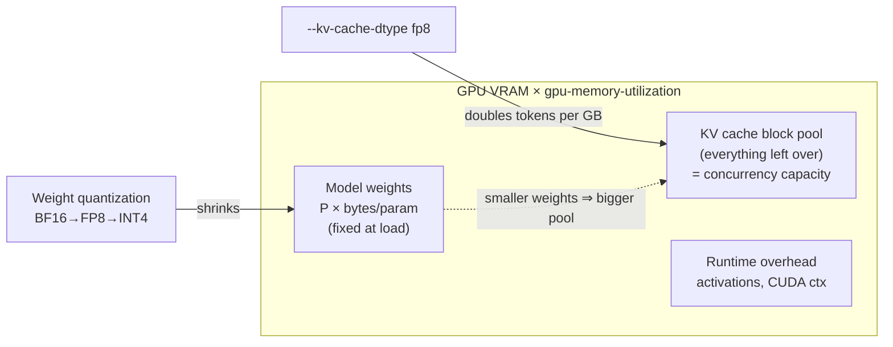
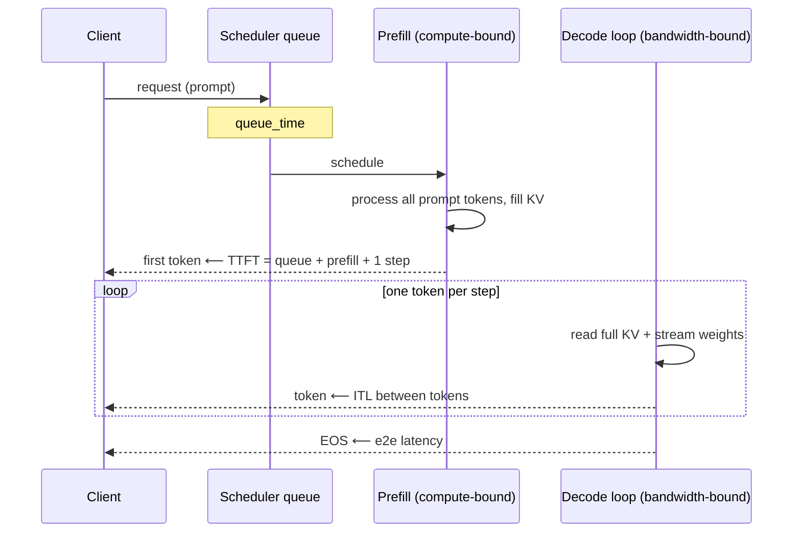
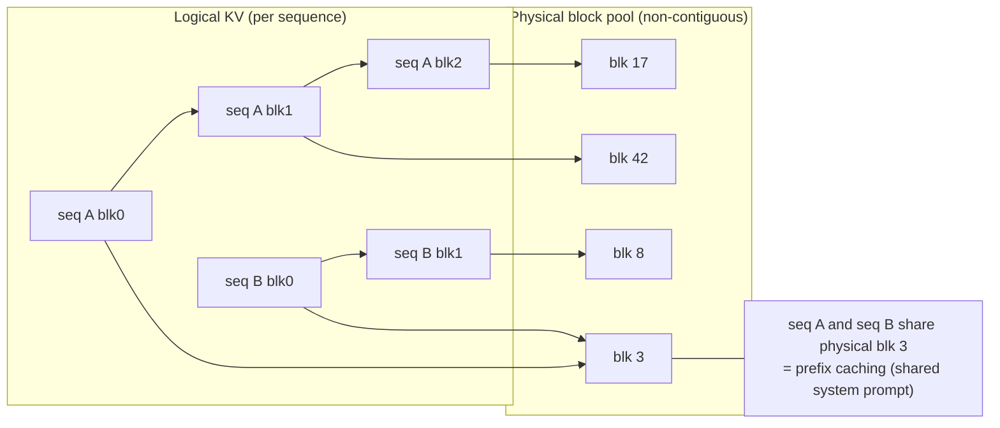
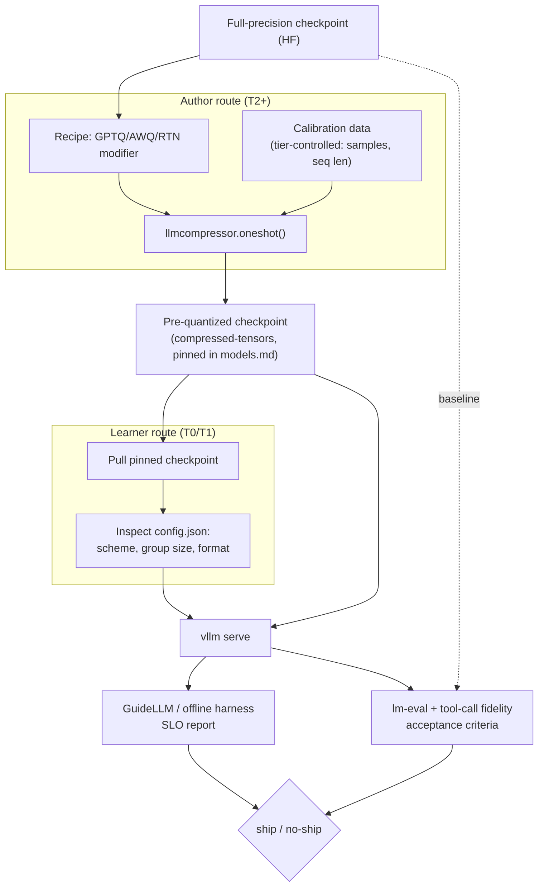
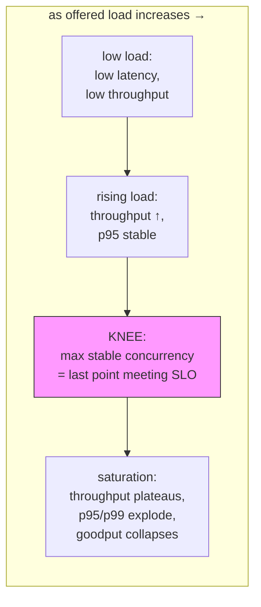
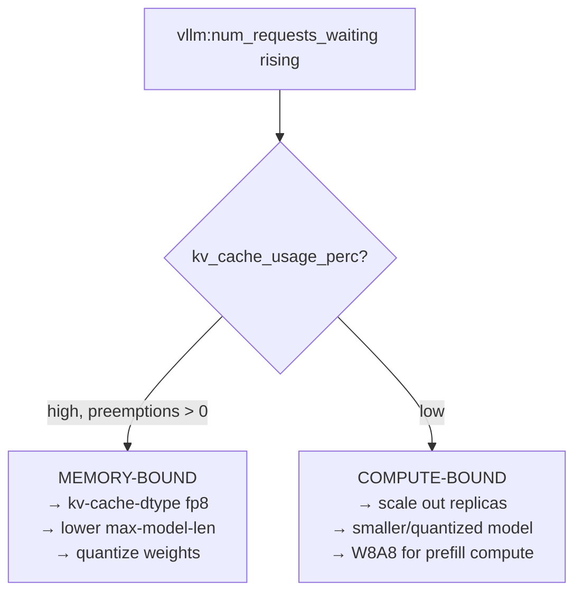
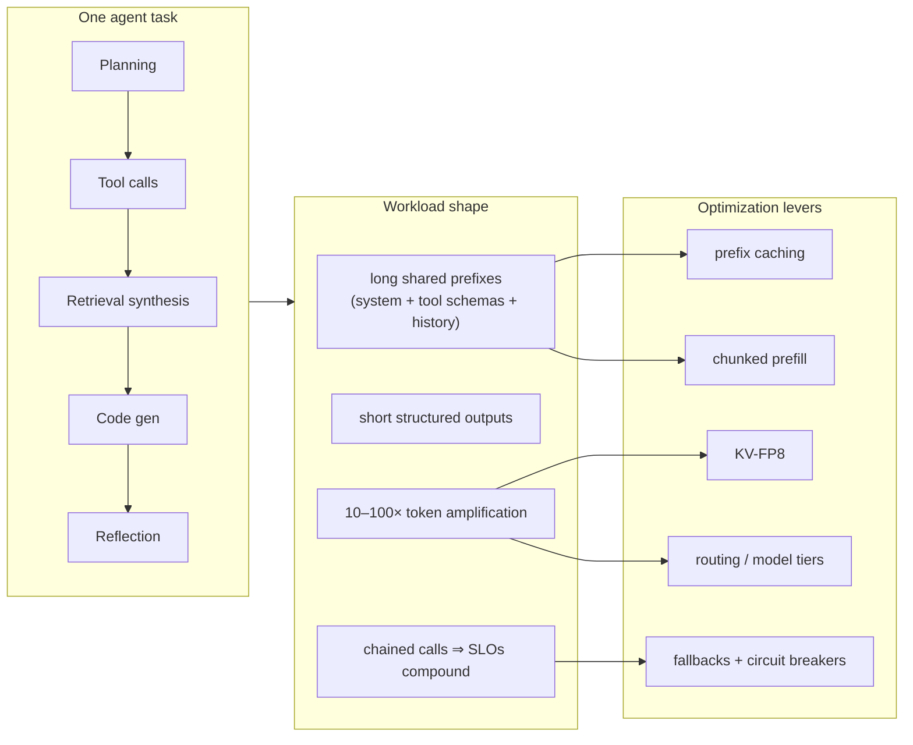
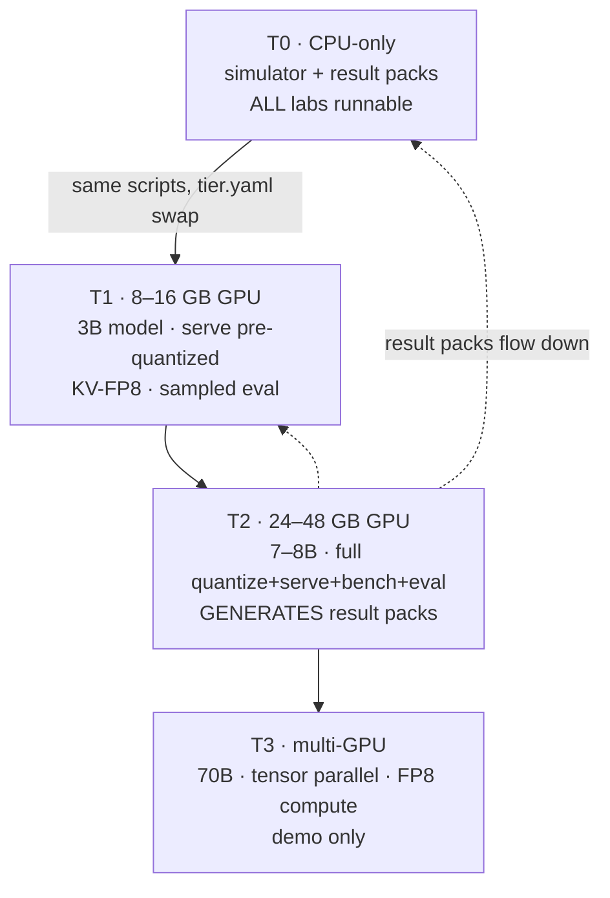

# Diagrams — LLM Inference Optimization

All diagrams are Mermaid (render natively on GitHub). Source of truth for slides/figures.

## D1. GPU memory budget (why weights and KV compete)

## D2. Request lifecycle (prefill → decode) and where metrics attach

## D3. Static vs continuous batching

```mermaid
gantt
    dateFormat X
    axisFormat %L
    section Static batch
    ReqA (long)        :0, 10
    ReqB (short, then idle slot) :0, 3
    ReqC (short, then idle slot) :0, 4
    section Continuous batch
    ReqA :0, 10
    ReqB :0, 3
    ReqD joins at t=3 :3, 6
    ReqC :0, 4
    ReqE joins at t=4 :4, 5
```

## D4. PagedAttention block mapping

## D5. Quantization → serving → evaluation pipeline (author vs learner route)

## D6. Latency–throughput frontier and the SLO knee (Lab 6 target figure)

## D7. Memory-pressure diagnostic (from /metrics)

## D8. Agent workload → inference optimization map (module thesis)

## D9. Hardware tiers and lab coverage

