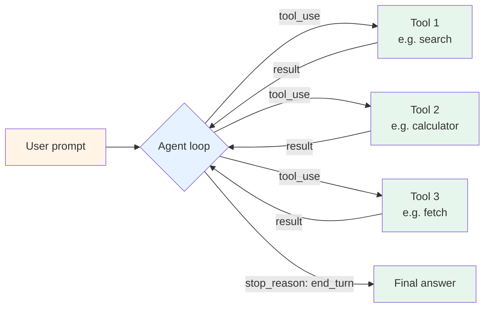

# Pattern 01 — Single-agent tool use

> 🟢 Stable · ⏱ ~10 min · 📍 The architecture-level companion to [`concepts/agents/`](../concepts/agents/) and [`concepts/tools/`](../concepts/tools/). Implemented in [Lab 01](../labs/01-first-agent-from-scratch/), [Lab 02](../labs/02-tool-design-and-selection/), [Lab 03](../labs/03-multi-step-research-agent/).

## Intent

One LLM, a handful of tools, no orchestration layer. The model picks which tool to call from the available set; the loop runs until the model returns a final answer or hits a cap.

## Diagram



One agent. Three to ten tools. A bounded loop. That's the entire pattern.

The loop runs as: send the conversation (including any tool results so far) to the model; if the model returns a tool-call, execute it and append the result; if the model returns a final message, exit. A step counter caps the loop to prevent runaway behavior — a typical cap is 8-15 iterations depending on task complexity.

## When to use

- **The task is bounded and well-defined.** "Summarize this PDF and answer questions about it." "Look up the weather and decide if I need an umbrella." "Search the API docs and write a code snippet." If you can describe what done looks like in one sentence, this pattern probably fits.
- **You have fewer than ~10 tools.** Beyond that, tool-selection signal degrades — the model spends more reasoning on which tool to pick than on the actual task. The fix isn't more prompt engineering; it's a different pattern (Router for distinct task types, Supervisor for decomposable tasks).
- **You're prototyping.** Almost every agent worth shipping starts here. The temptation to reach for multi-agent or framework abstractions before measuring single-agent performance is the #1 over-engineering trap in 2026 agent development per Anthropic's [Building Effective Agents](https://www.anthropic.com/research/building-effective-agents) (December 2024) — they explicitly recommend starting with the simplest viable pattern.

## When NOT to use

- **The task naturally decomposes into specialist subtasks.** If you find yourself writing tool descriptions like "for research questions, do X; for writing questions, do Y" — you've reverse-engineered a supervisor pattern badly. Reach for [Pattern 03 (Supervisor + workers)](./03-supervisor-workers.md) instead.
- **You need parallel tool execution.** Single-agent loops are inherently sequential; the model picks one tool, gets the result, picks the next. If you need to fan out across 20 sources concurrently, a single agent will be 20× slower than a planner-executor with thread-pooled execution. Reach for [Pattern 06 (Plan-and-execute)](./06-plan-and-execute.md).
- **Tool count exceeds ~10.** Selection signal degrades. The model starts picking near-randomly between tools with similar descriptions. Either prune (drop low-value tools), prefix-route (use a router that hands a smaller toolset to each downstream agent), or move to a Supervisor pattern.

## Implementation sketch

A minimal single-agent loop, framework-free Python. This is the shape Lab 01 builds from scratch.

```python
from typing import Any
import json

MAX_STEPS = 10

def run_agent(user_prompt: str, tools: dict[str, callable]) -> str:
    """One LLM, a few tools, a bounded loop.

    Args:
        user_prompt: The user's task.
        tools: Mapping of tool_name -> callable. Each callable takes a
            JSON-serializable dict and returns a JSON-serializable result.

    Returns:
        The final text answer from the model.
    """
    messages = [{"role": "user", "content": user_prompt}]
    tool_schemas = [build_tool_schema(name, fn) for name, fn in tools.items()]

    for step in range(MAX_STEPS):
        response = llm_call(messages=messages, tools=tool_schemas)

        if response.stop_reason == "end_turn":
            return response.content[0].text

        # Otherwise the model wants to call tools — execute and loop
        messages.append({"role": "assistant", "content": response.content})

        tool_results = []
        for block in response.content:
            if block.type == "tool_use":
                fn = tools[block.name]
                try:
                    result = fn(**block.input)
                except Exception as e:
                    result = {"status": "error", "error": str(e)}
                tool_results.append({
                    "type": "tool_result",
                    "tool_use_id": block.id,
                    "content": json.dumps(result),
                })
        messages.append({"role": "user", "content": tool_results})

    return "[max steps reached; partial answer not produced]"
```

The full implementation lives in [Lab 01](../labs/01-first-agent-from-scratch/) — including the tool-schema builder, the error envelope convention, and the action-hash dedup for repeated tool calls. The sketch above is the minimum that compiles and runs.

## Real-world examples

- **Anthropic's [Building Effective Agents](https://www.anthropic.com/research/building-effective-agents)** (December 2024) names this pattern explicitly. The post's framing — start with the simplest pattern; add complexity only when measurement justifies it — is the single most-cited 2026 agent-design reference.
- **Cursor, Claude Code, and Codex CLI** all use a single-agent core loop for the per-file edit case. Multi-file refactors escalate to plan-and-execute, but the inner loop per file is Pattern 01.
- **Most production "AI chatbot with tools" deployments** (customer support, internal knowledge bots, sales-assist) are Pattern 01. The pattern's reliability comes from its simplicity, not from being basic — production deployments measure 95%+ task completion rates when the tool set is well-curated.

## Tradeoffs

| Dimension | Cost |
|---|---|
| **Latency** | One LLM call per loop step. Median 3-5 steps per task in production; tail can run to MAX_STEPS. |
| **Cost** | Lowest of any agent pattern. ~3-8 LLM calls + tool calls per task. |
| **Reliability** | High when tool set is curated (Lab 02 territory); drops sharply past ~10 tools due to selection failure. |
| **Complexity** | Lowest. ~60-100 lines of Python end-to-end. No state machine, no message routing, no shared memory. |
| **Failure modes** | Tool selection errors (wrong tool picked); tool argument errors (model hallucinates a field); loop divergence (model repeats the same tool call). Mitigated by action-hash dedup and clear tool descriptions per [`concepts/tools/tool-design.md`](../concepts/tools/tool-design.md). |

The pattern's cost curve is approximately linear in tool count up to ~10, then degrades non-linearly as selection signal collapses. The break-even point against the planned `patterns/02-router.md` pattern is around 8-12 tools depending on description quality.

## Related patterns

- **Pattern 02 — Router** (planned; `patterns/02-router.md`) — the next step when you have distinct task *types* that each want their own toolset. The router decides which downstream Pattern 01 instance handles each request.
- **[Pattern 03 — Supervisor + workers](./03-supervisor-workers.md)** — the next step when tasks *decompose* (research → write → cite) rather than route. Supervisor delegates each sub-task to a worker that itself runs Pattern 01.
- **[Pattern 07 — Reflection / self-correction](./07-reflection.md)** — adds a critic loop on top of Pattern 01's output when the first answer is usually almost-right but needs refinement.
- **[Pattern 11 — MCP integration](./11-mcp-integration.md)** — Pattern 01 with tools served by external MCP servers instead of in-process Python functions. Same loop shape; the tool boundary moves out-of-process.

## References

**Foundational**:
- Anthropic (December 2024), *[Building Effective Agents](https://www.anthropic.com/research/building-effective-agents)* — names this pattern as the recommended starting point; the source of the 2026 simplest-first design discipline
- Yao et al. (2022), *[ReAct: Synergizing Reasoning and Acting in Language Models](https://arxiv.org/abs/2210.03629)* — the original reasoning-and-acting framing the modern single-agent loop derives from

**Adjacent repo content**:
- [`concepts/agents/what-is-an-agent.md`](../concepts/agents/what-is-an-agent.md) — what an agent is at the conceptual level
- [`concepts/agents/agent-loop.md`](../concepts/agents/agent-loop.md) — the loop mechanics in concept-page depth
- [`concepts/agents/react-pattern.md`](../concepts/agents/react-pattern.md) — the ReAct framing this pattern operationalizes
- [`concepts/tools/tool-design.md`](../concepts/tools/tool-design.md) — naming, descriptions, schemas for the tools this pattern uses
- [`concepts/tools/tool-selection.md`](../concepts/tools/tool-selection.md) — how the LLM picks among tools; the failure modes that bite this pattern past ~10 tools
- [Lab 01 — first agent from scratch](../labs/01-first-agent-from-scratch/) — builds this pattern end-to-end
- [Lab 02 — tool design and selection](../labs/02-tool-design-and-selection/) — tunes the pattern's tool surface
- [Lab 03 — multi-step research agent](../labs/03-multi-step-research-agent/) — Pattern 01 at the upper end of tool count and step count
