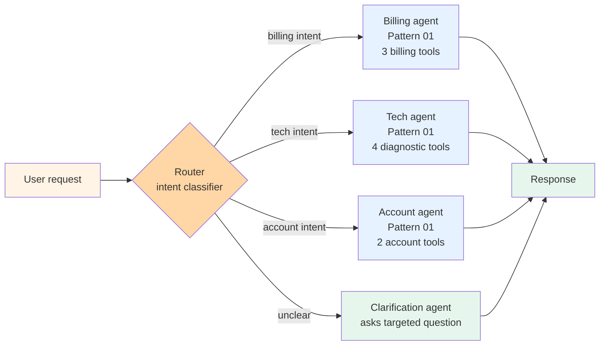

# Pattern 02 — Router

> 🟢 Stable · ⏱ ~10 min · 📍 The first specialization step above [Pattern 01 (Single-agent tool use)](./01-single-agent-tool-use.md). Architecture-level companion to [Path 01 Module 5 (tool design)](../learning-paths/01-foundations/) — `concepts/tools/tool-selection.md` documents the underlying selection-failure dynamic this pattern responds to.

## Intent

One-of-N selection: a thin classifier examines each incoming request, picks exactly one downstream handler, and forwards the request unchanged. Each downstream handler is its own [Pattern 01](./01-single-agent-tool-use.md) instance with a focused toolset for its task type. The pattern earns its place when distinct task *types* live in the same product but want different tools — and bundling them into one agent collapses tool-selection accuracy.

## Diagram



The router does no real work. It classifies and forwards. Each downstream handler runs unaware of the others — it gets a request shaped like any other Pattern 01 input. That separation is the point: the router protects each handler's tool-selection signal by ensuring it only sees requests in its specialty.

The unclear-intent branch matters in production. A router that doesn't have a "couldn't classify confidently" fallback either guesses (sending the request to the wrong specialist) or fails (returning an error to the user). The clarification path is the third option — ask a targeted question and re-classify.

## When to use

- **Distinct task *types* with distinct tool surfaces.** Customer support with billing, tech, and account specialists; multi-product chatbots; multi-domain assistants where the underlying tools for each domain don't overlap. Per the [BSWEN March 2026 routing implementation guide](https://docs.bswen.com/blog/2026-03-06-agent-routing/), the production sweet spot is 3-5 distinct intent categories — beyond that, the classifier's accuracy collapses and you've reverse-engineered a different pattern badly.
- **Pattern 01's tool count is creeping past ~10.** The failure mode this pattern responds to is exactly the [Pattern 01 break-even point](./01-single-agent-tool-use.md): tool-selection signal degrades non-linearly past 10 tools as the model spends more reasoning on which tool to pick than on the actual task. Routing partitions the toolset; each downstream handler sees 3-5 tools and the selection signal recovers.
- **The classification decision is cheap relative to the work.** The router runs once per request. If the downstream handler runs 5-10 LLM calls, the router's one classification call is a small markup (10-15%). If the downstream is itself a single LLM call, the router doubles your latency for marginal selection benefit — at that point, just let the model pick its own tools.
- **You can describe each handler in one sentence.** If the router's prompt looks like "route to billing for X, Y, Z UNLESS A or B in which case route to tech, but watch out for C edge cases," the routing decision isn't actually one-of-N — it's a small decision tree the router LLM will get wrong. Either decompose into a hierarchy ([Pattern 04](./04-hierarchical-teams.md)) or restructure the handlers so the routing decision is genuinely simple.

## When NOT to use

- **The "categories" overlap.** A request that could legitimately go to either billing or tech (e.g. "I was charged but the feature doesn't work") is a routing failure waiting to happen — either category will mishandle half the work. Reach for [Pattern 05 (Swarm hand-off)](./05-swarm-handoff.md) where the chosen specialist can transfer mid-conversation, or [Pattern 03 (Supervisor + workers)](./03-supervisor-workers.md) where a coordinator can fan out across multiple specialists.
- **Tasks decompose rather than route.** "Research the topic, then write a summary, then verify citations" doesn't route — every request needs all three stages. Reach for [Pattern 03](./03-supervisor-workers.md) (one supervisor orchestrates the stages) or [Pattern 06 (Plan-and-execute)](./06-plan-and-execute.md) (predictable pipeline).
- **Intent is genuinely opaque from the first message.** Multi-turn conversations where the user's real need only surfaces after 2-3 exchanges break the router's premise (classify once at the top). Use [Pattern 05](./05-swarm-handoff.md) with a triage agent that can transfer to the specialist *and* the specialist can transfer to peers when the conversation evolves.
- **You have fewer than 3 distinct categories.** Two-category routers are usually worth replacing with prompt-engineered branching inside a single Pattern 01 agent — the routing overhead doesn't pay off when there's barely anything to route between.

## Implementation sketch

The minimum viable router shape. Pydantic-validated routing decision plus three downstream Pattern 01 handlers.

```python
from typing import Literal
from pydantic import BaseModel, Field

class RouteDecision(BaseModel):
    """The router's output. Structured output makes routing decisions auditable."""
    route: Literal["billing", "tech", "account", "unclear"] = Field(
        description="The category of the user's request"
    )
    confidence: float = Field(ge=0.0, le=1.0)
    rationale: str = Field(max_length=200)


def route_request(user_message: str) -> RouteDecision:
    """Single LLM call. Cheap classifier. Returns structured decision."""
    return llm_structured_call(
        model="claude-haiku-4-5",  # small + fast for classification
        system=ROUTER_PROMPT,
        user=user_message,
        response_model=RouteDecision,
    )


# Each downstream handler is a Pattern 01 agent with its own focused toolset
DOWNSTREAM_HANDLERS = {
    "billing": billing_agent_pattern_01,   # tools: lookup_invoice, change_plan, ...
    "tech": tech_agent_pattern_01,         # tools: check_status, escalate, ...
    "account": account_agent_pattern_01,   # tools: update_profile, reset_password, ...
    "unclear": clarification_agent,         # asks targeted question, re-routes
}

# Confidence threshold: below this, treat as unclear and ask
ROUTE_CONFIDENCE_THRESHOLD = 0.7


def run(user_message: str) -> str:
    decision = route_request(user_message)
    if decision.confidence < ROUTE_CONFIDENCE_THRESHOLD:
        handler = DOWNSTREAM_HANDLERS["unclear"]
        return handler(user_message, decision)
    handler = DOWNSTREAM_HANDLERS[decision.route]
    return handler(user_message)
```

Four things to notice. First, the router uses *structured output* (Pydantic `Literal` enum) — free-text route names are a parsing-error source; the enum forces the classifier into a known set. Second, the router's model is a small one (Haiku/Mini class) — classification is a cheap task, no need to pay Sonnet/Opus rates per request. Third, the confidence threshold protects against the unclear case explicitly; under threshold means "ask the user," not "guess." Fourth, downstream handlers receive the original message unchanged — the router classifies but doesn't reformulate; reformulation is the handler's job.

The [BSWEN 2026 production analysis](https://docs.bswen.com/blog/2026-03-06-agent-routing/) reports that the "reserve the bigger model for execution, use a fast model for classification" pattern is the single biggest cost lever in production routing systems. Routing classifier costs are typically 10-15% of total request cost when sized correctly; bumping the router to Opus-class adds 40-60% to total cost for marginal classification accuracy.

For framework variants:
- **LangGraph** ships routing as a first-class primitive via `Command(goto=...)` returns from a classifier node; the [routing-pattern tutorial](https://medium.com/@huzaifaali4013399/the-routing-pattern-build-smart-multi-agent-ai-workflows-with-langgraph-44f177aadf7a) is the canonical example.
- **Semantic Router** (open-source library) uses embedding-similarity classification — typically 50-100ms latency vs an LLM classifier's 1-2s, at the cost of needing labeled examples per route.
- **OpenAI Agents SDK** uses triage-agent-with-handoffs — structurally a router followed by a hand-off, with the SDK's tracing capturing the routing decision.

## Real-world examples

- **Anthropic's [Building Effective Agents](https://www.anthropic.com/research/building-effective-agents)** (December 2024) names this the "routing workflow" — distinct from prompt chaining (deterministic sequence) and orchestrator-workers (dynamic decomposition). The post's framing — routing is for *known categories* with *clear handler boundaries* — is the 2026 canonical definition.
- **GitHub Copilot's mode picker** (Chat vs Inline vs Agent vs Edit) is a router with hand-engineered classification — different modes get different toolsets and different LLM configs. The UI exposes the routing decision (the mode picker) rather than hiding it.
- **Customer support deployments** running 3-5 specialist agents (billing, tech, account, scheduling, refund) routed by a thin triage classifier are the canonical 2026 production shape per [Gurusup 2026's multi-agent orchestration guide](https://gurusup.com/blog/multi-agent-orchestration-guide) — approximately 70% of production multi-agent deployments use an orchestrator-with-routing shape.
- **NVIDIA's [llm-router blueprint](https://github.com/NVIDIA-AI-Blueprints/llm-router)** routes to *different models* by intent (visual analysis → VLM, code generation → specialized LLM) rather than to different agents — same routing primitive applied to model selection instead of agent selection.

## Tradeoffs

| Dimension | Cost |
|---|---|
| **Latency** | +1 LLM call per request (the router). Embedding-similarity routers add ~50-100ms; LLM-classifier routers add 1-2 seconds. Both are small markups when downstream work is non-trivial. |
| **Cost** | Router calls run 10-15% of total request cost when sized correctly (Haiku-class for classification, Sonnet/Opus for execution). Inverting that — Opus for classification — adds 40-60% to total cost for marginal accuracy improvement per [BSWEN 2026](https://docs.bswen.com/blog/2026-03-06-agent-routing/). |
| **Reliability** | Routing accuracy is the load-bearing variable. With 3-5 well-defined categories and a confidence threshold, production deployments measure 90-95% correct routing. Category overlap drives this down sharply — at 7+ categories with fuzzy boundaries, accuracy can drop to 70-80%. |
| **Complexity** | Modest. Router + N downstream handlers; each handler is independent. The complexity is in the category design (getting 3-5 clean, non-overlapping categories), not in the code. |
| **Failure modes** | (1) Category overlap (request that fits multiple categories goes to a fixed one and mishandles half the work). (2) Out-of-category drift (the product grows beyond the routing categories; new request types get force-fit). (3) Confidence-threshold misses (router is confident but wrong; no fallback fires). (4) Multi-intent requests ("my card was declined AND the feature doesn't work") — single-category routing can't represent this; the router needs to either pick the dominant intent or escalate to a coordinator. |

The cost curve is approximately linear in category count up to ~5; degrades non-linearly above 7 as classification accuracy drops. Production-stable routers stay at 3-5 categories; above that, restructure into [Pattern 04 (Hierarchical teams)](./04-hierarchical-teams.md).

## Related patterns

- **[Pattern 01 — Single-agent tool use](./01-single-agent-tool-use.md)** — what each downstream handler is. Router is the entry point; each route lands in a Pattern 01 agent with a focused toolset. The pair compose naturally.
- **[Pattern 03 — Supervisor + workers](./03-supervisor-workers.md)** — the alternative when work *decomposes* (every request needs multiple specialists) rather than *routes* (each request needs one specialist). Don't conflate one-of-N selection with M-of-N decomposition.
- **[Pattern 04 — Hierarchical teams](./04-hierarchical-teams.md)** — what to reach for when routing categories exceed ~6 and accuracy collapses. Group categories into team supervisors; route at two levels.
- **[Pattern 05 — Swarm hand-off](./05-swarm-handoff.md)** — what to reach for when the user's intent evolves mid-conversation. Router handles the first turn; swarm peers handle the rest.
- **[Pattern 10 — Human-in-the-loop](./10-human-in-the-loop.md)** — natural composition for the confidence-threshold-miss case. When routing confidence is borderline, surface the routing decision for human approval before dispatching.

## References

**Foundational**:
- Anthropic (December 2024), *[Building Effective Agents](https://www.anthropic.com/research/building-effective-agents)* — names this the "routing workflow"; distinct from prompt chaining and orchestrator-workers; the production-discipline framing of when each fits

**2026 production guides**:
- BSWEN (March 2026), *[AI Agent Routing: A Practical Guide to Intent Classification and Routing Implementation](https://docs.bswen.com/blog/2026-03-06-agent-routing/)* — Pydantic structured-output routing decision; the "reserve the bigger model for execution; use a fast model for classification" production lever; LangGraph `Command(goto=...)` shape
- Gurusup (April 2026), *[Multi-Agent Orchestration: How to Coordinate AI Agents](https://gurusup.com/blog/multi-agent-orchestration-guide)* — the orchestrator-with-routing pattern as ~70% of production multi-agent deployments; 50-100ms embedding classifiers vs 1-2s LLM classifiers
- Huzaifaali (October 2025), *[The Routing Pattern: Build Smart Multi-Agent AI Workflows with LangGraph](https://medium.com/@huzaifaali4013399/the-routing-pattern-build-smart-multi-agent-ai-workflows-with-langgraph-44f177aadf7a)* — full LangGraph implementation with structured routing decision, unclear-fallback branch, and shared state
- Botpress (2025), *[Ultimate Guide to AI Agent Routing](https://botpress.com/blog/ai-agent-routing)* — the LLM-routing vs legacy-classifier comparison; context-aware routing for multi-turn conversations
- NVIDIA AI Blueprints, *[llm-router GitHub](https://github.com/NVIDIA-AI-Blueprints/llm-router)* — production routing applied to model selection (VLM for vision, specialized LLM for code)

**Adjacent repo content**:
- 🏛 [Pattern 01 — Single-agent tool use](./01-single-agent-tool-use.md) — what each downstream handler is
- 🏛 [Pattern 03 — Supervisor + workers](./03-supervisor-workers.md) — the decomposition alternative
- 🏛 [Pattern 04 — Hierarchical teams](./04-hierarchical-teams.md) — the layered alternative when category count exceeds ~6
- 🏛 [Pattern 05 — Swarm hand-off](./05-swarm-handoff.md) — when initial routing isn't enough and peer transfers help
- 📖 [`concepts/tools/tool-selection.md`](../concepts/tools/tool-selection.md) — the underlying tool-selection failure dynamic this pattern responds to
- 📖 [`concepts/tools/tool-design.md`](../concepts/tools/tool-design.md) — naming and description conventions that affect routing accuracy
- 🛣 [Path 01 — Foundations](../learning-paths/01-foundations/) — where tool-selection and the single-agent baseline live
- 🛣 [Path 03 — Multi-Agent Systems](../learning-paths/03-multi-agent-systems/) — for the multi-agent variations this pattern feeds into
