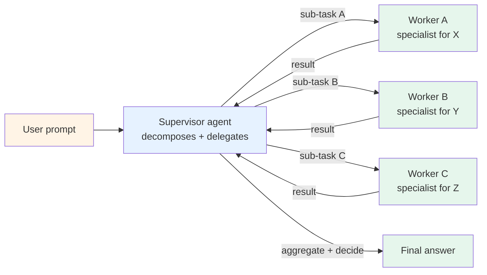

# Pattern 03 — Supervisor + workers

> 🟢 Stable · ⏱ ~12 min · 📍 The architecture-level companion to [Path 03 v1 Module 1](../learning-paths/03-multi-agent-systems/). Implemented in [Lab 10](../labs/10-supervisor-worker-from-scratch/) and [Lab 14](../labs/14-langgraph-supervisor-bridge/).

## Intent

One coordinator (the supervisor) decomposes a task into sub-tasks and delegates each to a specialized worker agent. Workers run independently; the supervisor aggregates results and decides whether the overall task is complete. The pattern earns its place when a task decomposes cleanly into specialist sub-tasks that benefit from worker specialization.

## Diagram



Each worker is itself typically a [Pattern 01](./01-single-agent-tool-use.md) agent — its own tool set, its own loop, its own bounded step count. The supervisor doesn't see inside the worker's loop; it sees only the worker's structured output. This is what makes the pattern compose: workers can themselves contain workers (see [Pattern 04 — Hierarchical teams](./04-hierarchical-teams.md)).

## When to use

- **The task decomposes into specialist sub-tasks.** Research → write → cite is the canonical example; each step has different tool needs (search vs generation vs URL verification) and different optimization criteria. A single agent juggling all three tool sets ends up with poor tool-selection signal past ~10 tools.
- **You have clear sub-task boundaries.** "Each worker owns its domain; the supervisor owns the orchestration" is testable: can you write each worker's system prompt without referencing the others? If yes, the decomposition is clean. If you keep wanting to share state mid-flight, the boundaries are wrong.
- **Workers benefit from different models.** Cheaper, faster models for simple workers; reasoning-heavy models for the supervisor and any complex specialist. Per [digitalapplied April 2026](https://www.digitalapplied.com/blog/agent-architecture-patterns-taxonomy-2026), "hierarchical wins over swarm in production almost every time" because the cost-quality differentiation pays off.
- **You need worker isolation for failure containment.** A worker that fails (timeout, tool error, hallucinated step) is contained — the supervisor catches the failure and decides whether to retry, reroute, or escalate. Without explicit boundaries, a single in-process agent's failure is the whole task's failure.

## When NOT to use

- **Single, scoped tasks with no decomposition.** "Summarize this PDF" doesn't need a supervisor. Use [Pattern 01](./01-single-agent-tool-use.md). The supervisor overhead (an extra LLM call per delegation; structured-output schema definition; aggregation logic) is pure cost when the task is one step.
- **Tasks that decompose into parallel rather than specialized steps.** "Process 1000 documents the same way" wants a worker pool, not a supervisor-worker. Reach for fan-out parallelism, not Pattern 03.
- **When the topology is wrong and you're really doing tool-calling.** If your "workers" are actually deterministic transformations the agent could call as tools, you have a [Pattern 01](./01-single-agent-tool-use.md) with too many tools — not a multi-agent system. Path 03 v1 Module 1's "when does multi-agent earn its complexity" discussion covers this failure mode.
- **Prototypes where the sub-task boundaries aren't yet stable.** Lock the decomposition once it stabilizes; not before. Premature supervisor-worker architecture turns into supervisor-worker-with-three-broken-handoffs.

## Implementation sketch

Framework-free Python showing the core supervisor loop. The handoff contract between supervisor and worker (the structured input/output schema) is what makes the pattern testable — both sides validate against it.

```python
from typing import Literal
from pydantic import BaseModel

class WorkerTask(BaseModel):
    """The supervisor's brief to a worker. See Path 03 v2 Pattern 1
    (handoff contracts) for the full schema specification."""
    objective: str
    constraints: list[str]
    available_tools: list[str]
    max_steps: int = 8

class WorkerResult(BaseModel):
    """The worker's structured return to the supervisor."""
    status: Literal["succeeded", "failed", "needs_escalation"]
    result: dict
    citations: list[str] = []
    confidence: float

def run_supervisor(user_prompt: str, workers: dict[str, callable]) -> str:
    """One supervisor coordinating N specialist workers.

    Args:
        user_prompt: The user's task.
        workers: Mapping of worker_name -> worker callable. Each worker takes
            a WorkerTask and returns a WorkerResult.

    Returns:
        The final aggregated answer.
    """
    plan = supervisor_decompose(user_prompt, available_workers=list(workers))

    completed_results = {}
    for step in plan.steps:
        worker_fn = workers[step.worker_name]
        task = WorkerTask(
            objective=step.objective,
            constraints=step.constraints,
            available_tools=step.tool_allowlist,
        )
        result = worker_fn(task)

        if result.status == "failed":
            # The supervisor decides: retry? reroute? escalate?
            plan = supervisor_recover(plan, step, result, completed_results)
            continue

        completed_results[step.id] = result

    return supervisor_aggregate(completed_results)
```

The full implementation lives in [Lab 10](../labs/10-supervisor-worker-from-scratch/) — including the decomposition prompt, the recovery logic, and the aggregation rules. [Lab 14](../labs/14-langgraph-supervisor-bridge/) shows the same pattern in LangGraph for production use.

The handoff contract between supervisor and worker is the pattern's primary failure point. See Path 03 v2 Pattern 1 at `learning-paths/03-multi-agent-systems/patterns/01-handoff-contracts.md` for the full six-field schema (input / output / ownership / status / citations / retry path).

## Real-world examples

- **Anthropic's [Building Effective Agents](https://www.anthropic.com/research/building-effective-agents)** (December 2024) names this as the "orchestrator-workers" pattern — distinct from prompt chaining (deterministic) and routing (one-of-N). The post's framing — supervisors handle dynamic decomposition where the structure isn't predictable in advance — is the 2026 canonical definition.
- **Deep research agents** (Anthropic's Research, OpenAI's Deep Research, Perplexity's various research modes) all use a supervisor-worker shape: a planner generates research questions, specialist workers retrieve and synthesize per topic, the supervisor aggregates with citation provenance.
- **CrewAI** is built around this pattern as its primary metaphor (crew = supervisor; tasks = sub-tasks; agents = workers). Per [digitalapplied April 2026](https://www.digitalapplied.com/blog/agent-architecture-patterns-taxonomy-2026), CrewAI's role-based framing makes Pattern 03 the default for most users.
- **AutoGen's hierarchical group chat** and **LangGraph's `create_supervisor` primitive** are framework-native expressions of the pattern.

## Tradeoffs

| Dimension | Cost |
|---|---|
| **Latency** | Higher than Pattern 01 by a factor of (1 + worker_count) at minimum — supervisor decomposes, workers run, supervisor aggregates. Workers can run in parallel where independent, reducing wall-clock latency but not LLM-call count. |
| **Cost** | Token cost roughly 2-4× Pattern 01 for the same task. Each worker repeats some context; supervisor pays decomposition + aggregation. Mitigation: smaller model for routine workers, reasoning-heavy model for supervisor only. |
| **Reliability** | Higher *worst-case* reliability (worker failures contained) but more *moving parts*. Per [digitalapplied April 2026](https://www.digitalapplied.com/blog/agent-architecture-patterns-taxonomy-2026): coordination overhead can dominate simple tasks; supervisor drift; sub-task conflicts not surfaced. |
| **Complexity** | ~200-400 lines of Python end-to-end (vs ~80 for Pattern 01). State machine, message routing, handoff contracts, aggregation logic. |
| **Failure modes** | Supervisor drift (the supervisor's mental model of progress diverges from actual worker state); handoff schema mismatches; sub-task budgets not enforced; aggregation losing worker citations. Path 03 v2 Patterns 1, 4, and 6 cover the operational mitigations for these failure modes in detail. |

The pattern's break-even against Pattern 01 is usually around 3+ distinct specialist roles. Below that, Pattern 01 with good tool descriptions wins on cost and simplicity.

## Related patterns

- **[Pattern 01 — Single-agent tool use](./01-single-agent-tool-use.md)** — what each worker typically is. The supervisor delegates to workers that are Pattern 01 agents.
- **[Pattern 04 — Hierarchical teams](./04-hierarchical-teams.md)** — Pattern 03 nested. When workers themselves benefit from worker-specialist decomposition.
- **[Pattern 06 — Plan-and-execute](./06-plan-and-execute.md)** — the close cousin. Plan-and-execute pre-commits to a static plan; Pattern 03 lets the supervisor adjust dynamically as worker results return.
- **[Pattern 10 — Human-in-the-loop](./10-human-in-the-loop.md)** — composes cleanly. The supervisor's `needs_escalation` status routes to a human reviewer before continuing.
- **[Pattern 11 — MCP integration](./11-mcp-integration.md)** — workers' tool access often goes through MCP servers. Each worker gets its own MCP client; the supervisor doesn't know or care.
- **[Pattern 12 — A2A federation](./12-a2a-federation.md)** — the cross-organizational expression of supervisor-worker. When workers run in different organizations, A2A is the protocol layer.

## References

**Foundational**:
- Anthropic (December 2024), *[Building Effective Agents](https://www.anthropic.com/research/building-effective-agents)* — the orchestrator-workers framing
- LangChain's [supervisor multi-agent reference](https://www.langchain.com/blog/planning-agents) — the production architecture

**2026 production grounding**:
- digitalapplied.com (April 2026), *[Agent Architecture Patterns: 2026 taxonomy](https://www.digitalapplied.com/blog/agent-architecture-patterns-taxonomy-2026)* — "hierarchical wins over swarm in production almost every time"; failure modes and mitigations
- Medium (March 2026), *[Agent Architectures: Planner, Executor, Router Patterns](https://medium.com/@vishal.agarwal.iitk/agent-architectures-planner-executor-router-patterns-148fe54ff595)* — production patterns including supervisor-worker
- Medium (May 2026), *[Chapter 4: Agent Architecture — Patterns That Scale](https://medium.com/@vinodkrane/part-4-agent-architecture-patterns-that-scale-2026-guide-3c3a1f45fab7)* — production-tested supervisor patterns

**Adjacent repo content**:
- 🛣 [Path 03 — Multi-Agent Systems](../learning-paths/03-multi-agent-systems/) — the learning path where supervisor-worker is developed in depth
- 📖 Path 03 v1 Module 1 covers when multi-agent earns its complexity; Path 03 v2 Pattern 1 covers handoff contracts (the supervisor-worker boundary specification)
- 🧪 [Lab 10 — Supervisor-worker from scratch](../labs/10-supervisor-worker-from-scratch/) — framework-free implementation
- 🧪 [Lab 14 — LangGraph supervisor bridge](../labs/14-langgraph-supervisor-bridge/) — the same pattern in LangGraph
- 🧪 [Lab 13 — Multi-agent RAG from scratch](../labs/13-multi-agent-rag-from-scratch/) — supervisor-worker applied to retrieval
- 📖 [`concepts/multi-agent/supervisor-worker-pattern.md`](../concepts/multi-agent/supervisor-worker-pattern.md) — the concept-page treatment
