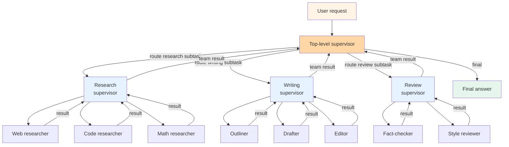

# Pattern 04 — Hierarchical teams

> 🟢 Stable · ⏱ ~11 min · 📍 The next step up from [Pattern 03 (Supervisor + workers)](./03-supervisor-workers.md) when one supervisor + N workers is no longer enough. Architecture-level companion to [Path 03 Multi-Agent Systems](../learning-paths/03-multi-agent-systems/).

## Intent

Multiple supervisors, each owning its own set of specialist workers, coordinated by a top-level supervisor that delegates whole sub-tasks across the supervisor tier. The shape is Pattern 03 nested one level: the top-level supervisor sees teams, not individuals; each team's supervisor sees its own workers. The pattern earns its place when a single supervisor's tool/agent surface gets too wide to reason about — typically past 5-6 specialists — or when domains cluster cleanly into teams.

## Diagram



Two levels of decomposition. The top-level supervisor doesn't see individual workers; it sees teams. Each team's supervisor doesn't see other teams; it sees its own workers. The compositional point: each team is itself a [Pattern 03](./03-supervisor-workers.md) — same supervisor primitive, just nested.

The same shape generalizes to three or more levels (supervisors of supervisors of supervisors), but in practice the latency cost of every hop deters depths beyond two. Most production hierarchical systems are exactly two levels deep.

## When to use

- **One supervisor's tool/agent list has gotten too wide.** Past 5-6 specialists, [supervisor routing accuracy](https://callsphere.ai/blog/langgraph-supervisor-multi-agent-orchestration-2026) degrades — the supervisor LLM spends more of its context budget reasoning about which agent to pick than on the task itself. Grouping specialists into teams of 3-4 each, with a thin top-level coordinator routing across teams, restores the per-decision toolset to a reasonable size at each level.
- **Domains cluster cleanly into teams.** Research-write-review is the canonical example: researchers don't write, writers don't fact-check, reviewers don't research. The team boundary maps to a real specialization boundary. Forcing this shape on a problem that doesn't naturally decompose adds latency without adding signal.
- **Different teams ship at different velocities.** A real-organization deployment often has a customer-service team's supervisor owned by the support engineering group and a billing team's supervisor owned by the finance engineering group. The hierarchy mirrors team boundaries; updating one team's workers doesn't require redeploying the top-level supervisor.

## When NOT to use

- **You have fewer than ~6 specialists total.** Stop at [Pattern 03](./03-supervisor-workers.md). Hierarchy adds two LLM-call hops per task (top supervisor → team supervisor → worker → team supervisor → top supervisor) for no decomposition benefit when the flat version already works.
- **The work doesn't actually cluster into teams.** If the supervisor's routing rules at the top level look like "send to team A unless it's about X, then team B" with the X exceptions multiplying, you don't have teams — you have a poorly-decomposed [Pattern 02 (Router)](./README.md) embedded in hierarchical clothing. Reach for the router pattern directly.
- **You need any of the specialists to talk to each other directly.** Hierarchy doesn't permit peer communication; everything routes through the team supervisor and (if cross-team) the top supervisor. Two-team coordination tasks like "research the data and have the writer cite it" force a round trip — top → research → top → writing — when peers could just hand off. Reach for [Pattern 05 (Swarm hand-off)](./05-swarm-handoff.md) if peer communication is the right shape.
- **Cost is the constraint.** Each level adds an LLM call per turn. Two-level hierarchies typically run 1.5-2× the token cost of flat Pattern 03 for the same work; three-level systems can hit 3-5×. The 100% routing accuracy that hierarchy buys is rarely worth that markup on tasks where flat Pattern 03's 85-90% routing accuracy is good enough.

## Implementation sketch

The framework-natural shape with LangGraph's [`create_supervisor`](https://github.com/langchain-ai/langgraph-supervisor-py) helper — the same primitive that builds a single [Pattern 03](./03-supervisor-workers.md) team, just composed.

```python
from langgraph_supervisor import create_supervisor
from langchain_anthropic import ChatAnthropic

model = ChatAnthropic(model="claude-sonnet-4-7-20260514")

# Team 1: research
research_agent = build_agent(name="researcher", tools=[web_search, fetch_page])
code_agent = build_agent(name="code_searcher", tools=[github_search])
research_team = create_supervisor(
    agents=[research_agent, code_agent],
    model=model,
    supervisor_name="research_supervisor",
    prompt="You manage research specialists. Route to the right one; return when "
           "their combined output answers the research subtask.",
).compile(name="research_team")

# Team 2: writing
outliner = build_agent(name="outliner", tools=[])
drafter = build_agent(name="drafter", tools=[])
writing_team = create_supervisor(
    agents=[outliner, drafter],
    model=model,
    supervisor_name="writing_supervisor",
    prompt="You manage writing specialists. The researcher's output is in state; "
           "outline first, then draft. Return the drafted answer.",
).compile(name="writing_team")

# Top level: composes teams as if they were agents
top_supervisor = create_supervisor(
    agents=[research_team, writing_team],   # teams treated as units
    model=model,
    supervisor_name="top_level_supervisor",
    prompt="Route research subtasks to research_team and writing subtasks to "
           "writing_team. The final answer is the writing_team's last output.",
).compile(name="top_level_supervisor")

result = top_supervisor.invoke({"messages": [{"role": "user", "content": prompt}]})
```

Three things to notice. First, the recursion is real: `create_supervisor` returns a compiled graph; you pass compiled graphs into another `create_supervisor` call as if they were individual agents. Second, each level's prompt only describes the level it owns — the top-level prompt doesn't enumerate researchers and writers; it talks about teams. Third, state flows up: the research team's final output lands in the top-level state, where the writing team reads it. There's no explicit message passing between teams; the state machine handles propagation.

Per the [LangGraph supervisor README (2026)](https://reference.langchain.com/python/langgraph-supervisor), the project now recommends the tool-calling pattern directly over the supervisor library for most use cases — but the hierarchical composition example above remains canonical for the two-level-or-deeper case where wiring it by hand gets verbose.

For framework-free implementations, the same shape works as nested function calls: a top-level coordinator function that calls team-level coordinator functions, each of which calls worker functions. State propagation becomes explicit return values rather than implicit graph state. Lab 10's bare-Python supervisor scales to this shape with a `team_dispatch(team_name, subtask)` helper.

## Real-world examples

- **Anthropic's deep research agent** uses a hierarchical structure per the [Building Effective Agents](https://www.anthropic.com/research/building-effective-agents) framing — a top-level orchestrator decomposes the research question into sub-questions, dispatches each to a specialist sub-agent that itself may have its own retrieval and synthesis workers. The pattern earns its place because research questions cluster into independent sub-areas (history, current state, opposing views) that can run in parallel.
- **OpenAI's Deep Research mode** and **Perplexity's research modes** use the same two-tier shape: a planner generates research sub-questions, a coordinator dispatches each to a retrieve-and-summarize specialist, the planner aggregates with citation provenance. Hierarchy here is parallelism plus specialization.
- **Microsoft Copilot for Enterprise** routes user requests through a hierarchy of supervisors per business domain (sales, marketing, finance), each managing its own specialist agents for that domain. The team boundary maps to organizational ownership — different teams ship different supervisors.
- Per the [LifetidesHub 2026 LangGraph patterns guide](https://www.lifetideshub.com/langgraph-supervisor-patterns-2026/), the production decision tree treats hierarchical as *the* answer to "6+ workers" — below that threshold, flat Pattern 03 wins on simplicity; above it, the routing-accuracy benefit of hierarchical compounds.

## Tradeoffs

| Dimension | Cost |
|---|---|
| **Latency** | 2× to 3× Pattern 03 for two-level hierarchy on the same task. Each level adds one supervisor LLM call per turn. Three-level hierarchy multiplies again — rarely worth the cost. |
| **Cost** | 1.5× to 2× Pattern 03 token spend. The top supervisor's prompt + the team supervisor's prompt are both paid per turn; only worker calls are equivalent to flat Pattern 03. |
| **Reliability** | Routing accuracy near-100% per level at 3-4 specialists per team (the [CallSphere 2026 reporting](https://callsphere.ai/blog/langgraph-supervisor-multi-agent-orchestration-2026) baseline) — restoring per-level tool count to a tractable size is exactly what hierarchy buys you. But end-to-end reliability is the *product* of per-level reliability; at 95% per level, two levels gives 90%, three gives 86%. |
| **Complexity** | Substantial step up from Pattern 03. Two-level hierarchies are 200-400 lines of orchestration code in LangGraph; three-level systems are 600+ lines and pain to debug. Add tracing (every level emits its own spans) before deploying. |
| **Failure modes** | Cross-team routing errors (top supervisor picks the wrong team); state-propagation gaps (writing team can't see research team's output because state schema wasn't designed for it); cascading retries (each level retries on failure, multiplying total LLM calls). The [LifetidesHub 2026 routing-error analysis](https://www.lifetideshub.com/langgraph-supervisor-patterns-2026/) reports that the most common production failure is the top supervisor routing the same subtask repeatedly to the same team — set a per-task ceiling at the top level (typical: 6-8 dispatches per request). |

The pattern's cost curve is the routing-accuracy benefit (sharp at ~6 specialists) traded against the latency-cost penalty (2-3× per level). Most production deployments stop at two levels; three-level systems mostly exist in research demos and Microsoft-scale enterprise contexts.

## Related patterns

- **[Pattern 03 — Supervisor + workers](./03-supervisor-workers.md)** — the foundation. Pattern 04 is Pattern 03 nested one level. If you're below 6 specialists, stay flat.
- **Pattern 02 — Router** (planned; `patterns/02-router.md`) — what you actually want when "hierarchy" is just a euphemism for "route by request type." Routers are one-of-N selection; hierarchies are M-of-N decomposition. Don't conflate.
- **[Pattern 05 — Swarm hand-off](./05-swarm-handoff.md)** — the no-coordinator alternative. When agents need to talk peer-to-peer (one specialist's output is another's input, no top-level coordinator), swarm hand-off fits better. The two patterns aren't competitors per se; production systems often have a hierarchy at the outer layer and swarm-style peer hand-off within a team.
- **[Pattern 06 — Plan-and-execute](./06-plan-and-execute.md)** — the alternative when the *structure* of the work is predictable enough to plan upfront. Hierarchy decides dynamically per turn; plan-and-execute commits to a structure at planning time. The two patterns frequently compose: a plan-and-execute planner emits a plan whose steps are then dispatched through a hierarchy.
- **[Pattern 07 — Reflection / self-correction](./07-reflection.md)** — composes inside a team. The writing team's editor reflecting on the drafter's output is a Pattern 07 loop nested inside a hierarchical structure.

## References

**Foundational**:
- Anthropic (December 2024), *[Building Effective Agents](https://www.anthropic.com/research/building-effective-agents)* — the orchestrator-workers framing; explicitly names hierarchical structure as "supervisor of supervisors" for dynamic decomposition past ~6 specialists
- LangChain (2025), *[LangGraph hierarchical agent teams tutorial](https://langchain-ai.github.io/langgraph/tutorials/multi_agent/hierarchical_agent_teams/)* — the canonical framework implementation (deprecated with LangGraph v1.0 October 2025; the supervisor primitive remains, the tutorial path shifted to tool-calling-based composition)

**2026 production guides**:
- [LangGraph Multi-Agent Supervisor README](https://reference.langchain.com/python/langgraph-supervisor) — current production guidance; the `create_supervisor(supervisors)` composition recipe
- CallSphere (May 2026), *[LangGraph Supervisor Pattern: Orchestrating Multi-Agent Teams in 2026](https://callsphere.ai/blog/langgraph-supervisor-multi-agent-orchestration-2026)* — the "4 specialists per team" production threshold; per-level routing accuracy measurements; default `max_iterations=25` for flat teams, `40` for hierarchical
- BetterLink (May 2026), *[LangGraph Multi-Agent Collaboration: Supervisor Pattern and Task Dispatch](https://eastondev.com/blog/en/posts/ai/20260512-langgraph-multi-agent-supervisor/)* — supervisor-of-supervisors framing for large, complex projects
- LifetidesHub (May 2026), *[LangGraph Supervisor Patterns 2026](https://www.lifetideshub.com/langgraph-supervisor-patterns-2026/)* — the orchestration decision tree (linear → pipeline; dynamic routing → supervisor; peers → swarm; refinement → reflection; planning → plan-and-execute; **6+ workers → hierarchical**)

**Adjacent repo content**:
- 🏛 [Pattern 03 — Supervisor + workers](./03-supervisor-workers.md) — the foundation this composes
- 🏛 [Pattern 05 — Swarm hand-off](./05-swarm-handoff.md) — the no-coordinator alternative
- 🏛 [Pattern 06 — Plan-and-execute](./06-plan-and-execute.md) — the explicit-plan alternative
- 🏛 [Pattern 07 — Reflection / self-correction](./07-reflection.md) — what nests inside a team
- 🛣 [Path 03 — Multi-Agent Systems](../learning-paths/03-multi-agent-systems/) — the learning path; v2 module 4 covers the routing-accuracy collapse at 6+ specialists this pattern responds to
- 🧪 [Lab 10 — Supervisor-worker from scratch](../labs/10-supervisor-worker-from-scratch/) — the base lab; extend by nesting another `create_supervisor` call to build the two-level shape
- 📖 [`concepts/agents/multi-agent-systems.md`](../concepts/multi-agent/what-is-a-multi-agent-system.md) — the conceptual companion; agent-topology taxonomy and when each fits
