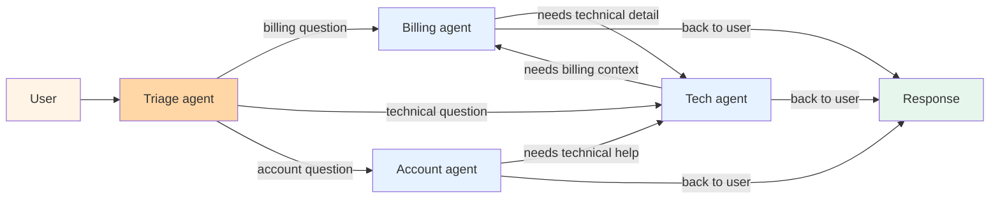

# Pattern 05 — Swarm hand-off

> 🟡 Active churn · ⏱ ~11 min · 📍 The architecture-level catalog page for peer-handoff multi-agent topology. Closely tied to OpenAI Agents SDK handoffs (March 2025+) and the deprecated OpenAI Swarm reference implementation; framework names move quickly here. Architecture-level companion to [Path 03 Multi-Agent Systems](../learning-paths/03-multi-agent-systems/).

## Intent

Peer agents transfer control to each other directly, with no top-level coordinator. Each agent's local decision is: "I'm done; the next agent that should handle this is X — here's the conversation state." The receiving agent runs until it either finishes or hands off again. Control flow is decentralized; the conversation lives in shared state rather than in a coordinator's reasoning.

## Diagram



No central coordinator. Each agent's prompt lists the peers it can hand off to; the agent decides per-turn whether to handle the request, hand it off, or return to the user. Conversation state flows with the control transfer — when Billing hands off to Tech, the full conversation history goes with it.

The 2026 reality check: most production "swarm-shaped" deployments are actually [Pattern 03 (Supervisor + workers)](./03-supervisor-workers.md) in disguise — a triage agent routes once and the conversation stays with the chosen specialist. True peer-to-peer hand-off (where the specialist itself can hand off mid-conversation to another peer) is rarer in production and is what this pattern actually catalogs.

## When to use

- **Specialists own ongoing dialogs, not one-shot tasks.** Customer-support flows where a billing question can reveal an underlying technical issue mid-conversation — and the user should keep talking to "the right specialist" rather than re-explaining their problem to a coordinator. Hand-off transfers the conversation; the user experience is "I got transferred to the right person."
- **The "right specialist" depends on conversation state, not just intent.** Triage routing handles the first turn. Peer hand-off handles turn N when the question has evolved. [OpenAI Agents SDK 2026 reporting](https://www.respan.ai/articles/openai-agents-sdk-vs-swarm) names this the "transfer-after-discovery" case — the conversation surfaces information that wasn't in the original intent.
- **Per-agent code stays small.** Each agent's logic is `{instructions, tools, list of peers I can hand off to}`. No coordinator to maintain; no shared state machine. The pattern's appeal is that adding a new specialist is a localized change — write the agent, add it to the peer lists of the agents that should route to it. The cost of this localization is observability (see "When NOT to use").

## When NOT to use

- **You need a single source of truth for what happened.** Swarm hand-off scatters the decision history across peer agents; there's no coordinator whose reasoning trace tells the whole story. Debugging "why did the user end up with the wrong answer" requires reconstructing the hand-off chain from traces — much harder than reading one supervisor's decision log. [LangGraph's 2026 framing](https://reference.langchain.com/python/langgraph-supervisor) explicitly recommends supervisor over swarm "when you need an orchestrator that retains control." Most production systems do.
- **You can't bound hand-off depth.** Without a coordinator, peer agents can hand off to each other in cycles — Billing → Tech → Billing → Tech. Production swarm implementations need a hard cap on hand-off depth (typical: 3-4 hops) and a fallback that returns to the user when the cap is hit. Without this, a hand-off loop can burn through tokens with no termination signal.
- **You're using "swarm" as a synonym for "multi-agent."** Most multi-agent systems people describe as "swarms" are actually supervisor-with-handoffs (the [OpenAI Agents SDK 2026 framing](https://www.digitalapplied.com/blog/multi-agent-orchestration-5-patterns-that-work)) — a triage agent routes to a specialist and the specialist owns the conversation from there. That's [Pattern 03](./03-supervisor-workers.md) wearing different clothes. True peer-to-peer hand-off, where the specialist hands off again mid-conversation to another peer, is a smaller territory than the marketing suggests.
- **You need parallel work.** Swarm hand-off transfers control to exactly one peer; there's no fan-out. If your problem is "research these 5 topics in parallel," reach for [Pattern 03](./03-supervisor-workers.md) or [Pattern 06 (Plan-and-execute)](./06-plan-and-execute.md).

## Provenance: OpenAI Swarm → Agents SDK

Worth being precise about because the term "swarm" is overloaded in 2026 documentation:

- **OpenAI Swarm** (October 2024) was an experimental Python library demonstrating the routines-and-handoffs pattern. Per [Respan 2026](https://www.respan.ai/articles/is-openai-swarm-still-worth-using), the README explicitly described it as "exploring ergonomic, lightweight multi-agent orchestration" — educational, not production. It was archived in March 2025.
- **OpenAI Agents SDK** (March 2025) replaced it as the production successor. Same mental model — agents have instructions, tools, and a list of peers they can hand off to — but added tracing, guardrails, sessions, and a stable API. Per [DigitalApplied 2026](https://www.digitalapplied.com/blog/multi-agent-orchestration-5-patterns-that-work), the Agents SDK's handoffs "implement the supervisor pattern, not a peer swarm" — a triage agent typically owns the routing decision, and the chosen specialist owns the conversation. True peer-to-peer hand-off mid-conversation (Specialist A → Specialist B → Specialist A) is possible but uncommon in production deployments.
- **The pattern this page catalogs** is the architectural shape: peers handing off without a central coordinator. The OpenAI Agents SDK is its canonical 2026 implementation; LangGraph has a "swarm" topology mode; CrewAI's hierarchy mode supports peer transfers. Pick the framework that fits the rest of your stack; the architectural decision (peer hand-off vs supervisor) is upstream of the framework choice.

## Implementation sketch

Using OpenAI Agents SDK 0.17+ (May 2026) — the canonical 2026 implementation:

```python
from agents import Agent, Runner, handoff

billing_agent = Agent(
    name="billing",
    instructions=(
        "You handle billing inquiries. If the question reveals a technical issue "
        "(e.g., the customer can't access a feature they paid for), hand off to "
        "the technical agent. If it's about plan changes, handle it yourself."
    ),
    tools=[lookup_invoice, change_plan],
)

tech_agent = Agent(
    name="tech",
    instructions=(
        "You handle technical issues. If the question reveals a billing "
        "implication (e.g., a feature outage that warrants a refund), hand off "
        "to the billing agent."
    ),
    tools=[check_service_status, escalate_to_engineer],
)

# Peer hand-off — each agent lists the others it can transfer to
billing_agent.handoffs = [handoff(tech_agent)]
tech_agent.handoffs = [handoff(billing_agent)]

# Triage agent picks the initial specialist
triage = Agent(
    name="triage",
    instructions="Route to billing or tech based on the user's first message.",
    handoffs=[handoff(billing_agent), handoff(tech_agent)],
)

result = await Runner.run(triage, input="My charge was wrong but the feature also isn't working")
print(result.final_output)
```

Four things to notice. First, every agent's `handoffs` list is the only piece of routing logic — there's no central state machine deciding who runs next. Second, the conversation state is the `Runner`'s shared session; handing off doesn't copy state, it passes the same session forward. Third, the triage agent is structurally identical to the specialists — it just happens to do the first routing turn. Fourth, the Agents SDK's tracing (`Runner.run` records the hand-off chain) is the only thing that makes this debuggable in production; without it, reconstructing what happened is hard.

Per [Respan May 2026](https://www.respan.ai/articles/openai-agents-sdk-vs-swarm), the Agents SDK is on a monthly release cadence (`openai-agents` v0.17.3 as of May 2026) and is provider-agnostic via litellm — Anthropic, Google, Bedrock, Azure, and local models are all callable. The handoff semantics survive provider switching unchanged.

For a framework-free implementation, the same shape works as a dict of agent functions plus a per-agent `next_agent` return value: each function returns `{"answer": str | None, "handoff_to": str | None}`; a loop iterates calling whichever agent is current until `handoff_to is None`. Cap the loop at 4 hops to prevent cycles.

## Real-world examples

- **OpenAI's example: airline customer-service triage** (Agents SDK docs) — a triage agent receives the user; routes to flight-status, baggage, or refund agents based on initial intent; each specialist can hand off to another peer mid-conversation when the question evolves. Per [Gurusup 2026](https://gurusup.com/blog/best-multi-agent-frameworks-2026), this is the canonical 2026 demo.
- **Cursor's multi-mode editor** (architectural shape, not branded as swarm) — different specialists for code completion, refactoring, debugging, with the active specialist switching based on conversation cues. The user doesn't see the hand-off; the editor's UX is consistent across specialists.
- **CrewAI's hierarchical mode with peer transfers** — supports a hybrid where teams of specialists can transfer control horizontally as well as vertically. Per [Gurusup 2026](https://gurusup.com/blog/best-multi-agent-frameworks-2026), this is the framework's answer to deployments that need both Pattern 03's coordination and Pattern 05's peer flexibility.
- **The negative example worth naming**: most "AI customer support" deployments described in 2026 marketing as "swarm-based" are structurally [Pattern 03](./03-supervisor-workers.md) — triage routes once, the specialist owns the conversation, no peer-to-peer transfer. [DigitalApplied March 2026](https://www.digitalapplied.com/blog/multi-agent-orchestration-5-patterns-that-work) notes the gap between marketing language and architectural reality explicitly: "handoffs implement the supervisor pattern, not a peer swarm."

## Tradeoffs

| Dimension | Cost |
|---|---|
| **Latency** | One LLM call per hop — same per-hop cost as Pattern 03's supervisor, but no top-down dispatch overhead. Typical conversation runs 2-4 hops total; 6+ hops indicates a routing pathology. |
| **Cost** | Comparable to Pattern 03 for the same task complexity. The token spend tradeoff is per-agent prompt size: swarm prompts must enumerate peers ("you can hand off to X, Y, Z") while supervisor prompts only need to describe the worker pool — same information, distributed across agents. |
| **Reliability** | Hand-off accuracy is the main variable. Per [Respan 2026](https://www.respan.ai/articles/openai-agents-sdk-vs-swarm), production deployments measure 85-95% correct-handoff rates with well-designed peer descriptions; below 80%, the user notices being passed around. |
| **Complexity** | Per-agent code is the simplest of the multi-agent patterns. System-level complexity is the highest — there's no single place to read the routing logic. Mitigated by traces (OpenAI Agents SDK ships this; rolling your own without traces is not recommended). |
| **Failure modes** | Hand-off cycles (A → B → A → B) burning tokens with no progress; specialists handing off too eagerly (every question becomes someone else's problem); state-loss during hand-off (when implementations don't pass full conversation context). Hard cap on hop depth (typical: 4) plus a "if you can handle it, handle it" instruction in every agent prompt mitigates the cycle and eager-handoff modes. |
| **Observability** | Worst of any multi-agent pattern without dedicated tracing. With the OpenAI Agents SDK's built-in tracing (OpenTelemetry-compatible), it's good. Without that — rolling your own swarm — observability is the first thing that becomes a production blocker. |

The cost curve is the opposite of [Pattern 04 (Hierarchical teams)](./04-hierarchical-teams.md): swarm hand-off is cheap per turn but expensive to debug; hierarchy is expensive per turn but easy to debug. Production tradeoff is usually "how stable is the routing logic?" — stable routing favors hierarchy (commit to the structure); fluid routing that depends on conversation state favors swarm.

## Related patterns

- **[Pattern 03 — Supervisor + workers](./03-supervisor-workers.md)** — the alternative when one agent should own the routing decision and the specialists shouldn't transfer to each other. Most "swarm" deployments are actually this; pick swarm only when peer transfers mid-conversation are the actual requirement.
- **[Pattern 04 — Hierarchical teams](./04-hierarchical-teams.md)** — what you reach for when swarm's observability problem bites and the routing structure stabilizes. Hierarchy commits to a topology; swarm doesn't.
- **[Pattern 02 — Router](./02-router.md)** — the one-of-N entry point. Most swarm systems start with a router (the triage agent) before peer hand-off kicks in. The router does the first turn; swarm peers do the rest.
- **[Pattern 10 — Human-in-the-loop](./10-human-in-the-loop.md)** — wraps swarm well. Insert HITL approval points at hand-off boundaries when the transfer has high stakes (refunds, account changes). The hand-off semantics make natural approval points.
- **[Pattern 12 — A2A federation](./12-a2a-federation.md)** — the cross-process equivalent. Swarm hand-off is in-process peer transfer; A2A federation is over-the-wire peer transfer. Same logical shape; different deployment substrate.

## References

**Foundational**:
- OpenAI (October 2024), *[Swarm: Educational Multi-Agent Orchestration](https://github.com/openai/swarm)* — the original framework; archived March 2025; the README's "routines and handoffs" framing is the conceptual root of the pattern
- OpenAI (March 2025), *[Agents SDK](https://github.com/openai/openai-agents-python)* — the production successor; handoff semantics, sessions, tracing, guardrails; v0.17.3 as of May 2026

**2026 production guides**:
- DigitalApplied (March-May 2026), *[Multi-Agent Orchestration: 5 Patterns That Work](https://www.digitalapplied.com/blog/multi-agent-orchestration-5-patterns-that-work)* — the supervisor-vs-swarm distinction; the explicit "Agents SDK handoffs implement the supervisor pattern, not a peer swarm" framing
- Respan (May 2026), *[OpenAI Agents SDK vs Swarm: Migration Guide 2026](https://www.respan.ai/articles/openai-agents-sdk-vs-swarm)* — feature-by-feature comparison; tracing, guardrails, sessions; provider-agnostic litellm integration
- Gurusup (April 2026), *[Best Multi-Agent Frameworks in 2026](https://gurusup.com/blog/best-multi-agent-frameworks-2026)* — framework comparison; the orchestration model (handoffs vs shared memory vs message queues) as the architectural axis
- byteiota (March 2026), *[Agent Orchestration Frameworks 2026: handoff vs swarm](https://byteiota.com/agent-orchestration-frameworks-2026-openai-ruflo-swarms/)* — the 5-20× token cost range for multi-agent vs single-agent; the 100% actionable-recommendation result for incident response

**Adjacent repo content**:
- 🏛 [Pattern 03 — Supervisor + workers](./03-supervisor-workers.md) — the central-coordinator alternative; what most "swarm" systems actually are
- 🏛 [Pattern 04 — Hierarchical teams](./04-hierarchical-teams.md) — the layered-coordinator alternative
- 🏛 [Pattern 10 — Human-in-the-loop](./10-human-in-the-loop.md) — natural approval-point composition with hand-offs
- 🏛 [Pattern 12 — A2A federation](./12-a2a-federation.md) — the cross-process variant of the same peer-handoff shape
- 🛣 [Path 03 — Multi-Agent Systems](../learning-paths/03-multi-agent-systems/) — Module 2 (state machines) and Module 3 (escalation) are the in-process companions
- 📖 [`concepts/agents/multi-agent-systems.md`](../concepts/multi-agent/what-is-a-multi-agent-system.md) — agent-topology taxonomy that places this pattern relative to the others
