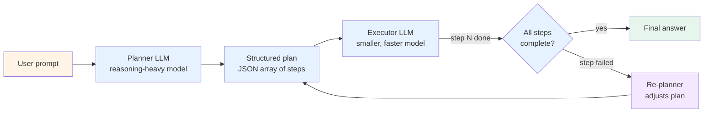

# Pattern 06 — Plan-and-execute

> 🟢 Stable · ⏱ ~12 min · 📍 The architecture-level companion to [Path 03 v1 Module 3](../learning-paths/03-multi-agent-systems/). Implemented in [Lab 12](../labs/12-plan-and-execute-from-scratch/) and [Lab 15](../labs/15-langgraph-plan-execute-bridge/).

## Intent

Separate strategic planning from tactical execution. A planner LLM generates a complete multi-step plan upfront; an executor (often a smaller, faster model) runs each step in turn; a re-planner adjusts the plan when execution diverges from expectations. Trades upfront planning cost for parallel execution, smaller-model economics, and inspectable plans.

## Diagram



The defining choice: the planner runs *once* upfront and produces a complete plan; the executor runs *N* times but uses a cheaper model. This is the inverse of [Pattern 01](./01-single-agent-tool-use.md), where the same expensive model runs every step. Per [dev.to March 2026](https://dev.to/ljhao/5-agent-design-patterns-every-developer-needs-to-know-in-2026-17d8), this trade reaches "92% task completion accuracy compared to 85% with ReAct" with "3.6× speedup over sequential execution" via LangChain's LLMCompiler.

## When to use

- **The task has many steps that benefit from upfront thinking.** Research workflows, report generation, competitor analysis, technical investigations, multi-step refactoring. If you can imagine writing the plan down before starting, the pattern fits.
- **Steps can run in parallel.** The plan exposes step dependencies as a directed acyclic graph; independent steps execute concurrently. Per LangChain's LLMCompiler benchmarks, this is where the 3.6× speedup comes from — sequential ReAct can't parallelize because each step's existence depends on the previous step's result.
- **Step execution is cheaper than step reasoning.** "Run this SQL query" or "search this index" is much cheaper than "decide what SQL query to write." Plan-and-execute lets you pay the reasoning-model cost once and the execution-model cost N times.
- **Inspectability matters.** The plan is a structured artifact — humans can audit it before execution begins. This composes with [Pattern 10 (Human-in-the-loop)](./10-human-in-the-loop.md): plan approval is a natural pre-execution gate. Per the [SAP October 2025 P-t-E security analysis](https://community.sap.com/t5/security-and-compliance-blog-posts/plan-then-execute-an-architectural-pattern-for-responsible-agentic-ai/ba-p/14239753), the pattern is "an architectural pattern for responsible agentic AI" specifically because of plan transparency.

## When NOT to use

- **Highly dynamic tasks where the plan changes every step.** If each step's correct next action depends critically on the previous step's result, the planner can't write a useful plan upfront. Reach for [Pattern 01](./01-single-agent-tool-use.md) (ReAct) or [Pattern 03 (Supervisor + workers)](./03-supervisor-workers.md) with dynamic supervisor delegation.
- **Short tasks (1-3 steps).** The planner's overhead doesn't pay off. Per the dev.to March 2026 measurements, plan-and-execute uses 3000-4500 tokens vs ReAct's 2000-3000 — the trade only pays at higher step counts.
- **When the planner is weaker than the executor.** If you've used the same model for both, the planner's mistakes can't be caught by the executor (which has no global view). Per [Medium May 2026](https://medium.com/@vinodkrane/part-4-agent-architecture-patterns-that-scale-2026-guide-3c3a1f45fab7): "planning failure propagation" — planner forgets a key step, executor never corrects, downstream cascades.
- **When external conditions change mid-execution.** Plans can become stale. If your task involves rapidly-changing data (real-time prices, live user state), the upfront plan may reflect a world that no longer exists by step 5.

## Implementation sketch

The core two-stage loop, framework-free Python:

```python
from typing import Literal
from pydantic import BaseModel

class PlanStep(BaseModel):
    """One step in the planner's output."""
    id: str
    task_description: str
    required_tool: str
    depends_on: list[str] = []  # step IDs this step depends on

class Plan(BaseModel):
    """The planner's complete output."""
    steps: list[PlanStep]
    expected_answer_shape: str  # what the final answer should look like

class StepResult(BaseModel):
    status: Literal["succeeded", "failed", "needs_replan"]
    output: dict
    error: str = ""

def run_plan_and_execute(
    user_prompt: str,
    tools: dict[str, callable],
    planner_model: str = "claude-opus-4-7",      # reasoning-heavy
    executor_model: str = "claude-haiku-4-5",     # cheaper, faster
) -> str:
    """Plan-and-execute with separate planner and executor models."""

    # Stage 1: plan once with reasoning-heavy model
    plan = planner_llm_call(
        model=planner_model,
        prompt=user_prompt,
        available_tools=list(tools),
    )

    # Stage 2: execute each step with cheaper model
    completed = {}
    max_replans = 3
    replan_count = 0

    while not all_complete(plan, completed):
        for step in ready_steps(plan, completed):  # respects depends_on
            result = executor_llm_call(
                model=executor_model,
                step=step,
                prior_results=completed,
                tools=tools,
            )

            if result.status == "needs_replan":
                replan_count += 1
                if replan_count > max_replans:
                    return "[max replans exceeded]"
                plan = replanner_llm_call(
                    model=planner_model,
                    original_plan=plan,
                    completed=completed,
                    failed_step=step,
                    failure_reason=result.error,
                )
                break  # restart the outer loop with new plan

            completed[step.id] = result

    return aggregate_to_answer(completed, plan.expected_answer_shape)
```

The full implementation lives in [Lab 12](../labs/12-plan-and-execute-from-scratch/) — including the dependency-resolution logic, the parallel-execution scheduler, and the re-planning decision rules. [Lab 15](../labs/15-langgraph-plan-execute-bridge/) shows the same pattern in LangGraph.

Two production conventions worth flagging: (1) the planner's output schema is the pattern's primary failure point — a planner that produces malformed JSON breaks the executor; use structured outputs with schema validation. (2) The replanner should preserve completed-step results across replans; throwing them away wastes the work and confuses the executor on retry.

## Real-world examples

- **LangChain's LLMCompiler** ([blog post](https://www.langchain.com/blog/planning-agents)) — the canonical implementation that streams a DAG of tasks with explicit dependency tracking; the source of the 3.6× speedup measurement.
- **BabyAGI** (Yohei Nakajima, 2023) — the early reference; the planner-task-executor loop that introduced the pattern to the agent community.
- **Anthropic's deep-research mode** combines plan-and-execute with [Pattern 03 (Supervisor + workers)](./03-supervisor-workers.md) — the planner produces a research plan; specialist workers execute each step.
- **Microsoft's Plan-and-Solve prompting** (Wang et al., the technique BabyAGI generalized) — the original prompt-engineering pattern that lifted to a full architecture.
- **SAP's October 2025 P-t-E security analysis** ([blog post](https://community.sap.com/t5/security-and-compliance-blog-posts/plan-then-execute-an-architectural-pattern-for-responsible-agentic-ai/ba-p/14239753)) — frames plan-and-execute as "an architectural pattern for responsible agentic AI" because plan transparency enables compliance audit.

## Tradeoffs

| Dimension | Cost |
|---|---|
| **Latency** | Higher *first response* latency (planner runs before any execution begins), lower *wall-clock* latency for the full task (parallel execution). The 3.6× speedup measurement is wall-clock, not first-token. |
| **Cost** | Per dev.to March 2026: 3000-4500 tokens vs ReAct's 2000-3000 — 50-100% more tokens. But the executor uses a cheaper model, so dollar cost can be lower despite higher token count. Calculation needed for each task. |
| **Reliability** | 92% task completion accuracy vs ReAct's 85% per dev.to March 2026. The pattern wins on *complex multi-step tasks*; on simple tasks the planner overhead doesn't pay off. |
| **Complexity** | Higher than Pattern 01 (~150-300 lines). Schema for the plan, scheduler for parallel execution, replanner for failure recovery. Mitigation: use LangGraph or LangChain's LLMCompiler — they handle the scheduler. |
| **Failure modes** | Planning failure propagation (planner forgets a step; executor can't correct); plan staleness (external conditions change); over-planning (planner produces too-fine-grained steps); replan loops (failure pattern triggers repeated replans). |

The arxiv [Architecting Resilient LLM Agents](https://arxiv.org/pdf/2509.08646) survey documents the pattern's security advantages — the explicit plan is a contract the system can validate against, unlike implicit ReAct reasoning that's only visible in the model's chain-of-thought.

## Related patterns

- **[Pattern 01 — Single-agent tool use](./01-single-agent-tool-use.md)** — the alternative when planning overhead doesn't pay off. Pattern 06 wins on multi-step tasks; Pattern 01 wins on single-step.
- **[Pattern 03 — Supervisor + workers](./03-supervisor-workers.md)** — the close cousin. Plan-and-execute pre-commits to a static plan; supervisor-worker lets the coordinator adjust dynamically as results return.
- **[Pattern 10 — Human-in-the-loop](./10-human-in-the-loop.md)** — composes cleanly. Pre-execution plan approval is a natural HITL gate when stakes are high.
- **[Pattern 07 — Reflection / self-correction](./07-reflection.md)** — composes by wrapping the executor: each step's output goes through a critic before being committed to `completed`.

## References

**Foundational**:
- Wang et al. (2023), *Plan-and-Solve Prompting* — the prompt-engineering technique the pattern lifted from
- Yohei Nakajima (2023), [BabyAGI](https://github.com/yoheinakajima/babyagi) — the early reference architecture
- LangChain (2024), *[Plan-and-Execute Agents](https://www.langchain.com/blog/planning-agents)* — the canonical implementation and LLMCompiler

**2026 production grounding**:
- dev.to (March 2026), *[5 Agent Design Patterns Every Developer Needs to Know in 2026](https://dev.to/ljhao/5-agent-design-patterns-every-developer-needs-to-know-in-2026-17d8)* — the 92%/85% accuracy, 3.6× speedup, 3000-4500 vs 2000-3000 token measurements
- Medium (May 2026), *[Chapter 4: Agent Architecture — Patterns That Scale](https://medium.com/@vinodkrane/part-4-agent-architecture-patterns-that-scale-2026-guide-3c3a1f45fab7)* — production tradeoffs; planning failure propagation framing
- jumpcloud.com (March 2026), *[Understanding the Plan-and-Execute AI Agent Framework](https://jumpcloud.com/it-index/understanding-the-plan-and-execute-ai-agent-framework)* — modular planner-executor design rationale
- SAP (October 2025), *[Plan-then-Execute — An Architectural Pattern for Responsible Agentic AI](https://community.sap.com/t5/security-and-compliance-blog-posts/plan-then-execute-an-architectural-pattern-for-responsible-agentic-ai/ba-p/14239753)* — the security and compliance framing
- doairight.org (April 2026), *[PAT: Planner Executor](https://www.doairight.org/posts/pat-multiagent-planner-executor/)* — Multi-Agent Cognitive Process Automation framing

**Adjacent repo content**:
- 🛣 [Path 03 — Multi-Agent Systems](../learning-paths/03-multi-agent-systems/) — Module 3 develops plan-and-execute in depth
- 📖 [`concepts/multi-agent/plan-and-execute.md`](../concepts/multi-agent/plan-and-execute.md) — the concept-page treatment
- 📖 [`concepts/multi-agent/planner-executor-pattern.md`](../concepts/multi-agent/planner-executor-pattern.md) — the planner/executor separation concept
- 🧪 [Lab 12 — Plan-and-execute from scratch](../labs/12-plan-and-execute-from-scratch/) — framework-free implementation
- 🧪 [Lab 15 — LangGraph plan-execute bridge](../labs/15-langgraph-plan-execute-bridge/) — the same pattern in LangGraph
