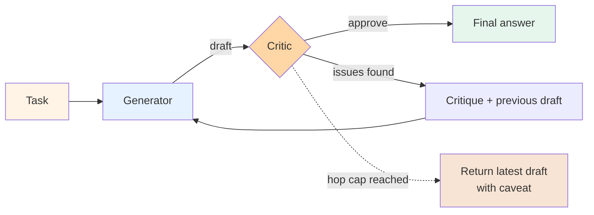

# Pattern 07 — Reflection / self-correction

> 🟢 Stable · ⏱ ~12 min · 📍 The architecture-level catalog page for the generate-critique-revise loop. Anthropic's [Building Effective Agents](https://www.anthropic.com/research/building-effective-agents) (December 2024) names this the "evaluator-optimizer" workflow.

## Intent

A generator produces a draft; a critic evaluates it against criteria; if the critic finds issues, the draft goes back to the generator with the critique attached; the loop repeats until the critic approves or a hop cap is reached. Two roles, one task, depth-first iteration on quality. The pattern earns its place when the first answer is usually almost-right but not quite — when iteration improves output more than re-rolling does.

## Diagram



Two LLM roles, possibly the same model with different prompts. The generator focuses on producing; the critic focuses on finding faults. The loop's exit conditions: critic approves (success), hop cap reached (degraded success, return with caveat), or critic-says-unfixable (failure, escalate).

The pattern's defining tension is the [Huang et al. ICLR 2024 result](https://arxiv.org/abs/2310.01798): LLMs cannot reliably self-correct reasoning errors using purely intrinsic capabilities. The generator and critic, when they're the same model, share the same blind spots. Reflection works when the critic has *external* signal — unit tests, retrieval grounding, a different model, a calibrated rubric — not when it's just "ask the model if it's confident."

## When to use

- **The first answer is usually almost-right.** Code generation, writing, structured output where the failure mode is "small fix needed" rather than "fundamentally wrong direction." Per [Reflexion (Shinn et al., NeurIPS 2023)](https://arxiv.org/abs/2303.11366), code generation hits 91% pass@1 on HumanEval with GPT-4 + reflection vs 80% baseline — the ~10% absolute gain comes from catching small bugs the first pass would miss.
- **You have an objective evaluator.** Unit tests for code, schema validators for structured output, a citation-checker for grounded writing, a retrieval-grounded judge for factual claims. The critic's signal needs to come from *outside* the generator's reasoning — otherwise you're catching errors with a tool that has the same blind spots that produced them. This is the [coherence trap](https://zylos.ai/research/2026-05-12-agent-self-correction-reflexion-to-prm) the 2026 self-correction literature names explicitly.
- **Correctness matters more than latency.** The pattern is 2-3× the cost of single-pass generation; production deployments use it on high-stakes outputs (production code commits, customer-facing legal/medical text) and skip it on bulk tasks where the first pass is good enough. Per [byteiota March 2026](https://byteiota.com/agent-orchestration-frameworks-2026-openai-ruflo-swarms/), the broader multi-agent cost range is 5-20× single-agent — reflection sits at the low end because it's depth (two roles) not breadth (many roles).

## When NOT to use

- **The generator and critic are the same model with no external grounding.** The [Huang et al. ICLR 2024 result](https://arxiv.org/abs/2310.01798) is the load-bearing finding: pure intrinsic self-correction does not reliably improve performance and sometimes degrades it. The 2026 Zylos Research [formalization](https://zylos.ai/research/2026-05-12-agent-self-correction-reflexion-to-prm) names this the "coherence trap" — iterative self-critique amplifies confidence without adding information. If your critic is "same model, no external signal," the pattern adds latency without adding correctness.
- **The first answer is usually fundamentally wrong.** Reflection refines; it doesn't redirect. If your failure mode is "the model misunderstood the task," critiquing the draft doesn't help — the draft was solving the wrong problem. Fix the prompt, the tool selection, or the decomposition (reach for [Pattern 06](./06-plan-and-execute.md) or [Pattern 03](./03-supervisor-workers.md)) before reaching for reflection.
- **You're being charged per token and cost is the constraint.** Reflection multiplies token spend by the number of iterations plus the critic's prompt. A task that runs reliably in single-pass at 4K input tokens runs in 12-15K tokens through three reflection cycles. On bulk workloads (millions of tasks per day), this markup dominates the bill.
- **The hop cap doesn't have a meaningful fallback.** Hop-cap-reached must have a graceful degradation path: return the latest draft with a caveat, escalate to human review, or fail loudly. Returning the partial silently as "the answer" hides the fact that the system tried multiple times and couldn't satisfy the critic.

## Implementation sketch

The minimum viable shape, framework-free Python. This is the architectural skeleton that Lab 11 (generator-critic) builds with full instrumentation.

```python
from dataclasses import dataclass
from typing import Optional

@dataclass
class CritiqueResult:
    """The critic's verdict on a draft."""
    approved: bool
    issues: list[str]
    score: Optional[float] = None  # for telemetry; not a routing signal

MAX_ITERATIONS = 4

def reflect_loop(task: str, generator_fn, critic_fn) -> tuple[str, list[CritiqueResult]]:
    """Run generate -> critique -> revise until approved or hop cap.

    Args:
        task: The original task description.
        generator_fn: Takes (task, previous_drafts, critiques) -> str (new draft).
        critic_fn: Takes (task, draft) -> CritiqueResult.

    Returns:
        (final_draft, full_critique_history). If hop cap reached, the last
        draft is returned with the unresolved critique attached.
    """
    drafts: list[str] = []
    critiques: list[CritiqueResult] = []

    for iteration in range(MAX_ITERATIONS):
        # Generate (or regenerate with context from prior critiques)
        draft = generator_fn(task, drafts, critiques)
        drafts.append(draft)

        # Critique
        verdict = critic_fn(task, draft)
        critiques.append(verdict)

        if verdict.approved:
            return draft, critiques

    # Hop cap reached — return latest draft with caveat
    return drafts[-1], critiques  # caller checks critiques[-1].approved
```

Three things to notice. First, the generator sees previous drafts and critiques — the loop is feedback-driven, not just re-rolling. Per the Reflexion paper, this verbal feedback ("the function fails on negative inputs") is meaningfully more informative than a binary fail-signal. Second, the critic is a separate callable — the pattern doesn't care whether it's an LLM, a unit-test runner, or a hand-written validator; the type contract is `(task, draft) -> CritiqueResult`. Third, the hop cap is non-negotiable: production deployments without one are an availability risk; the [Zylos 2026 formalization](https://zylos.ai/research/2026-05-12-agent-self-correction-reflexion-to-prm) names "correction budget" as a requirement, not a recommendation.

Common variations:

- **Self-Refine** (one-model variant): generator and critic are the same model with different prompts; works for narrow domains where intrinsic self-evaluation has signal (code with unit tests, structured output with schema validation) but fails on open-ended reasoning per the Huang 2024 result.
- **Reflexion** (verbal memory): the critique log persists across episodes; the agent learns from past failures across multiple invocations. Useful when the same kinds of errors recur — but adds state-management complexity.
- **LATS (Language Agent Tree Search)**: combines reflection with Monte Carlo tree search; the agent explores multiple reasoning paths simultaneously, evaluates them, and pursues the most promising. Per [Beancount April 2026](https://beancount.io/bean-labs/research-logs/2026/04/25/reflexion-language-agents-verbal-reinforcement-learning), this is the spiritual successor when correctness matters more than latency.
- **Process Reward Models (PRMs)**: a separately-trained model scores intermediate reasoning steps. Per [Zylos March 2026](https://zylos.ai/research/2026-03-06-ai-agent-reflection-self-evaluation-patterns), this is the production direction: PRMs decorrelate the critic's errors from the generator's, restoring the external-signal property the pattern depends on.

## Real-world examples

- **GitHub Copilot's "agent mode"** and **Cursor's auto-fix loop** use reflection on the editor side: the agent generates a code change, runs the unit tests, reads the failures, regenerates with the test output as feedback. The unit tests are the external evaluator that makes the pattern work — the critic's signal comes from outside the generator's reasoning.
- **Anthropic's deep research agent** uses an internal reflection loop on draft research summaries: a draft is generated; a critic checks citations against retrieved sources; uncited or unsupported claims trigger a regeneration. Citation-grounding is the external signal.
- **Constitutional AI's self-critique loop** (Anthropic, 2022) is the foundational example — an early production-scale reflection pattern where the critic applies a constitution of principles to outputs and the generator revises against those critiques.
- **The Reflexion paper itself** (Shinn et al., NeurIPS 2023) reports 91% HumanEval pass@1 (up from 80% baseline) on Python code generation with GPT-4. The same paper notes a structural failure on WebShop (a shopping-task benchmark): when the failure mode is "the agent explored the wrong part of a large search space," verbal critique can't redirect exploration. The pattern works when the critique can produce a crisp, actionable signal.
- Per [Zylos March 2026](https://zylos.ai/research/2026-03-06-ai-agent-reflection-self-evaluation-patterns), production 2026 deployments increasingly layer reflection with diverse evaluators (different model families critiquing each other) to decorrelate blind spots — pure single-model self-correction is treated as a starter pattern, not a production endpoint.

## Tradeoffs

| Dimension | Cost |
|---|---|
| **Latency** | 2-4× single-pass generation. Each iteration adds one generator call + one critic call; the typical 3-iteration loop runs ~6 LLM calls vs 1 for single-pass. |
| **Cost** | 2-4× single-pass token spend. Refined by reflection's hit rate: if the loop converges in 1 iteration for 50% of tasks and 3 iterations for the other 50%, average cost is ~2×. Tasks that frequently hit the hop cap can be 5× or worse — the hop cap protects availability, not cost. |
| **Reliability** | Highly dependent on the critic's signal quality. With an external evaluator (unit tests, schema validators, retrieval-grounded judge) and diverse-model critics, gains are real (the Reflexion 10-point HumanEval lift). With a same-model self-critic and no external signal, gains are unreliable and sometimes negative (the Huang 2024 result). |
| **Complexity** | Modest. Two prompts (generator and critic) plus the loop. Production complexity comes from instrumentation: per-iteration tracing, hop-cap telemetry, divergence detection (the same critique repeating without resolution is a signal to escalate). |
| **Failure modes** | (1) The coherence trap: same-model critic agrees with same-model generator on subtly-wrong reasoning; iterations polish but don't correct. (2) Cycle without convergence: critic flags issue A, generator fixes A but introduces B, critic flags B, generator fixes B but reintroduces A. (3) Hop-cap silent failures: production code returns the unapproved final draft without flagging that the loop didn't converge. (4) Critic over-eagerness: a too-strict critic prevents convergence on tasks that are already good enough. |

The cost curve compounds: longer tasks → more iterations needed → cost grows super-linearly with input complexity. Per [Zylos May 2026](https://zylos.ai/research/2026-05-12-agent-self-correction-reflexion-to-prm), production deployments measure "iterations to convergence" as a first-class metric; tail iterations beyond 4 hops correlate with task-misfit (the pattern was the wrong choice) rather than with task difficulty.

## Related patterns

- **[Pattern 01 — Single-agent tool use](./01-single-agent-tool-use.md)** — what reflection wraps. The simplest composition is "Pattern 01 + Pattern 07": the agent loop runs to completion, then the critic runs on the output, then back into the loop if needed. Effective when the agent loop reliably produces almost-right answers.
- **[Pattern 03 — Supervisor + workers](./03-supervisor-workers.md)** — what reflection composes inside. A supervisor's worker can itself be a reflection loop; the supervisor sees only the converged output, not the iteration history. This is the canonical writing-team shape: the editor worker is a reflection loop on the drafter's output.
- **[Pattern 06 — Plan-and-execute](./06-plan-and-execute.md)** — composes by wrapping the executor. Each step's output goes through a critic before being committed to `completed` — the planner doesn't see iteration noise. Effective when the plan is fixed but each step's execution benefits from refinement.
- **Pattern 08 — Agentic RAG** (planned; `patterns/08-agentic-rag.md`) — the natural external evaluator for reflection on factual outputs. The critic retrieves and verifies citations; the generator regenerates against the retrieval grounding.
- **[Pattern 10 — Human-in-the-loop](./10-human-in-the-loop.md)** — the right fallback for hop-cap-reached. When reflection can't converge, escalate to human review rather than returning the partial silently.

## References

**Foundational**:
- Shinn, N. et al. (NeurIPS 2023), *[Reflexion: Language Agents with Verbal Reinforcement Learning](https://arxiv.org/abs/2303.11366)* — the canonical paper; three-component architecture (Actor / Evaluator / Self-Reflection); 91% HumanEval pass@1 vs 80% baseline; the WebShop failure noting that verbal critique can't redirect exploration
- Huang, J. et al. (ICLR 2024), *[Large Language Models Cannot Self-Correct Reasoning Yet](https://arxiv.org/abs/2310.01798)* — the critical counterpoint; pure intrinsic self-correction does not reliably improve performance; the result that grounds the "needs external evaluator" framing
- Anthropic (December 2024), *[Building Effective Agents](https://www.anthropic.com/research/building-effective-agents)* — names this the "evaluator-optimizer" workflow; the production-discipline framing that pairs the pattern with measurement

**2026 production analysis**:
- Zylos Research (March 2026), *[AI Agent Reflection and Self-Evaluation Patterns](https://zylos.ai/research/2026-03-06-ai-agent-reflection-self-evaluation-patterns)* — the maturity arc from "ask the model if it's confident" to PRMs and multi-evaluator setups; production-deployment patterns
- Zylos Research (May 2026), *[Agent Self-Correction: From Reflexion to Process Reward Models](https://zylos.ai/research/2026-05-12-agent-self-correction-reflexion-to-prm)* — the information-theoretic formalization of the coherence trap; the "correction budget" framing that hop caps operationalize
- Beancount Labs (April 2026), *[Reflexion: Language Agents That Learn from Mistakes](https://beancount.io/bean-labs/research-logs/2026/04/25/reflexion-language-agents-verbal-reinforcement-learning)* — production-perspective re-reading of the Reflexion paper; the WebShop failure deep-dive
- MLPills (January 2026), *[DIY #19 — Evaluator-Optimiser LLM Workflow Pattern](https://mlpills.substack.com/p/diy-19-evaluator-optimiser-llm-agent)* — code-first walkthrough of the pattern; the breadth-vs-depth framing that contrasts evaluator-optimizer with orchestrator-worker

**Adjacent repo content**:
- 🏛 [Pattern 01 — Single-agent tool use](./01-single-agent-tool-use.md) — what reflection most naturally wraps
- 🏛 [Pattern 03 — Supervisor + workers](./03-supervisor-workers.md) — what reflection composes inside (as a worker's internal loop)
- 🏛 [Pattern 06 — Plan-and-execute](./06-plan-and-execute.md) — composes via wrapped executor; each step's output goes through a critic
- 🏛 [Pattern 10 — Human-in-the-loop](./10-human-in-the-loop.md) — the right fallback when reflection can't converge
- 🛣 [Path 03 — Multi-Agent Systems](../learning-paths/03-multi-agent-systems/) — Module 4 (worker patterns) covers the per-worker reflection composition
- 🧪 [Lab 11 — Generator-critic from scratch](../labs/11-generator-critic-from-scratch/) — builds the bare-Python reflection loop with instrumentation
- 📖 [`concepts/agents/multi-agent-systems.md`](../concepts/multi-agent/what-is-a-multi-agent-system.md) — places reflection in the broader topology taxonomy
