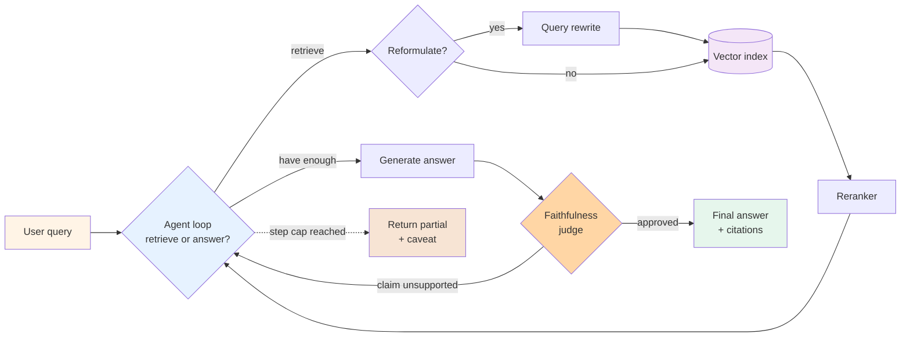

# Pattern 08 — Agentic RAG

> 🟡 Active churn · ⏱ ~12 min · 📍 The architecture-level companion to [Path 02 (Agentic RAG)](../learning-paths/02-agentic-rag/) and [`concepts/rag/retrieval-as-a-tool.md`](../concepts/rag/retrieval-as-a-tool.md). The agent decides whether to retrieve, what to retrieve, when to stop. Frame is stable; tool surface (vector DBs, rerankers, faithfulness judges) moves quickly.

## Intent

The agent treats retrieval as a tool — one of several it can choose to call — rather than as a fixed pre-step before generation. Each turn the agent decides: do I have enough grounding to answer, or do I need to search again, or do I need to search differently? The loop runs until the agent has enough evidence or hits a step budget. The pattern earns its place when single-pass retrieval misses — multi-hop questions, queries needing query reformulation, or domains where a faithfulness judge needs to gate the final answer.

## Diagram



Three things distinguish agentic RAG from classic RAG. First, the retrieve-or-answer decision is made by the model per turn, not by the pipeline once. Second, retrieval can run multiple times with reformulated queries — the agent reads the first results, identifies what's still missing, and searches again. Third, a faithfulness judge can send the answer back to retrieval if claims aren't grounded.

Each of these adds cost — typically 3-10× the tokens and 2-5× the latency of one-pass RAG per [MarsDevs April 2026](https://www.marsdevs.com/guides/agentic-rag-2026-guide). The trade is reliability on hard questions for cost on easy ones. A well-tuned agentic RAG routes easy questions through 1 retrieve and hard questions through 4.

## When to use

- **Multi-hop questions.** "Which of our 2024 customers based in EMEA had >50 seats and used the API feature?" needs intersection across multiple retrievals — customer list, region filter, seat count, feature usage. Classic RAG retrieves once and the LLM struggles to compose the answer from chunks it didn't ask for. Agentic RAG retrieves each filter separately, then synthesizes.
- **Ambiguous or under-specified queries.** "How do I fix my login?" without product context can mean a dozen things; classic RAG retrieves chunks for all of them. Agentic RAG can search broadly first, identify the ambiguity, ask a clarifying question (or commit to the most likely interpretation), then retrieve precisely.
- **High-stakes faithfulness requirements.** Legal, medical, financial summarization where every claim must trace to a source. A faithfulness judge in the loop catches ungrounded claims and triggers re-retrieval; classic RAG generates ungrounded text confidently and silently. Per [FutureAGI 2026](https://futureagi.com/blog/agentic-rag-systems-2025/), this is the primary reason high-stakes domains move from classic to agentic RAG despite the cost.
- **Tool diversity matters.** Beyond vector search: BM25 keyword search, SQL queries over structured data, web search for current events, internal API calls. Agentic RAG lets the agent pick the right retrieval surface per question; classic RAG forces every question through the same vector index.

## When NOT to use

- **Single-fact lookups.** "What's the price of Plan B?" needs one retrieval, one chunk, one generation. Wrapping that in a multi-step agentic loop adds 3-10× cost for zero accuracy benefit — the first retrieval was always going to be enough. Per the [MarsDevs 2026 guide](https://www.marsdevs.com/guides/agentic-rag-2026-guide), "FAQ bots or single-fact lookups" are the explicit anti-fit.
- **The retrieval surface is already good enough.** If single-pass retrieval hits ≥85% accuracy in eval, agentic RAG's gains are bounded by the marginal hard-question subset — typically 5-10 percentage points of accuracy at 3-5× the cost. The economic case has to come from those hard questions being disproportionately valuable (compliance failures, lost customers) — not from blanket accuracy improvement.
- **You can't measure faithfulness.** The pattern's reliability advantage depends on the judge actually catching ungrounded claims. If your judge is the same model that generated the answer (no decorrelation), you're in the [Pattern 07 coherence trap](./07-reflection.md) — the judge approves what the generator produced because they share blind spots. Reach for diverse-model judges or skip the judge step entirely.
- **The corpus changes fast.** Agentic RAG accumulates retrieval state across turns. When the underlying corpus changes mid-conversation (a document was edited; a record was deleted), reused retrievals can be stale. Set short retrieval-cache TTLs or skip caching entirely; the cost markup may eat the latency benefit.

## Implementation sketch

The shape: agent loop where retrieval is one tool of several. Pseudocode is framework-free; production deployments use LangGraph, LlamaIndex Workflows, or the OpenAI Agents SDK to handle state.

```python
from typing import Optional
from dataclasses import dataclass

MAX_RETRIEVAL_HOPS = 5

@dataclass
class RetrievalResult:
    chunks: list[str]
    sources: list[str]  # for citation provenance
    query: str           # the actual query used (possibly rewritten)


def retrieve_tool(query: str, k: int = 5) -> RetrievalResult:
    """Hybrid retrieval + reranking. The agent calls this; it doesn't see the index."""
    rewritten = rewrite_query(query)
    bm25_hits = bm25_search(rewritten, k=k * 2)
    vector_hits = vector_search(rewritten, k=k * 2)
    fused = reciprocal_rank_fusion(bm25_hits, vector_hits)
    top_k = reranker(rewritten, fused, top_k=k)
    return RetrievalResult(
        chunks=[h.text for h in top_k],
        sources=[h.source_url for h in top_k],
        query=rewritten,
    )


def faithfulness_judge(answer: str, retrieved_chunks: list[str]) -> dict:
    """Returns {"approved": bool, "unsupported_claims": list[str]}.
    Use a different model family than the generator for decorrelation."""
    return judge_llm(answer, retrieved_chunks)


def agentic_rag_loop(user_query: str) -> tuple[str, list[str]]:
    """The agent loop. Retrieval is a tool; the agent decides when to call it."""
    messages = [{"role": "user", "content": user_query}]
    retrieved_state: list[RetrievalResult] = []

    for hop in range(MAX_RETRIEVAL_HOPS):
        response = llm_call(
            messages=messages,
            tools=[retrieve_tool_schema, finalize_answer_schema],
        )

        if response.stop_reason == "tool_use" and response.tool_name == "retrieve_tool":
            result = retrieve_tool(**response.tool_input)
            retrieved_state.append(result)
            messages.append({"role": "tool", "content": result.chunks})
            continue

        if response.stop_reason == "tool_use" and response.tool_name == "finalize_answer":
            draft_answer = response.tool_input["answer"]
            all_chunks = [c for r in retrieved_state for c in r.chunks]
            verdict = faithfulness_judge(draft_answer, all_chunks)
            if verdict["approved"]:
                citations = list({s for r in retrieved_state for s in r.sources})
                return draft_answer, citations
            # Claims unsupported — push back into the loop with the critique
            messages.append({
                "role": "user",
                "content": f"Judge flagged unsupported claims: {verdict['unsupported_claims']}. "
                           f"Either retrieve more evidence or revise the answer.",
            })

    # Hop cap reached — return latest answer with caveat
    return draft_answer + "\n\n[Partial — exceeded retrieval budget; some claims unverified.]", []
```

Four things to notice. First, the retrieval tool encapsulates query rewrite + hybrid search + rerank — the agent sees a single `retrieve_tool(query)` interface and doesn't reason about retrieval internals. Second, the faithfulness judge runs only on `finalize_answer`, not per retrieval — gating the answer, not the chunks. Third, the hop cap (`MAX_RETRIEVAL_HOPS = 5`) is non-negotiable; production deployments without one risk runaway retrieval loops. Fourth, on judge rejection, the loop continues — the agent can either retrieve more or revise; the verdict's critique becomes part of the context.

Per [FutureAGI 2026](https://futureagi.com/blog/agentic-rag-systems-2025/), five sub-patterns recur in production agentic RAG. A real system uses 3-4 of them, rarely all 5:

1. **Query rewrite** — the user query is rarely what the retriever wants; the agent reformulates before searching.
2. **Hybrid retrieval** — BM25 + vector in parallel, fused with Reciprocal Rank Fusion (RRF) or a learned combiner. Per the [Lushbinary 2026 RAG production guide](https://lushbinary.com/blog/rag-retrieval-augmented-generation-production-guide/), naive vector-only retrieval fails ~40% of the time in production; hybrid retrieval closes most of that gap.
3. **Reranking** — top-k retrieval candidates re-scored by a cross-encoder; expensive but high-leverage.
4. **Iterative retrieval** — multi-hop; the agent reads results and searches again.
5. **Self-check / faithfulness judge** — gate the final answer; route ungrounded claims back into retrieval.

## Real-world examples

- **ChatGPT Deep Research** and **Claude Deep Research** use agentic RAG as their inner loop — the deep-research mode is [Pattern 09 (Deep research)](./09-deep-research.md) wrapping multiple agentic RAG calls. The retrieval surface is web search; the rest of the structure (multi-hop, query rewrite, citation grounding) is canonical agentic RAG.
- **Perplexity** is agentic RAG with web search as the primary retrieval surface and iterative refinement based on initial result quality.
- **GitHub Copilot Chat with codebase context** uses agentic RAG over the repository — the agent decides whether to search for symbol definitions, search file contents, or read the current selection.
- **Production legal-research and medical-summarization deployments** per [MarsDevs April 2026](https://www.marsdevs.com/guides/agentic-rag-2026-guide) are the canonical high-stakes-domain examples; the cost premium (3-10× tokens) is justified by faithfulness requirements that classic RAG can't meet.
- **The 2026 framework consensus**: [MarsDevs April 2026](https://www.marsdevs.com/guides/agentic-rag-2026-guide) names LangGraph + LlamaIndex Workflows + Ragas + Phoenix + Langfuse as the production default stack (LangGraph for stateful control flow; LlamaIndex Workflows for retrieval-heavy single-pipeline agentic; Ragas + Phoenix + Langfuse for evaluation). [VentureBeat Q1 2026 RAG infrastructure tracker](https://venturebeat.com/data/context-architecture-is-replacing-rag-as-agentic-ai-pushes-enterprise-retrieval-to-its-limits) reports buyer intent for hybrid retrieval tripled from 10.3% to 33.3% Jan→March 2026.

## Tradeoffs

| Dimension | Cost |
|---|---|
| **Latency** | 2-5× one-pass RAG per [MarsDevs 2026](https://www.marsdevs.com/guides/agentic-rag-2026-guide). Each retrieval hop adds one LLM-call + retrieval-call roundtrip. Typical production: median 2 hops, p95 4 hops, p99 hits the cap. |
| **Cost** | 3-10× one-pass RAG tokens. The cost curve is bimodal: easy questions (1 hop) are ~1.5× one-pass; hard questions (4-5 hops + judge) can be 8-10× — and the hard-question tail dominates token spend in production. Cap-hitting requests cost the most for the least benefit. |
| **Reliability** | Ceiling-raising for hard questions; flat-to-slightly-negative for easy ones. The 40% retrieval-failure rate of naive RAG ([Lushbinary 2026](https://lushbinary.com/blog/rag-retrieval-augmented-generation-production-guide/)) is the structural argument; agentic RAG closes a meaningful chunk of that gap on hard questions at the cost of overshooting on easy ones. |
| **Complexity** | Substantial step up from classic RAG. ~400-800 lines of orchestration code (LangGraph) plus evaluation infrastructure. The complexity is in the eval pipeline (which questions are hard? which retrievals were the cap-hitters?), not in the core loop. |
| **Failure modes** | (1) Retrieval thrashing — agent keeps retrieving with minor query variants without converging. (2) Judge correlation — same-family generator and judge approve each other's mistakes (the [Pattern 07 coherence trap](./07-reflection.md)). (3) Context window pollution — accumulating retrievals across hops blows the context window; need a context-budget policy. (4) Cap-hit silent partials — production code returns the partial without flagging the unmet faithfulness check. |

The cost curve has a sharp inflection at "is the retrieval surface good enough for one-pass?" — below that threshold agentic RAG earns its cost; above it, agentic RAG often loses to one-pass + ranking improvements. Measure retrieval recall@k before assuming agentic RAG is the right answer.

## Related patterns

- **[Pattern 01 — Single-agent tool use](./01-single-agent-tool-use.md)** — the structural skeleton. Agentic RAG is Pattern 01 where retrieval is one of the tools and a faithfulness judge gates the final answer. Composes naturally.
- **[Pattern 03 — Supervisor + workers](./03-supervisor-workers.md)** — composes when retrieval needs to fan out. Supervisor delegates "search SQL data" and "search vector index" to specialist workers in parallel; aggregates results.
- **[Pattern 06 — Plan-and-execute](./06-plan-and-execute.md)** — the alternative when the retrieval plan is known upfront. Plan-and-execute commits to "retrieve A, retrieve B, synthesize"; agentic RAG decides per-turn what to retrieve next. Use plan-and-execute when the structure is predictable; agentic RAG when it isn't.
- **[Pattern 07 — Reflection / self-correction](./07-reflection.md)** — the faithfulness judge is a Pattern 07 critic. Production deployments use Pattern 08 + Pattern 07 together: the judge IS the reflection critic, retrieval IS the external evaluator signal that makes the critic decorrelated.
- **[Pattern 09 — Deep research](./09-deep-research.md)** — Pattern 08 scaled to long-running research tasks. Deep research wraps multiple agentic RAG sessions across decomposed sub-questions, with citation provenance threading through.
- **[Pattern 10 — Human-in-the-loop](./10-human-in-the-loop.md)** — natural composition for cap-hit cases. When the loop hits its retrieval budget without satisfying the judge, escalate to human review instead of returning silently.

## References

**Foundational**:
- Lewis et al. (NeurIPS 2020), *[Retrieval-Augmented Generation for Knowledge-Intensive NLP Tasks](https://arxiv.org/abs/2005.11401)* — the original RAG paper; the foundation classic and agentic RAG both build on
- Anthropic (December 2024), *[Building Effective Agents](https://www.anthropic.com/research/building-effective-agents)* — frames retrieval as an agent tool; the architectural shift from "RAG is a pipeline" to "RAG is a tool the agent uses"

**2026 production guides**:
- FutureAGI (2026), *[Agentic RAG: Developer Guide to Smarter Retrieval](https://futureagi.com/blog/agentic-rag-systems-2025/)* — the five sub-patterns (query rewrite, hybrid retrieval, reranking, iterative retrieval, self-check); the faithfulness-judge-gates-the-answer architecture
- MarsDevs (April 2026), *[Agentic RAG: The 2026 Production Guide](https://www.marsdevs.com/guides/agentic-rag-2026-guide)* — the 3-10× token cost / 2-5× latency tradeoff; production stack consensus (LangGraph + LlamaIndex Workflows + Ragas + Phoenix + Langfuse); when NOT to go agentic
- Heeya (May 2026), *[Agentic RAG: The 2026 Enterprise Implementation Guide](https://heeya.fr/en/blog/agentic-rag-implementation-enterprise-2026)* — the five implementation patterns; framework comparison (LangGraph vs LlamaIndex vs managed)
- Lushbinary (April 2026), *[RAG Production Guide 2026](https://lushbinary.com/blog/rag-retrieval-augmented-generation-production-guide/)* — the 40% naive-RAG-retrieval-failure baseline; hybrid retrieval as the primary remediation; production patterns and gotchas
- VentureBeat (May 2026), *[Context architecture is replacing RAG as agentic AI pushes enterprise retrieval to its limits](https://venturebeat.com/data/context-architecture-is-replacing-rag-as-agentic-ai-pushes-enterprise-retrieval-to-its-limits)* — Q1 2026 RAG infrastructure tracker; hybrid retrieval adoption tripled Jan→March 2026
- FreeAcademy (2026), *[Agentic RAG Explained: AI Agents + RAG in 2026](https://freeacademy.ai/blog/agentic-rag-ai-agents-supercharge-retrieval-2026)* — the five-part production stack framing

**Adjacent repo content**:
- 🏛 [Pattern 01 — Single-agent tool use](./01-single-agent-tool-use.md) — the agent-loop foundation
- 🏛 [Pattern 03 — Supervisor + workers](./03-supervisor-workers.md) — fans out parallel retrieval
- 🏛 [Pattern 06 — Plan-and-execute](./06-plan-and-execute.md) — when the retrieval plan is predictable upfront
- 🏛 [Pattern 07 — Reflection / self-correction](./07-reflection.md) — the faithfulness-judge sub-pattern
- 🏛 [Pattern 09 — Deep research](./09-deep-research.md) — Pattern 08 scaled to long-running multi-stage research
- 🏛 [Pattern 10 — Human-in-the-loop](./10-human-in-the-loop.md) — escalation when the loop can't satisfy the judge
- 🛣 [Path 02 — Agentic RAG](../learning-paths/02-agentic-rag/) — the dedicated learning path
- 🧪 [Lab 06 — Agentic RAG from scratch](../labs/06-agentic-rag-from-scratch/) — builds this pattern end-to-end
- 🧪 [Lab 13 — Multi-agent RAG from scratch](../labs/13-multi-agent-rag-from-scratch/) — agentic RAG inside a supervisor-worker topology
- 📖 [`concepts/rag/retrieval-as-a-tool.md`](../concepts/rag/retrieval-as-a-tool.md) — the conceptual companion; the shift from pipeline to tool
- 📖 [`concepts/rag/what-is-rag.md`](../concepts/rag/what-is-rag.md) — classic RAG baseline
- 📖 [`concepts/rag/hybrid-search.md`](../concepts/rag/hybrid-search.md) — the BM25 + vector + RRF building block
- 📖 [`concepts/rag/reranking.md`](../concepts/rag/reranking.md) — the cross-encoder reranking step
- 📖 [`concepts/rag/query-rewriting.md`](../concepts/rag/query-rewriting.md) — the query-rewrite sub-pattern
