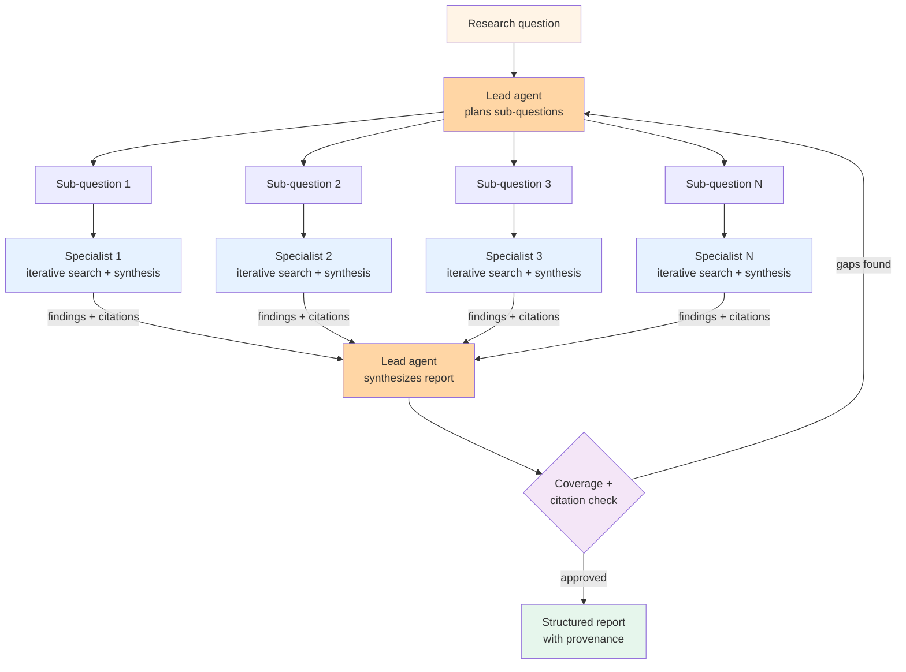

# Pattern 09 — Deep research

> 🟡 Active churn · ⏱ ~12 min · 📍 The architecture-level catalog page for the deep-research agent shape that ChatGPT Deep Research, Claude Deep Research, Gemini Deep Research, and Perplexity Pro all instantiate. Composes [Pattern 03 (Supervisor + workers)](./03-supervisor-workers.md) + [Pattern 06 (Plan-and-execute)](./06-plan-and-execute.md) + [Pattern 07 (Reflection)](./07-reflection.md) + [Pattern 08 (Agentic RAG)](./08-agentic-rag.md) into a single application class.

## Intent

The agent takes a high-level question, decomposes it into sub-questions, dispatches each to a specialist sub-agent that performs iterative search + synthesis with citation provenance, then aggregates the sub-agents' outputs into a structured citation-rich report. Long-running by design (minutes to hours, not seconds), token-heavy (50× to 250× a single Q&A), and explicitly trades latency for breadth-of-evidence-plus-grounding.

The pattern earns its place when the answer needs to compose evidence across many sources and the user is willing to wait for a structured report rather than a streamed chat reply. It does not earn its place on questions that admit a single-source answer.

## Diagram



Three structural choices distinguish deep research from simpler agentic RAG. First, the lead agent owns *planning* — explicit decomposition into sub-questions, not on-the-fly retrieval decisions. Second, specialists run *independently in parallel* — no shared state during the research phase; coordination is at decomposition and synthesis only. Third, the loop can replan — if the synthesis judge finds coverage gaps, the lead agent can dispatch follow-up sub-questions before finalizing. Per [ByteByteGo December 2025](https://blog.bytebytego.com/p/how-openai-gemini-and-claude-use), Anthropic's, OpenAI's, and Perplexity's production deep-research systems all share this lead-plus-parallel-specialists architecture.

## When to use

- **Research-shaped questions.** "What's the regulatory landscape for autonomous-vehicle insurance in EU and California?" decomposes naturally into ~6 sub-questions (EU framework, California framework, comparison, recent enforcement actions, industry response, gap analysis). Each sub-question is independently researchable; the value is in the synthesis.
- **The user is willing to wait minutes to hours.** Production deep-research systems run 5-30 minutes typical; Gemini Deep Research Max can run hours per [MindStudio April 2026](https://www.mindstudio.ai/blog/google-gemini-deep-research-max-api). This is async UX — kick off the task, get notified, read the report. If the user expects a chat-speed response, this is the wrong pattern.
- **Citation provenance matters.** The structured output is "claim → source URL → quote" provenance for every claim. Without that, the pattern's main value (composed evidence with audit trail) collapses. Production systems route every finding through citation grounding; the synthesis judge specifically checks for uncited claims.
- **The cost premium is justified.** Deep-research runs typically consume 50× to 250× the tokens of a single Q&A — a $0.10 question becomes a $5-25 research session. Worth it for high-stakes legal/financial/medical analysis, due-diligence research, competitive intelligence. Not worth it for chatbot-grade questions; the cost premium would dominate the product economics within weeks.

## When NOT to use

- **The answer fits in a single source.** "What does our quarterly report show for Q3 revenue?" is a one-document lookup. Deep research will spend 20× the tokens decomposing, searching, and synthesizing what was always going to be the same number from the same PDF. Reach for [Pattern 08 (Agentic RAG)](./08-agentic-rag.md) or even classic RAG.
- **Latency is the constraint.** Streaming UX, interactive chat, anything where the user is watching a cursor blink. Deep-research is async by design; forcing it into an interactive flow either ruins the UX or undermines the pattern's depth.
- **You don't have a faithfulness gate.** The pattern's value collapses without per-claim citation grounding. If your synthesis step just generates a summary from sub-agent outputs without checking every claim against a source, you're spending 100× the tokens of classic RAG to get a longer hallucination. The judge step is structural, not optional.
- **The sub-question decomposition is unstable.** If the lead agent's first decomposition is wrong (misses the user's actual need), the entire research run is misdirected. Production deployments mitigate this with a planning-confirmation step — the user reviews the decomposition before specialists kick off. If you can't surface that confirmation in your UX, the misdirection failure mode bites hard.

## Implementation sketch

The shape: lead agent for plan + synthesis, specialist agents for per-sub-question search-and-synthesize, parallel dispatch, citation-tracking throughout. Production deployments use LangGraph for state, but the architectural skeleton is framework-free.

```python
import asyncio
from dataclasses import dataclass

MAX_SUBQUESTIONS = 8
MAX_REPLANS = 2

@dataclass
class SubQuestionFindings:
    sub_question: str
    findings: str               # the specialist's synthesized answer
    citations: list[dict]       # [{"claim": str, "source_url": str, "quote": str}, ...]


def lead_plan(user_question: str, prior_findings: list[SubQuestionFindings] = None) -> list[str]:
    """Lead agent decomposes the question into sub-questions.
    On replan, the prior findings inform what's still uncovered."""
    return lead_llm_call(
        system=LEAD_PLANNER_PROMPT,
        user=user_question,
        prior=prior_findings or [],
        response_model=list[str],  # sub-questions
        max_items=MAX_SUBQUESTIONS,
    )


async def specialist_research(sub_question: str) -> SubQuestionFindings:
    """Specialist runs iterative agentic-RAG-shape on the sub-question.
    Returns synthesized findings + per-claim citations."""
    # This is Pattern 08 — agentic RAG with iterative retrieval + faithfulness judge
    findings, citations = await agentic_rag_loop(sub_question)
    return SubQuestionFindings(
        sub_question=sub_question,
        findings=findings,
        citations=citations,
    )


def coverage_judge(
    user_question: str,
    sub_findings: list[SubQuestionFindings],
    draft_report: str,
) -> dict:
    """Check whether the synthesis covers the original question and every claim is cited.
    Returns {"approved": bool, "gaps": list[str], "uncited_claims": list[str]}."""
    return judge_llm(user_question, sub_findings, draft_report)


async def deep_research(user_question: str) -> tuple[str, list[dict]]:
    """Full deep-research loop. Multi-hour wall-clock for hard questions."""
    all_findings: list[SubQuestionFindings] = []

    for replan in range(MAX_REPLANS + 1):
        sub_questions = lead_plan(user_question, prior_findings=all_findings)

        # Parallel dispatch — each sub-question runs independently
        new_findings = await asyncio.gather(*[
            specialist_research(sq) for sq in sub_questions
        ])
        all_findings.extend(new_findings)

        # Lead agent synthesizes
        draft_report = lead_synthesize(user_question, all_findings)

        # Judge gates the report
        verdict = coverage_judge(user_question, all_findings, draft_report)
        if verdict["approved"]:
            citations = [c for f in all_findings for c in f.citations]
            return draft_report, citations

        # Gaps found — incorporate into next replan
        if verdict["gaps"] and replan < MAX_REPLANS:
            continue

        # Hit replan cap with unresolved gaps — return partial
        return draft_report + f"\n\n[Partial — {len(verdict['gaps'])} gaps unresolved]", []
```

Four things to notice. First, `lead_plan` runs once per replan loop, not per sub-question — the lead agent is the cheap coordinator; specialists are the token-heavy researchers. Second, sub-questions dispatch in parallel via `asyncio.gather` — this is where deep research gets its wall-clock advantage over sequential search (N sub-questions × T seconds each, not N×T total). Third, each specialist is itself a [Pattern 08 (Agentic RAG)](./08-agentic-rag.md) instance with its own retrieval-judge loop. Fourth, the coverage judge gates the report against the original question — not just per-claim faithfulness like Pattern 08, but coverage-of-the-asked-question.

Per [Microsoft's DRACO benchmark (Zhong et al., arXiv:2602.11685, February 2026)](https://techcommunity.microsoft.com/blog/microsoft365copilotblog/introducing-multi-model-intelligence-in-researcher/4506011), deep-research systems are evaluated on Accuracy, Completeness, and Objectivity across 100 complex research tasks spanning 10 domains. Microsoft's Researcher with Critique variant uses Council mode — Anthropic and OpenAI models run in parallel, each produces a standalone report, a judge model evaluates both and surfaces agreements + divergences. This is the same pattern with model-diversity at the specialist tier.

Production framework variants:

- **OpenAI Deep Research API** — `o3-deep-research-2025-06-26` model via the responses endpoint; `web_search_preview` and `code_interpreter` tools; `background=True` for async per the [OpenAI Cookbook deep-research intro](https://developers.openai.com/cookbook/examples/deep_research_api/introduction_to_deep_research_api).
- **Anthropic's Deep Research mode** — Claude with multi-step web search and verified source citations within a 200K-token context window.
- **Gemini Deep Research Max** — extended-iteration variant; "standard Deep Research might run 20-30 search iterations; Max can run significantly more, spending more time on edge cases" per [MindStudio April 2026](https://www.mindstudio.ai/blog/google-gemini-deep-research-max-api).
- **Open-source: DeerFlow** (ByteDance) — multi-agent research system with planning and execution loops; the open-source canonical implementation of this pattern.

## Real-world examples

- **OpenAI Deep Research** (February 2025 launch; Pro/Plus/Team/Enterprise/Edu monthly quotas per the [OpenAI announcement](https://openai.com/index/introducing-deep-research/)) — the consumer-facing canonical implementation. Powered by an o3 variant optimized for web browsing. February 2026 update added MCP integration and trusted-site restrictions.
- **Claude Deep Research** — Anthropic's parallel implementation; emphasizes verified source citations and the 200K-token context for assembling cross-source evidence.
- **Gemini Deep Research Max** — Google's variant; the Max designation runs longer iteration budgets (significantly more than the standard 20-30 search iterations); benchmarks well on multi-step reasoning per [MindStudio April 2026](https://www.mindstudio.ai/blog/google-gemini-deep-research-max-api).
- **Perplexity Deep Research / Perplexity Pro** — iterative information retrieval loop; per [ByteByteGo December 2025](https://blog.bytebytego.com/p/how-openai-gemini-and-claude-use), Perplexity uses a hybrid architecture that selects best underlying models for different parts of the task (one model for summarization, another for synthesis).
- **Microsoft Researcher (M365 Copilot)** — Council mode runs Anthropic and OpenAI models in parallel; judge synthesizes a distilled summary highlighting agreements and divergences. Benchmarked on DRACO per [Microsoft March 2026](https://techcommunity.microsoft.com/blog/microsoft365copilotblog/introducing-multi-model-intelligence-in-researcher/4506011).
- **Open-source canonical: DeerFlow** (ByteDance, Apache 2.0) — multi-agent research system with explicit planning + execution loops; the reference open-source implementation for teams building deep-research internally rather than buying.

## Tradeoffs

| Dimension | Cost |
|---|---|
| **Latency** | 5-30 minutes typical; up to hours for Gemini Deep Research Max. Async by design — incompatible with chat UX. Wall-clock dominated by sub-agent parallelism: N sub-questions × per-sub-question wall-clock (typically 30s-3min each) / parallelism factor. |
| **Cost** | 50× to 250× a single Q&A. Token spend dominated by per-specialist iterative retrieval; mitigated marginally by parallel dispatch (latency wins, but tokens stay) and meaningfully by specialist model choice (Haiku-class for narrow synthesis vs Sonnet/Opus for breadth). |
| **Reliability** | Best of any pattern for citation-grounded research IF the coverage judge is good. Production benchmarks per Microsoft DRACO show meaningful gains over single-pass research, but the gap shrinks when the question is well-scoped (suggesting deep research's main win is on under-specified or multi-faceted questions). |
| **Complexity** | Highest of any pattern in this catalog. 1000+ lines of orchestration code; production deployments need dedicated tracing (sub-agent traces × replans is a lot of spans), cost monitoring (the 250× cost variance bites if uncontrolled), and content moderation (long-running searches surface more edge content). |
| **Failure modes** | (1) Misdirected decomposition (the first plan misses the user's real need; all sub-agent work is wasted). (2) Citation hallucination (sub-agents synthesize plausible quotes that don't appear in retrieved sources). (3) Replan thrashing (judge keeps finding gaps that the next replan can't close). (4) Context-window collapse (assembling N sub-agent outputs for synthesis blows the lead's context). (5) Cost runaway (an under-specified question triggers maximum replans + maximum sub-questions × maximum hops = the 250× cost tail). Production deployments cap aggressively at every level. |

The pattern's economics are bimodal: cheap-and-fast questions are wasted on deep research (50× cost premium for ~0% accuracy gain); expensive-and-slow questions justify the pattern (the 50× cost premium buys the only correct answer). Production deployments measure question-shape upfront (sentence count, ambiguity score, time-since-publication of likely sources) and route between Pattern 08 (cheap path) and Pattern 09 (expensive path) — itself a [Pattern 02 (Router)](./02-router.md) decision.

## Related patterns

- **[Pattern 08 — Agentic RAG](./08-agentic-rag.md)** — what each specialist is. Deep research is N parallel Pattern 08 instances coordinated by a lead agent with a coverage judge on top. The two patterns compose; Pattern 08 is the natural fallback when the question doesn't justify the full deep-research price.
- **[Pattern 03 — Supervisor + workers](./03-supervisor-workers.md)** — the coordination skeleton. The lead agent is the supervisor; specialists are workers. The structural difference is that deep research's workers run async-parallel iterative-RAG loops, not the synchronous tool calls Pattern 03 typically dispatches.
- **[Pattern 06 — Plan-and-execute](./06-plan-and-execute.md)** — the planning shape. The lead's first decomposition is a plan-and-execute plan; the replan loop is plan-and-execute's replanning policy. Pattern 09 inherits both.
- **[Pattern 07 — Reflection / self-correction](./07-reflection.md)** — the coverage judge is a Pattern 07 critic. Production deep-research systems use Pattern 07's diverse-model-critic guidance for the synthesis judge (Microsoft's Council mode runs Anthropic + OpenAI for exactly this reason).
- **[Pattern 02 — Router](./02-router.md)** — the upstream decision. Production deployments route between cheap path (Pattern 08) and expensive path (Pattern 09) by question shape; the router IS the cost-control gate.
- **[Pattern 10 — Human-in-the-loop](./10-human-in-the-loop.md)** — natural for planning confirmation. Production deep-research UX often surfaces the lead's first decomposition for user review before specialists dispatch — preventing misdirected research from burning the full cost budget.
- **[Pattern 04 — Hierarchical teams](./04-hierarchical-teams.md)** — the deep-research-of-deep-research case. When sub-questions are themselves research-shaped, specialists can be Pattern 09 instances rather than Pattern 08. Rare in 2026; mostly research demos.

## References

**Foundational**:
- OpenAI (February 2025), *[Introducing deep research](https://openai.com/index/introducing-deep-research/)* — the launch post; the canonical product framing; powered by an o3 variant optimized for web browsing; February 2026 update adds MCP and trusted-site restrictions
- ByteByteGo (December 2025), *[How OpenAI, Gemini, and Claude Use Agents to Power Deep Research](https://blog.bytebytego.com/p/how-openai-gemini-and-claude-use)* — the cross-vendor architecture comparison; lead-plus-parallel-specialists shape; Perplexity hybrid model selection; Anthropic's parallel sub-agents per topic angle

**2026 production sources**:
- OpenAI Cookbook, *[Introduction to deep research in the OpenAI API](https://developers.openai.com/cookbook/examples/deep_research_api/introduction_to_deep_research_api)* — `o3-deep-research-2025-06-26`; responses endpoint; `web_search_preview` + `code_interpreter` tools; `background=True` for async
- MindStudio (April 2026), *[Google Gemini Deep Research Max](https://www.mindstudio.ai/blog/google-gemini-deep-research-max-api)* — iterative-refinement loop; "Max" runs significantly more iterations; the iterative-search-catches-disputes argument
- Microsoft (March 2026), *[Introducing multi-model intelligence in Researcher](https://techcommunity.microsoft.com/blog/microsoft365copilotblog/introducing-multi-model-intelligence-in-researcher/4506011)* — DRACO benchmark (Zhong et al., arXiv:2602.11685, February 2026); Council mode (Anthropic + OpenAI in parallel); Researcher with Critique variant
- Wikipedia, *[ChatGPT Deep Research](https://en.wikipedia.org/wiki/ChatGPT_Deep_Research)* — quota structures; the "lightweight" o4-mini fallback for exceeded allowances
- *[Awesome AI Agents 2026](https://github.com/ARUNAGIRINATHAN-K/awesome-ai-agents-2026)* — catalog of deep-research implementations (ChatGPT, Claude, DeerFlow, Gemini, Perplexity Pro, Perplexity Personal Computer)

**Open-source canonical implementations**:
- ByteDance, *[DeerFlow](https://github.com/ARUNAGIRINATHAN-K/awesome-ai-agents-2026)* — Apache 2.0 multi-agent research system with planning and execution loops
- *[milkymap/anthropic-deep-research](https://github.com/milkymap/anthropic-deep-research)* — open deep iterative research using Anthropic + OpenAI; streaming + tool-system + agent-loop

**Adjacent repo content**:
- 🏛 [Pattern 03 — Supervisor + workers](./03-supervisor-workers.md) — the coordination skeleton
- 🏛 [Pattern 06 — Plan-and-execute](./06-plan-and-execute.md) — the planning + replan loop
- 🏛 [Pattern 07 — Reflection / self-correction](./07-reflection.md) — the coverage-judge critic role
- 🏛 [Pattern 08 — Agentic RAG](./08-agentic-rag.md) — what each specialist is
- 🏛 [Pattern 02 — Router](./02-router.md) — the upstream cost-control gate (Pattern 08 cheap path vs Pattern 09 expensive path)
- 🏛 [Pattern 10 — Human-in-the-loop](./10-human-in-the-loop.md) — planning confirmation before specialists dispatch
- 🛣 [Path 02 — Agentic RAG](../learning-paths/02-agentic-rag/) — the retrieval-side learning path
- 🛣 [Path 03 — Multi-Agent Systems](../learning-paths/03-multi-agent-systems/) — the orchestration-side learning path
- 📖 [`concepts/rag/retrieval-as-a-tool.md`](../concepts/rag/retrieval-as-a-tool.md) — the underlying retrieval-tool framing
- 📖 [`concepts/multi-agent/what-is-a-multi-agent-system.md`](../concepts/multi-agent/what-is-a-multi-agent-system.md) — the multi-agent topology framing
