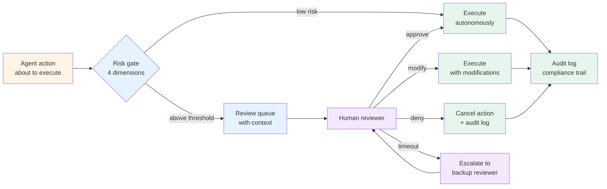

# Pattern 10 — Human-in-the-loop

> 🟢 Stable · ⏱ ~13 min · 📍 The architecture-level companion to compliance and safety work across the curriculum. References [`security/README.md`](../security/) for the safety framing.

## Intent

Pause the agent's execution at defined decision points for human review, approval, or override. Used when an action's irreversibility, blast radius, compliance exposure, or model confidence cross a defined threshold. The pattern's primary purpose isn't to slow the agent down — it's to put a human's authority on actions that *legally or operationally must* have one.

## Diagram



The four dimensions of the risk gate, per [myengineeringpath.dev March 2026](https://myengineeringpath.dev/genai-engineer/human-in-the-loop/):

1. **Irreversibility** — can this action be undone? Delete-database is irreversible; create-draft is reversible.
2. **Blast radius** — how many users/records/dollars does this affect? Updating one user's preference is small; bulk-sending to 50,000 users is large.
3. **Compliance exposure** — does this action create legal, regulatory, or contractual obligations? Medical advice, financial recommendations, legal guidance, contractual commitments.
4. **Confidence** — how certain is the agent? A well-calibrated confidence below threshold is a reliable HITL signal.

These four dimensions combine into a routing decision: actions above any threshold route to human review; actions below all thresholds execute autonomously. The thresholds are calibrated per-deployment against the organization's error-cost data.

## When to use

- **The action is high-risk on any of the four dimensions.** Sending external communications at scale, mutating production data, executing financial transactions, dispatching legal commitments. Per [Anna Jey April 2026](https://medium.com/@arvisionlab/human-in-the-loop-ai-agents-how-to-add-approvals-escalation-and-safe-autonomy-in-production-0a21e359781c): "review the decision, not the entire run" — HITL pays for itself when *one* decision crosses the threshold, not when every step does.
- **Compliance requires demonstrable human oversight.** The EU AI Act's August 2, 2026 deadline mandates that high-risk AI systems be designed with human-machine interfaces enabling effective oversight by natural persons per [Article 14](https://galileo.ai/blog/human-in-the-loop-agent-oversight). California's SB-833 adds state-level requirements by July 1, 2026. NIST AI RMF names HITL as a core risk management strategy. For systems in healthcare, credit, employment, or critical infrastructure, HITL is moving from best-practice to legal requirement.
- **You need an audit trail for accountability.** "What did the agent do, why did it do it, who approved it, when, with what rationale" — the audit log is the pattern's compliance artifact. Without HITL, you have agent decisions; with HITL, you have a defensible record. Per [Strata.io May 2026](https://www.strata.io/blog/agentic-identity/practicing-the-human-in-the-loop/): the goal is "a corpus of sessions showing trained humans exercising real authority with traceable rationale."
- **Confidence-calibrated routing improves precision over blanket review.** Don't route everything to a human; route only what crosses the threshold. Per [Prefactor April 2026](https://prefactor.tech/learn/enforcing-human-in-the-loop-controls): "naive HITL implementations create bottlenecks — every action queued for approval, reviewers overwhelmed with low-risk decisions, and agents stalling while humans are unavailable."

## When NOT to use

- **The decision boundary is unclear.** If you can't articulate what makes an action "high risk," approval logic becomes "random exceptions" per [Anna Jey April 2026](https://medium.com/@arvisionlab/human-in-the-loop-ai-agents-how-to-add-approvals-escalation-and-safe-autonomy-in-production-0a21e359781c). Define the risk tiers explicitly before adding the gate.
- **You're using it to compensate for a bad agent.** HITL doesn't fix an unreliable agent; it adds friction to a working one. If 80% of agent actions trigger human review, the answer isn't more reviewers — it's a better agent or a smaller scope.
- **The human's review can't add signal.** Don't queue actions for human review when the human can't actually evaluate them. A reviewer who sees only the final action without context can't make a meaningful decision; the pattern degrades to rubber-stamping.
- **Asynchronous review breaks the workflow.** For interactive flows where the user is waiting (real-time chat, live assistant), synchronous human approval may not be feasible. Per [Galileo April 2026](https://galileo.ai/blog/human-in-the-loop-agent-oversight): "synchronous patterns provide maximum control with latency penalties, asynchronous patterns maintain speed with delayed detection." Pick the pattern that matches the workflow.

## Implementation sketch

A risk-tiered approval gate, framework-free Python. The gate computes a risk score across the four dimensions and routes accordingly:

```python
from typing import Literal, Optional
from pydantic import BaseModel
from dataclasses import dataclass

class ActionRisk(BaseModel):
    """The four-dimension risk profile of an action."""
    irreversibility: Literal["reversible", "partially_reversible", "irreversible"]
    blast_radius: int  # affected users / records
    compliance_tier: Literal["none", "low", "medium", "high"]
    agent_confidence: float  # 0.0 to 1.0

class ApprovalDecision(BaseModel):
    status: Literal["approved", "modified", "denied", "escalated", "timed_out"]
    reviewer_id: Optional[str]
    rationale: str
    modifications: Optional[dict] = None
    timestamp: str
    audit_id: str

@dataclass
class RiskPolicy:
    """The deployment-specific risk thresholds.

    Calibrate these against your error-cost data. Defaults are
    placeholders; production deployments adjust each per-action-type.
    """
    irreversibility_requires_approval: bool = True  # always for irreversible
    blast_radius_threshold: int = 100               # 100+ users → approval
    compliance_tiers_require_approval: set = frozenset({"medium", "high"})
    confidence_threshold: float = 0.85              # below → approval

def needs_human_review(risk: ActionRisk, policy: RiskPolicy) -> bool:
    """Risk gate: any threshold crossed → route to human."""
    if risk.irreversibility == "irreversible" and policy.irreversibility_requires_approval:
        return True
    if risk.blast_radius >= policy.blast_radius_threshold:
        return True
    if risk.compliance_tier in policy.compliance_tiers_require_approval:
        return True
    if risk.agent_confidence < policy.confidence_threshold:
        return True
    return False

async def execute_with_hitl(
    action: dict,
    risk: ActionRisk,
    policy: RiskPolicy,
    review_queue: "ReviewQueue",
    audit_log: "AuditLog",
) -> dict:
    """Execute an action, gating through HITL when warranted."""
    if not needs_human_review(risk, policy):
        result = await execute_action(action)
        audit_log.record(action=action, decision="auto_executed", risk=risk)
        return result

    # Queue for human review with full context
    decision = await review_queue.submit_and_wait(
        action=action,
        risk=risk,
        context=extract_decision_context(action),
        timeout_seconds=300,
    )
    audit_log.record(action=action, decision=decision, risk=risk)

    if decision.status == "approved":
        return await execute_action(action)
    elif decision.status == "modified":
        return await execute_action({**action, **decision.modifications})
    elif decision.status == "denied":
        return {"status": "cancelled", "reason": decision.rationale}
    elif decision.status == "timed_out":
        return await handle_timeout(action, decision, policy)
    elif decision.status == "escalated":
        return await escalate_to_backup_reviewer(action, decision)
```

The audit log is the pattern's compliance artifact. The minimum useful fields per the EU AI Act Article 14 framing: action, decision, reviewer identity, rationale, timestamp, risk profile, audit ID. Production deployments add: reviewer's session ID, model version, policy version, prior actions in the same task. Per [Elementum AI March 2026](https://www.elementum.ai/blog/human-in-the-loop-agentic-ai): "treat compliance as an architectural feature, with audit trails, decision logs, and role-based access built into your workflow orchestration engine."

## Real-world examples

- **Financial-trading agents** route trades above $X to human approval; below they execute autonomously. The threshold is dollar-amount but also confidence — a low-confidence small trade may still require review.
- **Customer-support automation** routes refunds above the auto-approval limit and any policy-edge case to human review. The agent handles 70-80% of cases autonomously; HITL covers the rest.
- **Code-generation agents (Claude Code, Cursor, Codex CLI)** ask for human approval before destructive operations (file deletion, git push to main, irreversible refactors). The "always confirm" mode is HITL applied universally.
- **Healthcare diagnostic agents** route diagnoses to physician review by regulation — the EU AI Act's high-risk category for healthcare AI per [Galileo April 2026](https://galileo.ai/blog/human-in-the-loop-agent-oversight).
- **LangGraph's `interrupt()` function** is the framework-native expression of HITL — a checkpoint in the graph where execution pauses for external input.

## Tradeoffs

| Dimension | Cost |
|---|---|
| **Latency** | Reviewer-bound. P50 review time depends on reviewer SLA — minutes for human-in-the-loop, hours-to-days if escalated. Mitigation: route only above-threshold actions; auto-execute the rest. |
| **Cost** | Reviewer time. Per the Prefactor framing: "tier the reviewer pool — junior reviewer for tier-1 actions, senior reviewer for tier-2, compliance officer for tier-3." A flat reviewer queue burns budget on low-risk reviews. |
| **Reliability** | Higher per-decision reliability when reviewers are well-trained and have context; lower when reviewers rubber-stamp due to volume or fatigue. Per [Strata.io May 2026](https://www.strata.io/blog/agentic-identity/practicing-the-human-in-the-loop/): "automation bias" is the canonical failure mode — reviewers approve because the agent suggested it. Mitigation: challenge-and-response approval interfaces. |
| **Complexity** | Moderate. Risk gate logic, review queue infrastructure, reviewer UI, audit log persistence, timeout/escalation policy. Production deployments typically use a workflow engine (Temporal, Prefect) for the durable-state requirements. |
| **Failure modes** | Bottleneck under load (reviewers overwhelmed; agent stalls); rubber-stamping (reviewer approves without real evaluation); context starvation (reviewer can't make informed decision); audit-log gaps (decision recorded but not enough context to defend later); reviewer-unavailability cascades. |

The pattern's core trade is latency for accountability. For the actions that warrant it, latency is the right cost to pay; for actions that don't, blanket HITL is the wrong default.

## Related patterns

- **[Pattern 01 — Single-agent tool use](./01-single-agent-tool-use.md)** — HITL composes by gating specific tool calls. The agent loop pauses before high-risk tool calls; resumes after approval.
- **[Pattern 03 — Supervisor + workers](./03-supervisor-workers.md)** — HITL composes at the supervisor level. The supervisor's `needs_escalation` status routes to a human; workers continue autonomously below threshold.
- **[Pattern 06 — Plan-and-execute](./06-plan-and-execute.md)** — pre-execution plan approval is the canonical HITL gate. The plan is inspectable; the human reviews the whole sequence before any step runs.
- **[Pattern 12 — A2A federation](./12-a2a-federation.md)** — A2A's `input-required` task state is the cross-organizational expression of HITL. A remote agent can pause to request human input; the client routes that request to its own review queue.

## References

**Specification and compliance**:
- EU AI Act Article 14 — human oversight requirements; August 2, 2026 enforcement deadline for high-risk systems
- California SB-833 — state-level AI oversight; July 1, 2026 deadline
- NIST AI Risk Management Framework — names HITL as core risk-management strategy

**2026 production grounding**:
- Galileo (April 2026), *[How to Build Human-in-the-Loop Oversight for AI Agents](https://galileo.ai/blog/human-in-the-loop-agent-oversight)* — the four-dimensional framing; EU AI Act Article 14 compliance
- myengineeringpath.dev (March 2026), *[Human-in-the-Loop Patterns for AI Agents (2026)](https://myengineeringpath.dev/genai-engineer/human-in-the-loop/)* — risk-tier matrix; durable state; reviewer interface; audit trail
- redis.io (April 2026), *[AI Human in the Loop: Production Oversight Patterns](https://redis.io/blog/ai-human-in-the-loop/)* — runtime approval gates; confidence-based escalation; state persistence as the linchpin
- Prefactor (April 2026), *[Enforcing Human-in-the-Loop Controls for AI Agents](https://prefactor.tech/learn/enforcing-human-in-the-loop-controls)* — risk-based policy engine; reviewer routing; time limits and escalation
- Anna Jey / Medium (April 2026), *[Human-in-the-Loop AI Agents: How to Add Approvals, Escalation, and Safe Autonomy in Production](https://medium.com/@arvisionlab/human-in-the-loop-ai-agents-how-to-add-approvals-escalation-and-safe-autonomy-in-production-0a21e359781c)* — review-the-decision-not-the-run framing
- Strata.io (May 2026), *[Practicing the Human-in-the-Loop](https://www.strata.io/blog/agentic-identity/practicing-the-human-in-the-loop/)* — challenge-and-response approval; automation-bias mitigation; audit trail for compliance
- Elementum AI (March 2026), *[Human-in-the-Loop Agentic AI: When You Need Both](https://www.elementum.ai/blog/human-in-the-loop-agentic-ai)* — compliance-as-architectural-feature framing
- waxell.ai (April 2026), *[Human-in-the-Loop vs Human-on-the-Loop for AI Agents](https://www.waxell.ai/blog/human-in-the-loop-vs-human-on-the-loop-ai-agents)* — taxonomy of oversight positions

**Adjacent repo content**:
- 🔒 [`security/README.md`](../security/README.md) — defense-in-depth principles HITL extends
- 📖 [`concepts/agents/agent-loop.md`](../concepts/agents/agent-loop.md) — the loop mechanics HITL pauses
- 📖 [`concepts/tools/tool-design.md`](../concepts/tools/tool-design.md) — tool risk classification feeds the HITL gate
- 🛣 [Path 07 — Production and Safety](../learning-paths/07-production-and-safety/) — the path where HITL is developed for production deployment (scaffold; planned content)
