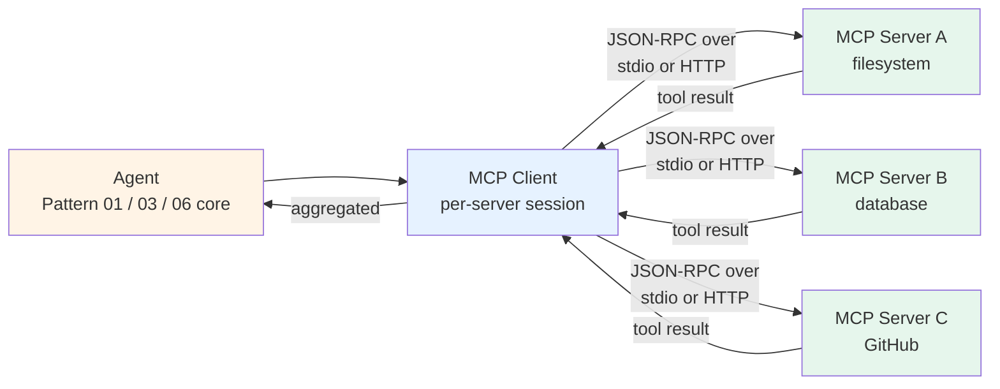

# Pattern 11 — MCP integration

> 🟢 Stable · ⏱ ~12 min · 📍 The architecture-level companion to [Path 04 Modules 1+2](../learning-paths/04-tool-protocols-mcp-a2a/) shipped in Batch 43. Implemented in [Lab 25](../labs/25-mcp-server-from-scratch/).

## Intent

Cross-process tool access via the Model Context Protocol. Agents call external tools served by MCP-compliant servers; the MCP client handles transport, capability discovery, and the JSON-RPC wire format. Replaces N×M bespoke integrations (every agent × every tool) with N+M (each agent speaks MCP once; each tool exposes MCP once).

## Diagram



The agent's core loop is unchanged from the underlying pattern (Pattern 01, 03, 06, or others). What changes is the *tool boundary*: instead of in-process Python functions, tools live in other processes — potentially on other machines, written in other languages, owned by other teams.

## When to use

- **You need the same tool from multiple agents.** A PostgreSQL query tool used by your customer-support agent, your sales-assist agent, and your internal analytics agent shouldn't be three separate `psycopg` wrappers. Expose it once via MCP; all three clients connect to the same server. Per [dev.to April 2026](https://dev.to/x4nent/complete-guide-to-mcp-model-context-protocol-in-2026-architecture-implementation-and-4a11), this is the dominant 2026 adoption driver.
- **The tool is owned by a different team or vendor.** Internal: another team maintains the document-search service and exposes it via MCP; you consume it without touching their code. External: Anthropic's filesystem MCP server, GitHub's official MCP server, etc. — 10,000+ public servers under Linux Foundation governance per truthifi.com May 2026.
- **The tool needs to be language-agnostic.** Your agent is in Python; the tool team writes Rust. MCP's JSON-RPC wire format means they don't have to ship a Python binding; you don't have to read their Rust code.
- **The tool will be reused across host applications.** Claude Desktop, Cursor, Codex CLI, and your custom agent SDK all speak MCP. Expose a tool once; it works in all of them.

## When NOT to use

- **The tool is single-use and you'll never reuse it.** Wrapping `def get_weather(city: str)` in an MCP server for one agent's exclusive use adds a JSON-RPC indirection layer with no payoff. Use the in-process function (Pattern 01) and graduate to MCP if a second agent ever needs the same tool.
- **You need sub-millisecond tool latency.** MCP's JSON-RPC indirection adds 5-50ms per call depending on transport (stdio fastest; Streamable HTTP slower). For high-frequency tools inside a tight loop (e.g., a numeric solver called 1000× per agent turn), keep them in-process.
- **The tool needs streaming output as it runs.** MCP supports sampling and notifications, but tool results aren't streamed — a search tool returning 10K rows blocks until all rows are serialized. Workarounds exist (chunked resources, paginated tool results) but they're conventions, not protocol features.
- **The agent's full task fits in a single tight loop with no need for tool reuse.** Pattern 01 with in-process tools is the lowest-overhead architecture; don't pay MCP's indirection cost without the reuse payoff.

## Implementation sketch

The client side — connecting an agent to an MCP server:

```python
from fastmcp import Client

async def run_with_mcp(user_prompt: str, server_path: str) -> str:
    """A Pattern 01 agent that talks to one MCP server instead of in-process tools.

    Args:
        user_prompt: The user's task.
        server_path: Path to an MCP server (local .py file → stdio, http://... → HTTP).

    Returns:
        The final answer.
    """
    async with Client(server_path) as mcp_client:
        # Discover what tools the server exposes
        mcp_tools = await mcp_client.list_tools()
        tool_schemas = [
            convert_mcp_to_llm_schema(t) for t in mcp_tools
        ]

        messages = [{"role": "user", "content": user_prompt}]

        for step in range(MAX_STEPS):
            response = llm_call(messages=messages, tools=tool_schemas)

            if response.stop_reason == "end_turn":
                return response.content[0].text

            messages.append({"role": "assistant", "content": response.content})

            tool_results = []
            for block in response.content:
                if block.type == "tool_use":
                    # The key line: tool execution goes through MCP, not local Python
                    result = await mcp_client.call_tool(
                        block.name,
                        block.input,
                    )
                    tool_results.append({
                        "type": "tool_result",
                        "tool_use_id": block.id,
                        "content": str(result.data),
                    })
            messages.append({"role": "user", "content": tool_results})

        return "[max steps reached]"
```

Compare with [Pattern 01](./01-single-agent-tool-use.md)'s sketch — the loop is identical; only the tool-execution line changes from in-process `tools[block.name]` invocation to `await mcp_client.call_tool(block.name, block.input)`. That symmetry is the whole point of MCP: the pattern above the tool layer doesn't change.

The server side — exposing a tool via MCP — is documented in [`concepts/tools/building-an-mcp-server.md`](../concepts/tools/building-an-mcp-server.md) and built end-to-end in [Lab 25](../labs/25-mcp-server-from-scratch/).

## Real-world examples

- **Anthropic's official MCP servers** — filesystem, GitHub, Slack, Google Drive, PostgreSQL — are the reference implementations used by Claude Desktop's default integrations.
- **The 10,000+ community servers** in the MCP registry per truthifi.com May 2026 cover everything from vector databases to CI systems to email providers.
- **Cursor and Claude Code** use MCP for their code-search and editor-integration tools. The same MCP server can be wired to either host without modification.
- **Anthropic's [Building Effective Agents](https://www.anthropic.com/research/building-effective-agents)** doesn't name MCP by name (the post predates the launch by a month) but the "orchestrator-worker pattern" it describes is exactly what MCP standardized for the tool layer six weeks later.

## Tradeoffs

| Dimension | Cost |
|---|---|
| **Latency** | +5-50ms per tool call vs in-process. stdio transport adds minimal overhead; Streamable HTTP adds network round-trip. For sub-second tools, MCP's overhead is a small fraction; for 1ms tools it's prohibitive. |
| **Cost** | Token cost unchanged from the underlying pattern. Operational cost adds: server hosting (HTTP transport), per-server auth provisioning, OTel-spans-per-call observability. |
| **Reliability** | Trade-off: gains *vendor reliability* (well-maintained official servers), loses *failure-domain isolation* (a misbehaving MCP server can stall the agent loop). Production deployments add client-side timeouts (~10s per tool call) and circuit-breakers on repeated failures. |
| **Complexity** | Lower at the *integration* layer (one MCP client speaks to all tools), higher at the *operations* layer (servers to deploy, sessions to manage, tokens to rotate, OTel spans to wire). |
| **Failure modes** | Server downtime (the server's process crashed); schema drift (server updated its tool surface; client cached stale `tools/list`); auth-token expiry; session state loss on server restart; rate limits at the MCP layer. |

## Related patterns

- **[Pattern 01 — Single-agent tool use](./01-single-agent-tool-use.md)** — Pattern 11 is Pattern 01 with the tool boundary moved out-of-process. The loop above the boundary is identical.
- **[Pattern 03 — Supervisor + workers](./03-supervisor-workers.md)** — supervisor-worker patterns combine with MCP cleanly: each worker gets its own MCP client connection to its own server. The supervisor doesn't know or care that tools are out-of-process.
- **[Pattern 12 — A2A federation](./12-a2a-federation.md)** — the complementary protocol. MCP is agent-to-tool (vertical); A2A is agent-to-agent (horizontal). Per [dev.to March 2026](https://dev.to/pockit_tools/mcp-vs-a2a-the-complete-guide-to-ai-agent-protocols-in-2026-30li), the most common 2026 confusion is treating them as competitors. They compose: production multi-agent systems use both.

## References

**Specification and ecosystem**:
- Anthropic (November 2024), *[Introducing the Model Context Protocol](https://www.anthropic.com/news/model-context-protocol)* — the launch announcement
- The official MCP specification at [modelcontextprotocol.io](https://modelcontextprotocol.io)
- [github.com/modelcontextprotocol](https://github.com/modelcontextprotocol) — the official organization
- [github.com/prefecthq/fastmcp](https://github.com/prefecthq/fastmcp) — FastMCP, the framework powering ~70% of MCP servers

**2026 production grounding**:
- dev.to (April 2026), *[Complete Guide to MCP in 2026](https://dev.to/x4nent/complete-guide-to-mcp-model-context-protocol-in-2026-architecture-implementation-and-4a11)* — 97M monthly SDK downloads; production-deployment patterns
- truthifi.com (May 2026), *[State of MCP 2026](https://truthifi.com/education/state-of-mcp-2026-ai-agents-custom-connectors)* — 10,000+ active public servers; Linux Foundation governance
- dev.to (March 2026), *[MCP vs A2A: The Complete Guide](https://dev.to/pockit_tools/mcp-vs-a2a-the-complete-guide-to-ai-agent-protocols-in-2026-30li)* — protocol-separation framing
- a2a-mcp.org (March 2026), *[MCP 2026 Roadmap](https://a2a-mcp.org/blog/mcp-2026-roadmap)* — H2 2026 priorities including Server Cards
- digitalapplied.com (March 2026), *[AI Agent Protocol Ecosystem Map 2026](https://www.digitalapplied.com/blog/ai-agent-protocol-ecosystem-map-2026-mcp-a2a-acp-ucp)* — MCP's 97M downloads; "MCP has effectively won the agent-to-tool layer"

**Adjacent repo content**:
- 🛣 [Path 04 — Tool Protocols (MCP + A2A)](../learning-paths/04-tool-protocols-mcp-a2a/) — the learning path where MCP is developed in depth
- 📖 [MCP foundations](../concepts/tools/mcp-foundations.md) — Module 1 concept page (protocol architecture, primitives, lifecycle, transports)
- 📖 [Building an MCP server](../concepts/tools/building-an-mcp-server.md) — Module 2 concept page (FastMCP 3.0, decorators, deployment)
- 🧪 [Lab 25 — MCP server from scratch](../labs/25-mcp-server-from-scratch/) — implementation lab
- 🧠 [MCP foundations and server quiz](../quizzes/foundations/mcp-foundations-and-server.md) — 8 questions across the two concept pages and Lab 25
