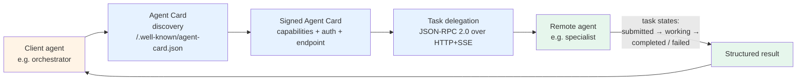

# Pattern 12 — A2A federation

> 🟢 Stable · ⏱ ~12 min · 📍 The architecture-level pattern. Implementation-level companions (concept pages + labs) ship as [Path 04 Modules 5-7](../learning-paths/04-tool-protocols-mcp-a2a/) — Modules 5 (A2A foundations), 6 (A2A endpoint at production depth), and 7 (MCP + A2A composition) operationalize this pattern with working code.

## Intent

Cross-agent task delegation via the Agent-to-Agent (A2A) protocol. A client agent discovers another agent's capabilities (via signed Agent Cards), formulates a task, delegates it, and receives a structured result. Replaces N×M bespoke agent integrations with N+M — each agent publishes its capabilities once; any A2A-compliant peer can delegate to it.

## Diagram



Three primitives: **Agent Cards** (JSON published at `/.well-known/agent-card.json` advertising what the agent can do, what auth it requires, and where to reach it); **Tasks** (the structured work units exchanged between client and remote agents with explicit lifecycle states); **Transport** (JSON-RPC 2.0 over HTTP+SSE — no new protocol layer required).

Per Google's [A2A launch announcement](https://developers.googleblog.com/en/a2a-a-new-era-of-agent-interoperability/) (April 2025) and the [Stellagent A2A explainer](https://stellagent.ai/insights/a2a-protocol-google-agent-to-agent) (April 2026), the v1.0 release in early 2026 added Signed Agent Cards — a cryptographic signature lets a receiving agent verify the card was actually issued by the domain owner, preventing card-forgery attacks.

## When to use

- **Cross-vendor agent coordination.** A Salesforce agent needs to delegate a sub-task to a ServiceNow agent. A Google Vertex agent coordinates with an AWS Bedrock agent. Without A2A, each pair needs custom integration code. With A2A, both agents speak the protocol and discover each other via Agent Cards. Per the [Linux Foundation April 2026 announcement](https://www.linuxfoundation.org/press/a2a-protocol-surpasses-150-organizations-lands-in-major-cloud-platforms-and-sees-enterprise-production-use-in-first-year), 150+ organizations now support the standard.
- **Cross-organizational delegation with auth boundaries.** A2A is the protocol-layer expression of *one agent delegates to another agent's authority*. The remote agent runs in its own organization's environment, with its own permissions, and returns only what its access scopes allow. A bespoke integration would require sharing credentials.
- **Long-running tasks with progress streaming.** A2A's task lifecycle (`submitted` → `working` → `input-required` → `completed` / `failed` / `canceled` / `rejected`) plus SSE streaming makes it the right shape for tasks that run minutes-to-hours. Per [dev.to April 2026](https://dev.to/agentsindex/googles-a2a-protocol-how-ai-agents-communicate-across-frameworks-52jj), a single A2A implementation can use sync, streaming, and asynchronous push-notification patterns depending on the task.
- **You need version negotiation across heterogeneous agents.** A2A's common semantic model lets two agents from different vendors negotiate which spec version they both support — so a v0.5 client can talk to a v1.0 server without breaking. This is the kind of compatibility that bespoke integrations never get right.

## When NOT to use

- **In-process multi-agent systems.** If your supervisor and workers all run in the same Python process, A2A's HTTP transport is pure overhead. Use the in-process supervisor-worker pattern from [Path 03 Module 1](../learning-paths/03-multi-agent-systems/) instead. A2A's payoff is across process and organizational boundaries.
- **Agent-to-tool access.** That's [Pattern 11 (MCP integration)](./11-mcp-integration.md). MCP is for connecting to *tools*; A2A is for connecting to *other agents*. Per [dev.to April 2026](https://dev.to/agentsindex/googles-a2a-protocol-how-ai-agents-communicate-across-frameworks-52jj), confusing them is "frequently observed and has consequences" — picking the wrong protocol means building the wrong abstraction.
- **You only delegate to one specific agent.** A2A's payoff scales with the number of remote agents you'd plausibly call. For a single dedicated downstream service, a typed REST API or gRPC is simpler and faster.
- **You need sub-100ms task delegation.** A2A adds Agent Card discovery + JSON-RPC + HTTP round-trip latency. The SSE streaming model is for long-running tasks; for snappy interactive flows, in-process supervisor-worker is the right shape.

## Implementation sketch

Client-side: discovering a remote agent and delegating a task. Pseudocode showing the protocol structure (not the full SDK surface, which varies by language):

```python
import httpx
import json

async def delegate_to_agent(
    agent_url: str,
    task_description: str,
    inputs: dict,
) -> dict:
    """Discover a remote agent, delegate a task, return the result.

    Args:
        agent_url: Root URL of the remote agent.
        task_description: Natural-language description of the task.
        inputs: Structured inputs the remote agent's capabilities accept.

    Returns:
        The task result, including completion state.
    """
    async with httpx.AsyncClient() as client:
        # 1. Discover the agent's capabilities via Agent Card
        card_response = await client.get(
            f"{agent_url}/.well-known/agent-card.json"
        )
        agent_card = card_response.json()

        # 2. (v1.0+) Verify the signed Agent Card cryptographically
        if not verify_signed_card(agent_card):
            raise SecurityError("Agent Card signature invalid")

        # 3. Submit the task via JSON-RPC
        task_endpoint = agent_card["endpoint"]
        submit_response = await client.post(
            task_endpoint,
            json={
                "jsonrpc": "2.0",
                "id": 1,
                "method": "tasks/submit",
                "params": {
                    "description": task_description,
                    "inputs": inputs,
                },
            },
            headers={"Authorization": f"Bearer {get_token_for(agent_card)}"},
        )
        task_id = submit_response.json()["result"]["task_id"]

        # 4. Stream progress via SSE until completion
        async with client.stream(
            "GET",
            f"{task_endpoint}/tasks/{task_id}/stream",
        ) as event_stream:
            async for line in event_stream.aiter_lines():
                if line.startswith("data: "):
                    event = json.loads(line[6:])
                    if event["state"] in ("completed", "failed", "canceled"):
                        return event["result"]
```

The remote-agent side — exposing an A2A endpoint — publishes a signed Agent Card at `/.well-known/agent-card.json` describing capabilities, authentication, and endpoint; implements the JSON-RPC `tasks/submit` and `tasks/{id}/stream` methods; manages the task lifecycle state machine.

Path 04 Modules 5-7 build this end-to-end with working code; Module 6 lands the JWS-RS256 signed-card cryptographic verification.

## Real-world examples

- **Google Vertex AI Agent Builder, AWS Bedrock Agents, Microsoft Copilot Studio** — all three major cloud platforms support A2A as of April 2026 per the [Linux Foundation announcement](https://www.linuxfoundation.org/press/a2a-protocol-surpasses-150-organizations-lands-in-major-cloud-platforms-and-sees-enterprise-production-use-in-first-year).
- **Supply chain, financial services, insurance, IT operations** — the verticals where A2A has the deepest production deployments. The recurring pattern: a workflow agent at the orchestration layer delegates to specialist agents owned by different teams or vendors, each with its own data access and approval rules.
- **AP2 extension** — the [Stellagent A2A explainer (April 2026)](https://stellagent.ai/insights/a2a-protocol-google-agent-to-agent) describes the AP2 (Agent Payments Protocol) extension that builds on A2A to add transaction primitives. Architecture pattern: the discovery + delegation shape is reusable for non-task domains.

## Tradeoffs

| Dimension | Cost |
|---|---|
| **Latency** | Agent Card discovery (1 HTTP roundtrip, cacheable); JSON-RPC task submission (1 roundtrip); SSE streaming for progress. Total: ~50-200ms per task setup; then bounded by remote agent's task duration. |
| **Cost** | Per-call cost is small (HTTP + JSON-RPC overhead). Real cost is operational: hosting Agent Card endpoints, managing Signed Agent Card issuance, OAuth 2.1 token rotation, SSE connection management, task lifecycle monitoring. |
| **Reliability** | Two failure domains: client-side (token expiry, network) and remote agent (its own failures). A2A's task lifecycle (`failed`, `canceled`, `rejected`) makes these explicit. Production deployments add client-side retry with exponential backoff and circuit breakers on repeated remote-agent failures. |
| **Complexity** | Higher than MCP at first contact (more protocol primitives, lifecycle states, signed-card verification). Lower than bespoke integration at scale (one protocol, all peers). |
| **Failure modes** | Signed Agent Card forgery (mitigated by v1.0's cryptographic verification); task lifecycle state confusion (client misreads `input-required` as a failure); auth boundary leakage (remote agent's results contain data the client agent shouldn't have); cross-vendor schema drift (Agent Card v1 vs v2 field renames). |

## Related patterns

- **[Pattern 11 — MCP integration](./11-mcp-integration.md)** — the complementary protocol. MCP is vertical (agent ↔ tools); A2A is horizontal (agent ↔ other agents). They compose: a production multi-agent system uses A2A for delegation between agents and MCP for each agent's tool access.
- **[Pattern 03 — Supervisor + workers](./03-supervisor-workers.md)** — A2A is the cross-organizational expression of supervisor-worker. When the supervisor and workers run in the same process, use Pattern 03; when they run across organizational boundaries, A2A is the protocol layer that makes Pattern 03 work across those boundaries.
- **[Pattern 10 — Human-in-the-loop](./10-human-in-the-loop.md)** — A2A's `input-required` task state pairs naturally with human-in-the-loop patterns. A remote agent can pause its task to request human approval; the client agent can route that request to its own human-review queue.

## References

**Specification and ecosystem**:
- Google (April 2025), *[Announcing the Agent2Agent Protocol (A2A)](https://developers.googleblog.com/en/a2a-a-new-era-of-agent-interoperability/)* — the launch announcement
- The [A2A specification site](https://google-a2a.github.io/A2A/)
- [github.com/google/A2A](https://github.com/google/A2A) — the official repository under Linux Foundation governance since June 2025

**2026 production grounding**:
- Linux Foundation (April 2026), *[A2A Protocol Surpasses 150 Organizations](https://www.linuxfoundation.org/press/a2a-protocol-surpasses-150-organizations-lands-in-major-cloud-platforms-and-sees-enterprise-production-use-in-first-year)* — adoption milestone; cloud platform integration; vertical deployments
- atlan.com (May 2026), *[Google A2A Protocol: How Agent-to-Agent Coordination Works](https://atlan.com/know/google-a2a-protocol/)* — Agent Card capability advertisement; task lifecycle; transport details
- stellagent.ai (April 2026), *[A2A Protocol Explained](https://stellagent.ai/insights/a2a-protocol-google-agent-to-agent)* — v1.0 changes (Signed Agent Cards, multi-tenancy); AP2 extension
- dev.to (April 2026), *[Google's A2A Protocol: How AI Agents Communicate Across Frameworks](https://dev.to/agentsindex/googles-a2a-protocol-how-ai-agents-communicate-across-frameworks-52jj)* — sync/streaming/asynchronous patterns; MCP-vs-A2A distinction; 150+ supporters by mid-2025
- programming-helper.com (April 2026), *[Agent to Agent Protocol 2026: Google's A2A Standard Takes Shape](https://www.programming-helper.com/tech/agent-to-agent-protocol-2026-google-a2a-standard)* — architectural considerations; capability manifest design

**Adjacent repo content**:
- 🛣 [Path 04 — Tool Protocols (MCP + A2A)](../learning-paths/04-tool-protocols-mcp-a2a/) — the learning path; Modules 5-7 implement A2A end-to-end (foundations + production depth + composition)
- 🏛 [Pattern 11 — MCP integration](./11-mcp-integration.md) — the complementary tool-layer protocol
- 📖 [MCP foundations § What MCP is not](../concepts/tools/mcp-foundations.md#what-mcp-is-not) — the MCP-is-not-A2A framing this pattern's "When NOT to use" extends
- 🛣 [Path 03 — Multi-Agent Systems](../learning-paths/03-multi-agent-systems/) — in-process multi-agent coordination; the architectural foundation A2A operates above the boundary of
