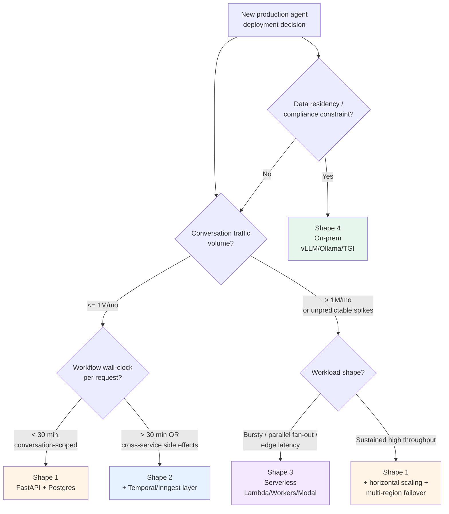

# Deployment patterns for production agents

> 🔴 Advanced · ⏱ ~35 min · 🛠 Verified 2026-05-29 · 📍 Read after Path 06 v1 (you need observability before you ship) + Path 03 Pattern 4 (cost budgeting) + Pattern 5 (retry policies)

## What this page is for

The going-to-prod playbook for stateful agent systems. You've built the agent; you've evaluated it; now you need to ship it without burning money, dropping mid-conversation state on a deploy, or discovering at 3am that a tool-call loop has burned through your quota.

This page covers four deployment shapes:

1. **FastAPI + Docker + PostgreSQL** — the default for self-hosted single-region deployments
2. **Durable execution layered under the agent** — LangGraph checkpointing + Temporal/Inngest for crash-recovery at the orchestration layer
3. **Serverless trade-offs** — when AWS Lambda / Cloudflare Workers / Modal are the right call, when they aren't
4. **On-prem and air-gapped deployments** — when data residency or network isolation drives the architecture

Each shape carries its own trade-offs around cold starts, state persistence, observability cost, and the operational discipline required to keep it running. The deeper concept-level material lives in [`production/`](./README.md) (this directory) and [`concepts/`](../concepts/); this page focuses on the *engineering decisions* the four shapes force.

What this page does **not** do is in section 7 (Anti-scope).

## The stateful agent problem

The fundamental tension: agents are stateful, long-running, and resumable; HTTP APIs are stateless, request-response, and fail-fast. Wrapping an agent in a basic Flask `POST /chat` handler is a common antipattern that ignores the actual shape of agent workloads — long tail latency, mid-execution failure recovery, mid-conversation memory, concurrent thread isolation. Per [Ranjan Kumar's February 2026 production-template walkthrough](https://ranjankumar.in/building-production-ready-ai-agent-services-fastapi-langgraph-template-deep-dive): "agents need memory across turns, resumable execution after failures, and observability into their decision chains; HTTP APIs expect millisecond responses, fail-fast semantics, and clean separation between requests."

Four properties define the difference:

1. **Long tail latency**: Agent responses span 2-30 seconds typical, with multi-step tasks reaching minutes. P95 latency budgets that work for traditional APIs (≤800ms per [Hivenet's 2026 checklist](https://www.hivenet.com/post/llm-production-checklist) for short prompts) don't apply.
2. **Mid-execution failure recovery**: A tool call failing on step 6 of an 8-step plan shouldn't restart from step 1. The right primitive is the *checkpoint*, not the *retry*.
3. **Conversation state across requests**: Turn N+1 needs the state from turn N — message history, accumulated tool outputs, intermediate reasoning. Statelessness at the API layer means state lives somewhere else.
4. **Concurrent thread isolation**: Two users in two different conversations must not see each other's state, even when their requests hit the same FastAPI process.

The right abstraction per the 2026 production literature ([Cordum April 2026](https://cordum.io/blog/temporal-vs-langgraph), [Zylos Research February 2026](https://zylos.ai/research/2026-02-17-durable-execution-ai-agents)) is **checkpointed state machines with async execution**: each agent is a state machine; each node transition is a checkpoint; state persists in PostgreSQL (or equivalent) between nodes; concurrent threads are keyed by `thread_id`.

## Shape 1 — FastAPI + Docker + PostgreSQL (the default)

The reference architecture for self-hosted single-region deployments handling up to ~100K-1M conversations/month per the [agentic-AI cost benchmarks](https://www.intuz.com/blog/top-5-ai-agent-frameworks-2025). The shape Wassim El Bakkouri's production template ships ([fastapi-langgraph-agent-production-ready-template, verified 2026-04-20](https://github.com/wassim249/fastapi-langgraph-agent-production-ready-template)) is essentially this.

### Components

```
┌──────────────────────────────────────────────────────────────┐
│ Client (web, mobile, API consumer)                           │
└────────────────────────┬─────────────────────────────────────┘
                         │ HTTPS
┌────────────────────────▼─────────────────────────────────────┐
│ Load balancer (nginx / cloud LB) — TLS termination           │
└────────────────────────┬─────────────────────────────────────┘
                         │
┌────────────────────────▼─────────────────────────────────────┐
│ FastAPI process (uvicorn, async event loop)                  │
│  - JWT auth + session management                             │
│  - Rate limiting (slowapi or equivalent)                     │
│  - Structured logging with thread_id / user_id / request_id  │
│  - LangGraph agent invocation                                │
│  - Streaming SSE for in-flight tokens                        │
└────────────────────────┬─────────────────────────────────────┘
                         │
        ┌────────────────┼────────────────┐
        │                │                │
┌───────▼─────┐  ┌───────▼──────┐  ┌──────▼─────────┐
│ PostgreSQL  │  │ Redis cache  │  │ Vector DB      │
│ (state +    │  │ (semantic +  │  │ (long-term     │
│  checkpoint)│  │  L1 query)   │  │  memory + RAG) │
└─────────────┘  └──────────────┘  └────────────────┘
```

The four backing stores serve four different concerns: PostgreSQL holds the checkpoint state (per-thread message history, intermediate state) plus relational data (users, sessions, audit log); Redis is the rate-limiting backend plus L1 cache for semantic deduplication; the vector DB serves long-term memory + RAG retrieval.

### When this shape fits

- Conversation traffic ≤ 1M conversations/month
- Single-region deployment is acceptable (no compliance requirement for multi-region failover)
- Team can operate a PostgreSQL instance + Redis + vector DB
- Crash recovery semantics of "resume from last checkpoint within the conversation" are sufficient (not "resume mid-tool-call after a 12-hour outage")

### Concrete recipe

The PostgreSQL checkpointing setup with LangGraph follows the [Use Apify March 2026 production-guide pattern](https://use-apify.com/blog/langgraph-agents-production):

```python
from langgraph.checkpoint.postgres import PostgresSaver
from contextlib import contextmanager

DB_URI = os.environ["POSTGRES_URI"]  # connection string from secrets manager

@contextmanager
def get_checkpointer():
    """Production: keep the connection pool open across requests."""
    with PostgresSaver.from_conn_string(DB_URI) as checkpointer:
        checkpointer.setup()  # idempotent; creates checkpoint tables if absent
        yield checkpointer

# In the FastAPI handler:
@app.post("/conversations/{thread_id}/messages")
async def post_message(thread_id: str, msg: MessageIn, user: User = Depends(get_current_user)):
    with get_checkpointer() as checkpointer:
        graph = build_agent_graph(checkpointer=checkpointer)
        config = {"configurable": {"thread_id": thread_id, "user_id": user.id}}
        result = await graph.ainvoke({"messages": [msg.content]}, config=config)
        return {"assistant_message": result["messages"][-1].content}
```

The `thread_id` is the load-bearing identifier: it's the checkpoint key, the conversation-history scope, and the concurrency-isolation boundary. Get it wrong (e.g., generating a new UUID per request instead of per conversation) and the agent loses all memory between turns.

### The five things this shape doesn't give you

What you have to build yourself on top of FastAPI + LangGraph + Postgres:

1. **JWT auth + session management** — FastAPI doesn't ship a session abstraction; add `fastapi-users` or roll your own with `python-jose` + Redis session store
2. **Rate limiting** — `slowapi` decorator at the route level; per-user limits keyed off `user_id`; per-tenant limits keyed off `tenant_id` if multi-tenant
3. **Structured logging with per-request context** — `structlog` with a context-var middleware that binds `request_id`, `thread_id`, `user_id` to every log line for the request's duration
4. **Retry-with-exponential-backoff on LLM calls** — `tenacity` wrapper on the LLM client; retry only on transient errors (429, 503), not on 4xx
5. **Multi-provider fallback** — if Anthropic returns 503, fall back to OpenAI for the same prompt; "circular-fallback LLM service" per the [El Bakkouri template](https://github.com/wassim249/fastapi-langgraph-agent-production-ready-template)

Skipping any of these five lands you in a 3am page. Most teams ship them in the order above; auth and rate limiting are non-negotiable before any external traffic.

### Docker packaging

The Dockerfile shape is uninteresting — pinned base image (Python 3.12-slim), `uv pip install -r requirements.txt`, non-root user, `CMD ["uvicorn", "app.main:app", "--host", "0.0.0.0"]`. The interesting choices are:

- **Multi-stage build**: separate `builder` stage (with build deps) from `runtime` stage (lean). Reduces image size from ~1.5 GB to ~400 MB typical.
- **`uv` over `pip`**: 10-100× faster install during build per the [PyInns April 2026 deployment guide](https://www.pyinns.com/python/llm-and-generative-ai/llm-deployment-fastapi-docker-uv-python-2026-complete-guide-best-practices). At image-rebuild speed, this matters for CI/CD iteration.
- **Health check baked in**: `HEALTHCHECK CMD curl --fail http://localhost:8000/health || exit 1`. The load balancer's health probe relies on the `/health` endpoint surface; the Dockerfile's `HEALTHCHECK` makes container-orchestrator-aware health visible too.
- **Resource limits set in `docker-compose.yml` / orchestrator manifest**: memory + CPU. LangGraph processes have a 150-250 MB base memory overhead plus 50-150 MB per concurrent execution per [AgentMarketCap's April 2026 framework benchmarks](https://agentmarketcap.ai/blog/2026/04/08/langgraph-vs-temporal-long-running-agent-workflows-2026); unbounded growth here is the most common OOM-kill source.

## Shape 2 — Durable execution layered under the agent

The argument for adding Temporal / Inngest / Hatchet / Cloudflare Workflows under the agent is straightforward: LangGraph's native checkpointing handles *crash recovery within a single graph execution*, but it doesn't handle *workflows that span days, multiple services, or guarantees beyond "best-effort resume from last checkpoint"*. Per [Cordum's April 2026 production-comparison guide](https://cordum.io/blog/temporal-vs-langgraph): "LangGraph already supports durable execution with checkpoints, but durable behavior depends on how you model tasks, side effects, and thread identity; Temporal adds event-history-backed orchestration durability, replay, and long-running execution semantics measured in days or years."

### When durable execution is the right call

Three failure thresholds suggest layering durable execution under LangGraph:

1. **Workflows that span > 30 minutes wall-clock with external side effects.** A research pipeline that fans out to 8 specialist agents over 15 minutes per [Path 03 Project 2](../learning-paths/03-multi-agent-systems/projects/02-research-pipeline-with-deep-research.md) approaches this threshold; a multi-day customer-onboarding workflow exceeds it.
2. **Cross-service workflows with idempotency-unsafe side effects.** Sending a payment, creating a Stripe subscription, dispatching a physical shipment — operations where "the worker crashed mid-step and we re-ran" must not double-execute. Saga-pattern compensating rollbacks per [Zylos Research February 2026](https://zylos.ai/research/2026-02-17-durable-execution-ai-agents) are the structural answer.
3. **Multi-region failover with state recovery.** Temporal Cloud's event-history backing means a worker crash in region A can resume in region B from the last completed activity. LangGraph checkpointing doesn't give you this on its own.

### The two-layer pattern

The 2026 production consensus per [Cordum April 2026](https://cordum.io/blog/temporal-vs-langgraph), [AgentMarketCap April 2026](https://agentmarketcap.ai/blog/2026/04/10/durable-agent-execution-production-temporal-modal-event-sourced), and the [March 23, 2026 OpenAI Agents SDK + Temporal Python SDK GA integration](https://agentmarketcap.ai/blog/2026/04/08/langgraph-vs-temporal-long-running-agent-workflows-2026):

```
┌─────────────────────────────────────────────────────────┐
│ Temporal workflow (durable orchestration layer)          │
│  - Event history persisted; resumable across crashes     │
│  - Each Activity is a discrete, retryable unit           │
│  - Days-to-years execution semantics                     │
└──────────────────┬──────────────────────────────────────┘
                   │ Activities wrap LangGraph invocations
                   │
┌──────────────────▼──────────────────────────────────────┐
│ LangGraph agent (reasoning + tool-call layer)            │
│  - Decision graph: which tool to call, when to escalate  │
│  - Within-execution checkpointing (Postgres)             │
│  - Sub-second to minutes execution semantics             │
└─────────────────────────────────────────────────────────┘
```

LangGraph models the agent's *reasoning* and tool flow; Temporal keeps the *multi-step execution* durable when workers restart or networks fail. Both layers do "durable execution" but at different time scales and with different guarantees.

### Concrete OpenAI Agents SDK + Temporal pattern (March 2026 GA)

The [March 23, 2026 GA integration](https://agentmarketcap.ai/blog/2026/04/08/langgraph-vs-temporal-long-running-agent-workflows-2026) wraps agent reasoning loops and tool calls as discrete Temporal activities:

```python
from temporalio import workflow, activity
from agents import Agent, Runner

@activity.defn
async def call_specialist_agent(input_data: dict) -> dict:
    """Each agent invocation is a retryable Temporal activity."""
    agent = build_specialist_agent(input_data["specialist_kind"])
    result = await Runner.run(agent, input_data["query"])
    return {"output": result.final_output, "tool_calls": result.new_items}

@workflow.defn
class ResearchWorkflow:
    @workflow.run
    async def run(self, research_question: str) -> dict:
        plan = await workflow.execute_activity(
            decompose_research_question,
            research_question,
            start_to_close_timeout=timedelta(minutes=5),
            retry_policy=RetryPolicy(maximum_attempts=3),
        )
        # Parallel fan-out — each child workflow is independently durable
        results = await asyncio.gather(*[
            workflow.execute_activity(
                call_specialist_agent,
                {"specialist_kind": sq.kind, "query": sq.text},
                start_to_close_timeout=timedelta(minutes=10),
                retry_policy=RetryPolicy(maximum_attempts=3),
            )
            for sq in plan.subquestions
        ])
        return await workflow.execute_activity(
            synthesize_findings,
            results,
            start_to_close_timeout=timedelta(minutes=5),
        )
```

Three properties this gives you that vanilla LangGraph doesn't: (1) any activity crashing mid-execution resumes from where it left off, not from the workflow start; (2) rate-limit responses from LLM APIs trigger automatic backoff at the activity boundary; (3) the workflow execution history is the audit trail — every retry, every backoff, every state transition is permanently recorded.

### The four serverless durable-execution alternatives

The Temporal ecosystem is the most mature, but four other 2026 production options exist. Per [Speakeasy March 2026](https://www.speakeasy.com/blog/ai-agent-framework-comparison) and [Zylos Research February 2026](https://zylos.ai/research/2026-02-17-durable-execution-ai-agents):

| Platform | Mental model | Best fit | Trade-off |
|---|---|---|---|
| **Temporal** | Event-history-backed workflows; activities are retryable units | Multi-day workflows; cross-service durability; high-throughput production | Operational complexity (Temporal Cluster); cost at small scale |
| **Inngest** | Event-driven serverless durable functions | Serverless deployments (Lambda, Cloudflare Workers); small-to-medium scale | Newer ecosystem; less mature than Temporal at high throughput |
| **Hatchet** | Postgres-backed task queue with retry semantics | Teams already on Postgres; want to avoid adding a new infrastructure component | Simpler primitive than Temporal; doesn't handle days-long workflows as cleanly |
| **Cloudflare Workflows** | Durable execution baked into Cloudflare Workers runtime | Edge-deployed agents; latency-sensitive global deployments | Vendor lock-in to Cloudflare; smaller ecosystem |
| **Prefect / Convex** | Checkpoint-based task recovery; results cached and replayed | Data-pipeline-rooted teams; simpler than full Temporal/Inngest | Less suited to long-running agent workflows than purpose-built durable-execution platforms |

The decision rule per [Cordum April 2026](https://cordum.io/blog/temporal-vs-langgraph): "Temporal vs LangChain is a layering decision: LangChain for agent logic, Temporal for durable execution, with practical thresholds and tradeoffs." Don't pick one *or* the other — layer them when the workflow's failure threshold demands it.

### What durable execution costs

Adding Temporal or equivalent isn't free. The operational footprint includes:

- A Temporal Cluster (self-hosted) or Temporal Cloud subscription (managed) — at 100K workflow executions/month, Temporal Cloud is roughly $200-500/mo depending on history retention
- Activity worker processes — separate from your FastAPI processes; need their own scaling + monitoring
- Workflow code authoring discipline — Temporal workflows have determinism constraints (no `time.now()`, no random numbers, no I/O outside activities); violating these breaks replay

For teams below the workflow-spans-30-minutes threshold, the cost-benefit usually favors staying on LangGraph checkpointing alone. The "do I need Temporal" question gets a sharp answer when your team has lost data to a worker crash — the engineering cost of *not* having durable execution suddenly clarifies the engineering cost of adding it.

## Shape 3 — Serverless trade-offs

Serverless deployment (AWS Lambda, Google Cloud Functions, Azure Functions, Cloudflare Workers, Modal) is genuinely appealing for agentic workloads: pay-per-invocation pricing, zero idle cost, native auto-scaling. The trade-offs are also real.

### When serverless fits

- **Bursty, unpredictable traffic patterns** where idle cost on a dedicated FastAPI instance would dominate
- **Embarrassingly parallel workloads** (parallel specialist agents, parallel evaluation runs) where the fan-out maps cleanly to function invocations
- **Edge-deployed agents** with sub-100ms latency requirements globally — Cloudflare Workers with [Durable Objects](https://developers.cloudflare.com/durable-objects/) for state
- **Spike absorption** during product launches — autoscale to thousands of concurrent invocations within seconds

### When serverless doesn't fit

- **Long-running tool calls** that exceed Lambda's 15-minute hard cap (most agents fine; deep-research workflows aren't)
- **Cold-start-sensitive UX** — first invocation after idle period adds 500ms-2s of warmup time; for interactive chat, this is the difference between "responsive" and "broken"
- **Stateful in-process conversations** — serverless functions are stateless by definition; you have to push state to an external store on every invocation, and the I/O overhead can dominate the agent's own latency
- **Workloads with strong GPU requirements** — Modal handles this; most serverless platforms don't

### The cold start problem

Cold-start latency on first invocation can be 500ms-2s for a Python Lambda with LangGraph + PyTorch dependencies. Three mitigations:

1. **Provisioned concurrency** (AWS Lambda) or equivalent — keeps N instances warm; trade pay-per-invocation savings for predictable latency
2. **Smaller import surface** — split the agent code into a minimal handler that lazy-imports LangGraph only after auth + rate-limiting; the auth-and-rate-limit path stays fast
3. **Container-based serverless** (Lambda container images, Cloud Run) over zip-package serverless — the warm pool is larger; cold starts amortize over more invocations

[Modal](https://modal.com/) and the GPU-serverless category solve a different shape: containerized GPU functions with sub-second cold starts via shared filesystem snapshots. The cost per second is higher than Lambda, but the use case (running a fine-tuned model alongside the agent) is the differentiator.

## Shape 4 — On-prem and air-gapped deployments

The shape forced by data residency, compliance, or network-isolation requirements. The architecture is recognizable — FastAPI + Postgres + Redis + vector DB, same as Shape 1 — but the model layer changes shape.

### When on-prem is the right call

- **EU AI Act high-risk-category obligations** (August 2026 enforcement deadline) requiring data residency in specific jurisdictions
- **Healthcare deployments** with HIPAA / GDPR data-handling constraints that preclude US-hosted commercial APIs
- **Financial services** with internal governance requiring all model invocations within the firm's network perimeter
- **Government and defense** workloads with air-gap requirements
- **High data sensitivity** where the compliance cost of sending data to external APIs exceeds the engineering cost of self-hosting

### The model-layer choice

Self-hosted LLM serving for production agents in 2026 is dominated by three runtimes per the [Thomas Cherickal March 2026 local-LLM survey](https://thomascherickal.medium.com/how-to-run-your-own-local-llm-2026-edition-version-1-7ec6fe654c03):

- **vLLM** (Apache 2.0, GPU-only) — PagedAttention + continuous batching; the production standard for high-throughput LLM serving; supports Llama-3-70B, Qwen-2.5-72B, DeepSeek-V3 as of mid-2026
- **Ollama** (MIT, CPU + GPU) — developer-friendly local serving; lower throughput than vLLM but simpler operational model
- **TGI (Text Generation Inference)** (Apache 2.0, GPU-only) — Hugging Face's serving runtime; competitive with vLLM on throughput; deeper Hugging Face Hub integration

The trade-off vs commercial APIs: self-hosting a Llama-3-70B at production throughput typically requires 4-8× H100 GPUs (~$30-60/hr cloud equivalent) plus engineering time on serving infrastructure. At >100K agent invocations/day, the unit economics start favoring self-hosting; below that threshold, commercial APIs are usually cheaper end-to-end including engineering time.

### The five-to-ten-developer concurrency ceiling

Per the [Thomas Cherickal March 2026 walkthrough](https://thomascherickal.medium.com/how-to-run-your-own-local-llm-2026-edition-version-1-7ec6fe654c03): "running LLMs locally in production with agentic coding systems means that only 5-10 developers can use this concurrently, with each developer using agents." This is the *single-node* ceiling. For wider concurrency, you need either a multi-node serving cluster (Nvidia DGX Station, vLLM with tensor parallelism) or to accept the per-developer-tier scaling model.

The implication for Path 07: on-prem agent deployments tend to be either **small-team-internal** (5-10 developers per node, simple operational model) or **enterprise-scale-clustered** (multi-node serving, dedicated MLOps team). The middle range is uncommon — the engineering cost of clustered self-hosting is roughly fixed regardless of whether you serve 50 or 5,000 concurrent users.

## Stateful vs stateless agent design

The orthogonal design decision across all four deployment shapes: how much state lives inside the agent process, and how much lives in the backing store.

### Stateless agents (the FastAPI default)

Every request pulls state from the backing store at start; pushes any updates back at end; process holds nothing between requests.

**Properties**:
- Trivial horizontal scaling (any process can serve any request)
- Easy deploys (rolling restart loses no state)
- Backing-store I/O on every request — adds 10-50ms latency typical
- Compatible with serverless (Shape 3)

This is the default for FastAPI + LangGraph + PostgreSQL deployments. The conversation state is the checkpoint in Postgres; the process holds only the LangGraph graph definition.

### Stateful agents (in-process state, sticky routing)

Some state lives in process memory; the load balancer routes each conversation to the same process (sticky session by `thread_id`).

**Properties**:
- Lower per-request latency (no backing-store round-trip for state)
- Horizontal scaling requires sticky routing (consistent hashing on `thread_id`)
- Deploys harder (state in dying process must drain or migrate)
- Incompatible with stateless serverless (Shape 3); needs Durable Objects or equivalent

This is the LangGraph Platform / LangGraph Cloud shape, or Cloudflare Workers + Durable Objects shape. It's the right call when the per-conversation state is small (KB-scale) and the per-request latency budget is tight.

### Recommendation by deployment shape

| Shape | Stateless | Stateful | Notes |
|---|---|---|---|
| 1 — FastAPI + Postgres | ✅ Default | ⚠️ Possible but uncommon | The Postgres-checkpoint shape IS stateless agents; rare to need in-process state on top |
| 2 — Temporal-layered | ✅ Default (activity workers are stateless) | ❌ Not the model | Temporal handles state at the workflow layer; activities should be stateless |
| 3 — Serverless | ✅ Required | ❌ Incompatible | Stateless functions are the abstraction; in-process state defeats the model |
| 4 — On-prem | ✅ Common | ✅ Possible | Either works; usually picked by the same considerations as Shape 1 |

The default for new builds in 2026 is stateless agents with Postgres checkpointing. Stateful designs are a tuning knob for specific latency-critical use cases, not the starting point.

## Picking a shape — a decision tree



The first question is volume; the second is wall-clock + side-effect shape; the third (only if Q1 routes to high-volume) is workload shape. Compliance constraints (Q4) override everything else — if you can't send data to commercial APIs, Shape 4 is forced.

Most production agent deployments in 2026 start on Shape 1 (FastAPI + Postgres), add Shape 2 (Temporal layer) when their workflows cross the 30-minute or cross-service threshold, and graduate to Shape 3 (serverless components for specific bursty pieces) opportunistically. Shape 4 is its own track driven by compliance, not a graduation.

## Operational discipline: the things that take a quarter to learn

Five operational practices that the 2026 production literature ([Hivenet 2026 checklist](https://www.hivenet.com/post/llm-production-checklist), [FutureAGI February 2026](https://futureagi.com/blog/llm-deployment-best-practices-2026), [DigitalApplied April 2026](https://www.digitalapplied.com/blog/llm-agent-cost-attribution-guide-production-2026)) treats as non-negotiable, and that teams shipping their first agent typically learn through a 3am page:

1. **Instrument cost attribution on day one, not "once we have traffic."** Per [DigitalApplied April 2026](https://www.digitalapplied.com/blog/llm-agent-cost-attribution-guide-production-2026): "the most common failure mode is not bad math — it's late instrumentation. Teams ship the first agent, defer attribution to 'once we have traffic,' and then spend a quarter retroactively joining CloudWatch logs to customer records to figure out why gross margin ticked down four points." Tag every request at creation time with `tenant_id`, `user_id`, `agent_kind`, `model_string`.
2. **Three-layer rate limiting.** Per [TrueFoundry's May 2026 rate-limiting guide](https://www.truefoundry.com/blog/rate-limiting-ai-agents-preventing-llm-api-exhaustion): token-bucket per-user (prevents one user saturating the pool), per-tenant (multi-tenant fairness), per-LLM-provider (avoid 429 cascades). Enforce at the gateway, not in agent code; "429 is not a crash, it's the gateway telling a runaway agent to back off."
3. **Per-agent and per-tenant kill switches.** A circuit breaker that any on-call engineer can flip without a deploy — Redis-backed feature flag, checked on every request, default-on with explicit kill option. The [agentgateway February 2026 case study](https://agentgateway.dev/blog/2026-02-21-kill-switch/) shows the production shape: kill switch lives in front of every LLM and MCP tool invocation; one config change disables an agent without code deployment.
4. **Connection pooling sized for `worker_count × 3`.** Per the [Postgres production tuning standard](https://use-apify.com/blog/langgraph-agents-production): if you have 4 FastAPI workers, your Postgres connection pool should be ~12 connections per worker, not the default of 5. Under-provisioning the pool is the most common P95-latency-spike source after launch.
5. **Pinned base Docker image, not `latest`.** A breaking change in `python:3.12-slim` between two CI runs lands you in the position of debugging an `image rebuild failure that shouldn't exist`. The discipline is non-negotiable: pin to a specific tag (e.g., `python:3.12.7-slim-bookworm`) and update tags via PR, not auto-pull.

These five aren't optional in 2026 production deployments. The teams that skip them learn them the hard way; the teams that adopt them upfront ship faster.

## Anti-scope (what this page does not cover)

- **Specific cloud-provider deployment YAMLs.** Kubernetes manifests, Terraform configs, AWS CDK stacks are organization-specific and age fastest of any deployment artifact. The principles here transfer; the YAMLs don't.
- **Choice-of-Postgres-tier or specific vector DB benchmarks.** These are operational tuning decisions; the principles (need durable state; need vector search; need rate-limiting backend) hold across choices of specific managed Postgres / vector DB.
- **GenericApplication-layer security (SQL injection, XSS, CSRF, OAuth flows).** Standard web/API security still applies and is well-covered elsewhere. Path 07 covers what's *new* in agentic systems — prompt injection (Module 4), tool abuse (Module 5), data exfiltration (Module 5).
- **Specific kubernetes auto-scaling configurations.** The HPA / KEDA configurations for LangGraph workloads are specific enough that they belong in implementation runbooks; the principle (scale on per-request latency + queue depth, not on CPU) is the takeaway.
- **Multi-model orchestration at the inference layer** (model routing per request based on cost / latency / capability). This is its own large topic that Path 07 Module 2 (Cost engineering) covers.

## References

**2026 production guides and case studies**:
- [El Bakkouri (Apr 2026), *fastapi-langgraph-agent-production-ready-template*](https://github.com/wassim249/fastapi-langgraph-agent-production-ready-template) — the production-shape reference for FastAPI + LangGraph + Postgres + Langfuse + Prometheus
- [Ranjan Kumar (Feb 2026), *Building Production-Ready AI Agent Services*](https://ranjankumar.in/building-production-ready-ai-agent-services-fastapi-langgraph-template-deep-dive) — deep dive on the stateful-vs-stateless mismatch
- [Use Apify (Mar 2026), *LangGraph Agents in Production*](https://use-apify.com/blog/langgraph-agents-production) — Postgres checkpointing recipe; production gotchas
- [PyInns (Apr 2026), *LLM Deployment with FastAPI + Docker + uv*](https://www.pyinns.com/python/llm-and-generative-ai/llm-deployment-fastapi-docker-uv-python-2026-complete-guide-best-practices) — Docker packaging best practices
- [LangChain (April 2026), *The Runtime Behind Production Deep Agents*](https://www.langchain.com/blog/runtime-behind-production-deep-agents) — durable execution, memory, HITL framing

**Durable execution literature (2026)**:
- [Cordum (Apr 2026), *Temporal vs LangGraph for Long-Running Agent Workflows*](https://cordum.io/blog/temporal-vs-langgraph) — the two-layer pattern; LangGraph + Temporal layering decision
- [AgentMarketCap (Apr 2026), *Durable Agent Execution in Production*](https://agentmarketcap.ai/blog/2026/04/10/durable-agent-execution-production-temporal-modal-event-sourced) — Temporal Cloud production metrics; OpenAI Agents SDK + Temporal GA integration
- [AgentMarketCap (Apr 2026), *LangGraph vs Temporal Decision Guide*](https://agentmarketcap.ai/blog/2026/04/08/langgraph-vs-temporal-long-running-agent-workflows-2026) — March 23, 2026 GA integration details; performance benchmarks
- [Zylos Research (Feb 2026), *Durable Execution Patterns for AI Agents*](https://zylos.ai/research/2026-02-17-durable-execution-ai-agents) — Temporal $5B valuation; Saga pattern adaptation
- [The New Stack (Mar 2026), *Temporal serverless workers and workflow streams at Replay 2026*](https://thenewstack.io/temporal-replay-2026-news/) — durable execution for AI agent workflows

**Operational discipline (2026)**:
- [FutureAGI (Feb 2026), *LLM Deployment Best Practices in 2026: A Production Checklist*](https://futureagi.com/blog/llm-deployment-best-practices-2026) — six-layer production architecture
- [DigitalApplied (Apr 2026), *LLM Agent Cost Attribution Guide*](https://www.digitalapplied.com/blog/llm-agent-cost-attribution-guide-production-2026) — per-tenant cost attribution
- [TrueFoundry (May 2026), *Rate Limiting AI Agents*](https://www.truefoundry.com/blog/rate-limiting-ai-agents-preventing-llm-api-exhaustion) — three-layer gateway pattern
- [agentgateway (Feb 2026), *Multi-Agent Architecture with a Kill Switch*](https://agentgateway.dev/blog/2026-02-21-kill-switch/) — kill switch architecture
- [Hivenet, *Production Checklist for Your LLM API*](https://www.hivenet.com/post/llm-production-checklist) — production-readiness criteria

**Repo cross-references**:
- [`production/checklist.md`](./checklist.md) — the companion pre-launch checklist for the deployments shaped here
- [`production/README.md`](./README.md) — the production playbook this page anchors
- [Path 03 Pattern 4 (Per-agent cost budgeting)](../learning-paths/03-multi-agent-systems/patterns/04-per-agent-cost-budgeting.md) — the per-agent-budget primitive that scales to per-tenant tiers in Path 07 Module 2
- [Path 03 Pattern 5 (Retry policies)](../learning-paths/03-multi-agent-systems/patterns/05-retry-policies.md) — the retry-with-backoff pattern this page assumes is in place
- [Path 03 Project 1 (Customer-support multi-agent)](../learning-paths/03-multi-agent-systems/projects/01-customer-support-multi-agent.md) — Shape 1 deployment example
- [Path 03 Project 2 (Research pipeline)](../learning-paths/03-multi-agent-systems/projects/02-research-pipeline-with-deep-research.md) — Shape 2 deployment example (Temporal-layered)
- [Path 03 Project 3 (A2A-federated multi-agent)](../learning-paths/03-multi-agent-systems/projects/03-a2a-federated-multi-agent.md) — cross-org deployment example
